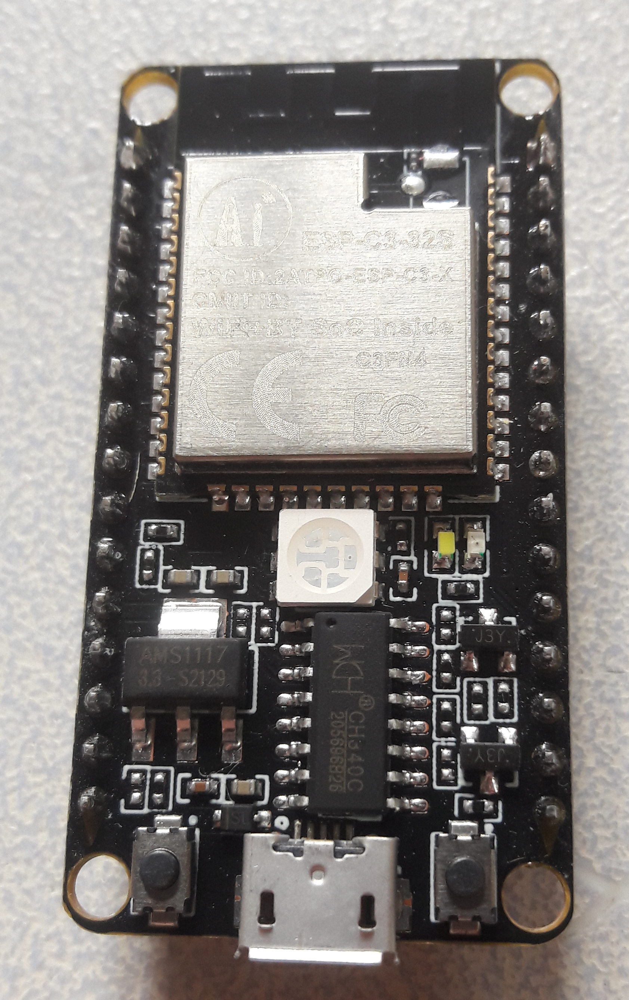

# Chapter 5: ไมโครคอนโทรลเลอร์และการจำลองการทำงาน

## Microcontrollers & Simulation Tools (ESP32 Architecture, GPIO, Wokwi, PlatformIO)

---

**รายวิชา:** เทคโนโลยีดิจิทัลสำหรับวิศวกรรม (Digital Technology for Engineering)  
**หลักสูตร:** วิศวกรรมเครื่องกล ชั้นปีที่ 1  
**ผู้เรียบเรียง:** คณะวิศวกรรมศาสตร์  

---

> ### 🎯 ผลลัพธ์การเรียนรู้และการเชื่อมโยง (Constructive Alignment)
>
> - **สัปดาห์การเรียนรู้:** สัปดาห์ที่ 5 — ไมโครคอนโทรลเลอร์เบื้องต้น (ESP32/Arduino) และเครื่องมือจำลอง Wokwi
> - **ผลลัพธ์การเรียนรู้ระดับรายวิชา (CLOs):**
>   - **CLO1:** อธิบายหลักการและสถาปัตยกรรมของระบบ IoT ตัวรับรู้ ตัวกระทำ และไมโครคอนโทรลเลอร์ได้
>   - **CLO4:** ปฏิบัติการสร้าง ทดสอบ และประยุกต์ใช้ระบบ IoT พร้อมการเรียนรู้ของเครื่องเบื้องต้น และทำงานเป็นทีมอย่างรับผิดชอบ
> - **ผลลัพธ์การเรียนรู้ระดับบทเรียน (LLOs):**
>   - **LLO5.1:** อธิบายสถาปัตยกรรม ESP32, ฟังก์ชันของขา GPIO และวงจรภายในไมโครคอนโทรลเลอร์ได้ (CLO1)
>   - **LLO5.2:** เขียนโครงสร้างโปรแกรม Arduino C++ (setup/loop) และจำลองการทำงานของวงจรด้วย Wokwi Simulator ได้ (CLO4)
>
---

<div class="chapter-tab-content" data-tab-name="Concept" data-tab-icon="💡" id="concept" markdown="1">

## 5.1 ไมโครคอนโทรลเลอร์คืออะไร? (Introduction to Microcontrollers)

**ไมโครคอนโทรลเลอร์ (Microcontroller Unit — MCU)** คือชิปประมวลผลเดี่ยว (Single-chip computer) ที่รวมหน่วยประมวลผล (CPU), หน่วยความจำ (RAM, Flash), และโมดูลอินพุต/เอาต์พุต (Peripherals) ทั้งแอนะล็อกและดิจิทัลไว้ภายในวงจรรวม (Integrated Circuit - IC) เดียวกัน เพื่อควบคุมการทำงานของอุปกรณ์ในระบบฝังตัว (Embedded Systems) เช่น ระบบอัตโนมัติในโรงงาน เครื่องวัดค่าทางการแพทย์ หรือระบบยานยนต์

### 5.1.1 เปรียบเทียบ MCU กับ Microprocessor (MPU)

| หัวข้อ | ไมโครคอนโทรลเลอร์ (MCU) | ไมโครโพรเซสเซอร์ (MPU) |
|---|---|---|
| **ตัวอย่าง** | ESP32, ATmega328 (Arduino Uno), STM32 | Intel Core i7, AMD Ryzen, Apple M1, ARM Cortex-A |
| **โครงสร้างระบบ** | รวมทุกอย่างในชิปเดี่ยว (SoC - System on Chip) | มีเฉพาะ CPU ต้องเชื่อมต่อ RAM, ROM, I/O ภายนอก |
| **ระบบปฏิบัติการ** | รันแบบ Bare-metal หรือ Real-Time OS (RTOS) | รันระบบปฏิบัติการเต็มรูปแบบ เช่น Windows, Linux, macOS |
| **ความถี่สัญญาณนาฬิกา** | ต่ำ (ระดับ MHz ถึงร้อยกว่า MHz) | สูง (ระดับ GHz) |
| **การใช้พลังงาน** | ต่ำมาก (ระดับมิลลิวัตต์ mW) มีโหมด Sleep | สูง (ระดับวัตต์ W จนถึงร้อยวัตต์) |
| **ต้นทุนระบบ** | ต่ำมาก (หลักสิบถึงหลักร้อยบาท) | สูง (หลักพันถึงหลายหมื่นบาท) |
| **ลักษณะงาน** | ควบคุมฮาร์ดแวร์เฉพาะด้าน, งาน IoT, ระบบควบคุมรถยนต์ | ประมวลผลข้อมูลทั่วไป, งานคำนวณหนัก, เซิร์ฟเวอร์ |

---

> ### 🎯 ผลลัพธ์การเรียนรู้และการเชื่อมโยง (Constructive Alignment)
>
> - **สัปดาห์การเรียนรู้:** สัปดาห์ที่ 5 — ไมโครคอนโทรลเลอร์เบื้องต้น (ESP32/Arduino) และเครื่องมือจำลอง Wokwi
> - **ผลลัพธ์การเรียนรู้ระดับรายวิชา (CLOs):**
>   - **CLO1:** อธิบายหลักการและสถาปัตยกรรมของระบบ IoT ตัวรับรู้ ตัวกระทำ และไมโครคอนโทรลเลอร์ได้
>   - **CLO4:** ปฏิบัติการสร้าง ทดสอบ และประยุกต์ใช้ระบบ IoT พร้อมการเรียนรู้ของเครื่องเบื้องต้น และทำงานเป็นทีมอย่างรับผิดชอบ
> - **ผลลัพธ์การเรียนรู้ระดับบทเรียน (LLOs):**
>   - **LLO5.1:** อธิบายสถาปัตยกรรม ESP32, ฟังก์ชันของขา GPIO และวงจรภายในไมโครคอนโทรลเลอร์ได้ (CLO1)
>   - **LLO5.2:** เขียนโครงสร้างโปรแกรม Arduino C++ (setup/loop) และจำลองการทำงานของวงจรด้วย Wokwi Simulator ได้ (CLO4)
>
---

### 5.1.2 สถาปัตยกรรมหน่วยความจำ: Von Neumann vs Harvard Architecture

ในการออกแบบสถาปัตยกรรมคอมพิวเตอร์และระบบบัสเพื่อเข้าถึงคำสั่ง (Instruction) และข้อมูล (Data) มีแนวคิดหลักสองรูปแบบดังนี้:

### 1) สถาปัตยกรรมแบบ Von Neumann (Von Neumann Architecture)
สถาปัตยกรรมที่ใช้บัสข้อมูล (Data Bus) และบัสแอดเดรส (Address Bus) ชุดเดียวกันในการเข้าถึงทั้งหน่วยความจำโปรแกรม (คำสั่ง) และหน่วยความจำข้อมูล
- **ลักษณะเด่น:** คำสั่งและข้อมูลแชร์พื้นที่หน่วยความจำและระบบบัสร่วมกัน
- **ข้อดี:** ออกแบบทางฮาร์ดแวร์ได้ง่าย ประหยัดสายสัญญาณบัสบนชิป
- **ข้อเสีย:** เกิดปัญหา **"คอขวดฟอนนอยมันน์" (Von Neumann Bottleneck)** เนื่องจาก CPU ไม่สามารถ Fetch คำสั่งพร้อมกับ Read/Write ข้อมูลในหน่วยความจำในเวลาเดียวกันได้ (ต้องผลัดกันส่งข้อมูลผ่านบัสร่วม)

<div style="text-align: center; margin: 20px 0;">
<svg viewBox="0 0 760 300" width="100%" height="auto" xmlns="http://www.w3.org/2000/svg" font-family="'IBM Plex Sans Thai', system-ui, sans-serif">
  <title>สถาปัตยกรรมแบบ Von Neumann</title>
  <style>
    .bg { fill: #f8fafc; stroke: #cbd5e1; stroke-width: 1.5; rx: 12px; }
    .box-cpu { fill: #faf5ff; stroke: #7c3aed; stroke-width: 2; rx: 8px; }
    .box-mem { fill: #ffffff; stroke: #334155; stroke-width: 2; rx: 4px; }
    .wire { fill: none; stroke: #334155; stroke-width: 3; stroke-linecap: round; stroke-linejoin: round; }
    .active-flow { fill: none; stroke: #f59e0b; stroke-width: 4; stroke-linecap: round; }
    .text-title { font-size: 16px; font-weight: bold; fill: #1e293b; }
    .text-node { font-size: 14px; font-weight: bold; fill: #1e293b; }
    .text-desc { font-size: 12px; fill: #64748b; }
    .packet-inst { fill: #7c3aed; stroke: #ffffff; stroke-width: 1.5; }
    .packet-data { fill: #f59e0b; stroke: #ffffff; stroke-width: 1.5; }
    
    @keyframes busTraffic {
      0%, 45% { stroke: #7c3aed; }
      50%, 95% { stroke: #f59e0b; }
      46%, 49%, 96%, 99% { stroke: #dc2626; }
    }
    .active-bus { animation: busTraffic 7s infinite; }
    
    @keyframes moveInst {
      0% { transform: translate(500px, 150px); opacity: 0; }
      5% { transform: translate(500px, 150px); opacity: 1; }
      40% { transform: translate(250px, 150px); opacity: 1; }
      45%, 100% { transform: translate(250px, 150px); opacity: 0; }
    }
    @keyframes moveData {
      0%, 50% { transform: translate(250px, 150px); opacity: 0; }
      55% { transform: translate(250px, 150px); opacity: 1; }
      90% { transform: translate(500px, 150px); opacity: 1; }
      95%, 100% { transform: translate(500px, 150px); opacity: 0; }
    }
    @keyframes gateRed {
      0%, 45% { fill: #16a34a; }
      46%, 95% { fill: #dc2626; }
      96%, 100% { fill: #16a34a; }
    }
    @keyframes gateBlue {
      0%, 49% { fill: #dc2626; }
      50%, 95% { fill: #16a34a; }
      96%, 100% { fill: #dc2626; }
    }
    .inst-dot { animation: moveInst 7s infinite; }
    .data-dot { animation: moveData 7s infinite; }
    .gate-inst-light { animation: gateRed 7s infinite; }
    .gate-data-light { animation: gateBlue 7s infinite; }
  </style>
  
  <rect x="5" y="5" width="750" height="290" class="bg"/>
  <text x="380" y="30" class="text-title" text-anchor="middle">สถาปัตยกรรมแบบ Von Neumann (บัสร่วม)</text>
  
  <rect x="50" y="90" width="180" height="120" class="box-cpu"/>
  <text x="140" y="135" class="text-node" text-anchor="middle">หน่วยประมวลผล (CPU)</text>
  <text x="140" y="160" class="text-desc" text-anchor="middle">- ALU &amp; Registers</text>
  <text x="140" y="180" class="text-desc" text-anchor="middle">- Control Unit</text>
  
  <rect x="530" y="90" width="180" height="120" class="box-mem"/>
  <text x="620" y="135" class="text-node" text-anchor="middle">หน่วยความจำร่วม</text>
  <text x="620" y="160" class="text-desc" text-anchor="middle">[คำสั่ง (Instruction)]</text>
  <text x="620" y="180" class="text-desc" text-anchor="middle">&amp; [ข้อมูล (Data)]</text>
  
  <line x1="230" y1="150" x2="530" y2="150" class="wire"/>
  <line x1="230" y1="150" x2="530" y2="150" class="active-flow active-bus"/>
  
  <text x="380" y="115" class="text-node" text-anchor="middle">บัสร่วม (Shared Address / Data Bus)</text>
  <text x="380" y="195" class="text-desc" text-anchor="middle" fill="#dc2626">คอขวด (Bottleneck): คำสั่งและข้อมูลต้องสลับกันเข้าบัส</text>
  
  <g transform="translate(260, 95)">
    <rect x="0" y="0" width="18" height="34" fill="#334155" rx="3"/>
    <circle cx="9" cy="9" r="5" class="gate-inst-light"/>
    <circle cx="9" cy="25" r="5" class="gate-data-light"/>
  </g>
  <text x="280" y="85" class="text-desc" font-size="10">คิวบัส</text>
  
  <g class="inst-dot">
    <circle r="10" class="packet-inst"/>
    <text y="3" font-size="8" font-weight="bold" fill="#ffffff" text-anchor="middle">Inst</text>
  </g>
  
  <g class="data-dot">
    <circle r="10" class="packet-data"/>
    <text y="3" font-size="8" font-weight="bold" fill="#ffffff" text-anchor="middle">Data</text>
  </g>
</svg>
<div style="font-size: 12px; color: #64748b; margin-top: 8px;">ภาพที่ 5.1 สถาปัตยกรรมแบบ Von Neumann ที่มีบัสคำสั่งและข้อมูลแชร์ร่วมกัน เกิดสภาวะคอขวดสะสม</div>
</div>

### 2) สถาปัตยกรรมแบบ Harvard (Harvard Architecture)
สถาปัตยกรรมที่แยกบัสข้อมูล (Data Bus) และบัสคำสั่ง (Instruction Bus) ออกจากกันเป็นอิสระ รวมถึงแยกหน่วยความจำโปรแกรมและหน่วยความจำข้อมูลด้วย
- **ลักษณะเด่น:** CPU สามารถ Fetch คำสั่งจากหน่วยความจำโปรแกรม ไปพร้อมกับการอ่านหรือเขียนข้อมูลในหน่วยความจำข้อมูลได้ในรอบสัญญาณนาฬิกาเดียวกัน
- **ข้อดี:** ความเร็วในการประมวลผลสูงกว่า หลีกเลี่ยงปัญหาคอขวดบัส
- **ข้อเสีย:** การออกแบบวงจรบนชิปมีความซับซ้อนมากกว่า และใช้จำนวนพิน/สายสัญญาณมากกว่า

<div style="text-align: center; margin: 20px 0;">
<svg viewBox="0 0 760 300" width="100%" height="auto" xmlns="http://www.w3.org/2000/svg" font-family="'IBM Plex Sans Thai', system-ui, sans-serif">
  <title>สถาปัตยกรรมแบบ Harvard</title>
  <style>
    .bg { fill: #f8fafc; stroke: #cbd5e1; stroke-width: 1.5; rx: 12px; }
    .box-cpu { fill: #faf5ff; stroke: #7c3aed; stroke-width: 2; rx: 8px; }
    .box-mem { fill: #ffffff; stroke: #334155; stroke-width: 2; rx: 4px; }
    .wire { fill: none; stroke: #334155; stroke-width: 3; stroke-linecap: round; stroke-linejoin: round; }
    .active-flow-inst { fill: none; stroke: #7c3aed; stroke-width: 3; stroke-linecap: round; }
    .active-flow-data { fill: none; stroke: #16a34a; stroke-width: 3; stroke-linecap: round; }
    .text-title { font-size: 16px; font-weight: bold; fill: #1e293b; }
    .text-node { font-size: 14px; font-weight: bold; fill: #1e293b; }
    .text-desc { font-size: 12px; fill: #64748b; }
    .packet-inst { fill: #7c3aed; stroke: #ffffff; stroke-width: 1.5; }
    .packet-data { fill: #16a34a; stroke: #ffffff; stroke-width: 1.5; }
    
    @keyframes moveInstHarvard {
      0% { transform: translate(500px, 100px); opacity: 0; }
      10% { transform: translate(500px, 100px); opacity: 1; }
      90% { transform: translate(230px, 100px); opacity: 1; }
      100% { transform: translate(230px, 100px); opacity: 0; }
    }
    @keyframes moveDataHarvard {
      0% { transform: translate(230px, 200px); opacity: 0; }
      10% { transform: translate(230px, 200px); opacity: 1; }
      90% { transform: translate(500px, 200px); opacity: 1; }
      100% { transform: translate(500px, 200px); opacity: 0; }
    }
    .inst-dot { animation: moveInstHarvard 3s linear infinite; }
    .data-dot { animation: moveDataHarvard 3s linear infinite; }
  </style>
  
  <rect x="5" y="5" width="750" height="290" class="bg"/>
  <text x="380" y="30" class="text-title" text-anchor="middle">สถาปัตยกรรมแบบ Harvard (บัสแยกอิสระ)</text>
  
  <rect x="50" y="80" width="180" height="150" class="box-cpu"/>
  <text x="140" y="135" class="text-node" text-anchor="middle">หน่วยประมวลผล (CPU)</text>
  <text x="140" y="160" class="text-desc" text-anchor="middle">- ALU &amp; Registers</text>
  <text x="140" y="180" class="text-desc" text-anchor="middle">- Parallel Control Units</text>
  
  <rect x="500" y="60" width="200" height="75" class="box-mem"/>
  <text x="600" y="90" class="text-node" text-anchor="middle">หน่วยความจำโปรแกรม</text>
  <text x="600" y="110" class="text-desc" text-anchor="middle">Program Memory [Inst]</text>
  
  <rect x="500" y="165" width="200" height="75" class="box-mem"/>
  <text x="600" y="195" class="text-node" text-anchor="middle">หน่วยความจำข้อมูล</text>
  <text x="600" y="215" class="text-desc" text-anchor="middle">Data Memory [Data]</text>
  
  <line x1="230" y1="100" x2="500" y2="100" class="wire"/>
  <line x1="230" y1="100" x2="500" y2="100" class="active-flow-inst"/>
  <text x="365" y="85" class="text-desc" font-weight="bold" fill="#7c3aed">บัสคำสั่ง (Instruction Bus)</text>
  
  <line x1="230" y1="200" x2="500" y2="200" class="wire"/>
  <line x1="230" y1="200" x2="500" y2="200" class="active-flow-data"/>
  <text x="365" y="185" class="text-desc" font-weight="bold" fill="#16a34a">บัสข้อมูล (Data Bus)</text>
  
  <text x="365" y="265" class="text-desc" text-anchor="middle" font-weight="bold" fill="#16a34a">ทำงานขนานกัน (Parallel): อ่านคำสั่งพร้อมกับอ่าน/เขียนข้อมูลในรอบเดียวกัน</text>
  
  <g class="inst-dot">
    <circle r="9" class="packet-inst"/>
    <text y="3" font-size="8" font-weight="bold" fill="#ffffff" text-anchor="middle">Inst</text>
  </g>
  
  <g class="data-dot">
    <circle r="9" class="packet-data"/>
    <text y="3" font-size="8" font-weight="bold" fill="#ffffff" text-anchor="middle">Data</text>
  </g>
</svg>
<div style="font-size: 12px; color: #64748b; margin-top: 8px;">ภาพที่ 5.2 สถาปัตยกรรมแบบ Harvard แยกสายส่งข้อมูลและสายสั่งงานออกเป็นอิสระ เพื่อการรันงานแบบขนานเต็มประสิทธิภาพ</div>
</div>

### 3) Modified Harvard Architecture
ไมโครคอนโทรลเลอร์และไมโครโพรเซสเซอร์ยุคใหม่ (เช่น สถาปัตยกรรม ARM Cortex หรือ Xtensa ใน ESP32) มักหันมาใช้สถาปัตยกรรมแบบ **Modified Harvard** ซึ่งเป็นการผสานข้อดีของทั้งสองระบบ โดยภายใน CPU จะแยกบัสคำสั่งและบัสข้อมูลเพื่อให้ประมวลผลได้เร็วแบบ Harvard แต่ระบบหน่วยความจำภายนอกหรือพื้นที่แอดเดรสจะสามารถเข้าถึงร่วมกันได้ ทำให้โปรแกรมสามารถอ่านข้อมูลคงที่ (Constant data เช่น ตาราง lookup table) ที่เก็บอยู่ใน Flash Memory (หน่วยความจำโปรแกรม) เสมือนเป็นข้อมูลปกติใน RAM ได้โดยสะดวกผ่านกลไก MMU

---

### 5.1.3 ส่วนประกอบภายในของ CPU และวงรอบการทำงาน (Internal CPU Components & Instruction Cycle)

### 1) ส่วนประกอบสำคัญภายใน CPU
- **ALU (Arithmetic Logic Unit):** หน่วยคำนวณทางคณิตศาสตร์ (เช่น บวก ลบ) และตรรกศาสตร์ (เช่น AND, OR, XOR)
- **Registers (รีจิสเตอร์):** หน่วยความจำภายใน CPU ที่ทำงานเร็วที่สุด ใช้เก็บข้อมูลและสถานะขณะประมวลผล:
  - **Program Counter (PC):** รีจิสเตอร์ที่ทำหน้าที่ชี้ตำแหน่งแอดเดรสของคำสั่งถัดไปในหน่วยความจำโปรแกรมที่จะต้องถูกดึงมาประมวลผล
  - **Stack Pointer (SP):** รีจิสเตอร์ที่เก็บตำแหน่งแอดเดรสล่าสุดของหน่วยความจำสแต็ก (Stack) ใช้สำหรับเก็บสถานะของ CPU และตัวแปรชั่วคราวเมื่อเกิดการเรียกฟังก์ชัน (Function Call) หรือเมื่อมีสัญญาณขัดจังหวะ (Interrupt)
  - **Instruction Register (IR):** รีจิสเตอร์ที่พักรหัสคำสั่ง (Opcode) ที่เพิ่งจะถูก Fetch มาจากหน่วยความจำ เพื่อรอส่งต่อไปยังหน่วยถอดรหัสคำสั่ง (Decoder)
  - **Status Register / Flag Register:** รีจิสเตอร์เก็บสถานะที่ระบุผลลัพธ์ของการคำนวณล่าสุดจาก ALU เช่น Zero Flag (Z - ผลลัพธ์เป็นศูนย์), Carry Flag (C - มีการทดเลข), Negative Flag (N - ผลลัพธ์เป็นลบ), และ Overflow Flag (V - เกิดการล้นของเลขมีเครื่องหมาย)
  - **General Purpose Registers (รีจิสเตอร์ทั่วไป):** รีจิสเตอร์ที่โปรแกรมเมอร์หรือคอมไพเลอร์ใช้สำหรับพักข้อมูลตัวแปรชั่วคราวในขั้นตอนการคำนวณทั่วไป

### 2) วงรอบการทำงาน Fetch-Decode-Execute-Writeback (FDEW Cycle)
CPU ทำงานตามลำดับรอบที่เรียกว่า **Instruction Cycle** วนซ้ำไปเรื่อย ๆ ดังนี้:

<div style="text-align: center; margin: 20px 0;">
<svg viewBox="0 0 760 320" width="100%" height="auto" xmlns="http://www.w3.org/2000/svg" font-family="'IBM Plex Sans Thai', system-ui, sans-serif">
  <title>วงรอบ FDEW Cycle</title>
  <style>
    .bg { fill: #f8fafc; stroke: #cbd5e1; stroke-width: 1.5; rx: 12px; }
    .box-stage { fill: #ffffff; stroke: #334155; stroke-width: 2; rx: 4px; transition: all 0.3s ease; }
    .wire { fill: none; stroke: #334155; stroke-width: 2.5; stroke-dasharray: 6 6; stroke-linecap: round; stroke-linejoin: round; }
    .text-title { font-size: 16px; font-weight: bold; fill: #1e293b; }
    .text-stage-title { font-size: 14px; font-weight: bold; fill: #1e293b; }
    .text-stage-desc { font-size: 11px; fill: #64748b; }
    .dot-flow { fill: #f59e0b; stroke: #ffffff; stroke-width: 1.5; }
    
    .stage-fetch { animation: activeFetch 6s infinite; }
    .stage-decode { animation: activeDecode 6s infinite; }
    .stage-execute { animation: activeExecute 6s infinite; }
    .stage-writeback { animation: activeWriteback 6s infinite; }
    
    @keyframes activeFetch {
      0%, 25% { fill: #faf5ff; stroke: #7c3aed; stroke-width: 3; }
      25.01%, 100% { fill: #ffffff; stroke: #334155; stroke-width: 2; }
    }
    @keyframes activeDecode {
      0%, 25% { fill: #ffffff; stroke: #334155; stroke-width: 2; }
      25.01%, 50% { fill: #faf5ff; stroke: #7c3aed; stroke-width: 3; }
      50.01%, 100% { fill: #ffffff; stroke: #334155; stroke-width: 2; }
    }
    @keyframes activeExecute {
      0%, 50% { fill: #ffffff; stroke: #334155; stroke-width: 2; }
      50.01%, 75% { fill: #faf5ff; stroke: #7c3aed; stroke-width: 3; }
      75.01%, 100% { fill: #ffffff; stroke: #334155; stroke-width: 2; }
    }
    @keyframes activeWriteback {
      0%, 75% { fill: #ffffff; stroke: #334155; stroke-width: 2; }
      75.01%, 100% { fill: #faf5ff; stroke: #7c3aed; stroke-width: 3; }
    }
    @keyframes colorChangeDot {
      0%, 25% { fill: #7c3aed; }
      25.01%, 50% { fill: #f59e0b; }
      50.01%, 75% { fill: #dc2626; }
      75.01%, 100% { fill: #16a34a; }
    }
    .dot-animated { animation: colorChangeDot 6s infinite; }
  </style>
  
  <rect x="5" y="5" width="750" height="310" class="bg"/>
  <text x="380" y="30" class="text-title" text-anchor="middle">วงรอบการทำงานของ CPU (FDEW Cycle)</text>
  <text x="380" y="160" font-size="14px" font-weight="bold" fill="#334155" text-anchor="middle">Instruction Cycle</text>
  <text x="380" y="180" font-size="11px" fill="#64748b" text-anchor="middle">ประมวลผลคำสั่งวนซ้ำทีละขั้นตอน</text>
  
  <path id="loopPath" d="M 380 65 Q 580 65 580 160 Q 580 255 380 255 Q 180 255 180 160 Q 180 65 380 65" class="wire"/>
  
  <g transform="translate(290, 35)">
    <rect x="0" y="0" width="180" height="60" class="box-stage stage-fetch"/>
    <text x="90" y="24" class="text-stage-title" text-anchor="middle">1. Fetch (ดึงคำสั่ง)</text>
    <text x="90" y="44" class="text-stage-desc" text-anchor="middle">ดึงคำสั่งจาก Flash/RAM ชี้โดย PC</text>
  </g>
  
  <g transform="translate(490, 130)">
    <rect x="0" y="0" width="180" height="60" class="box-stage stage-decode"/>
    <text x="90" y="24" class="text-stage-title" text-anchor="middle">2. Decode (ถอดรหัส)</text>
    <text x="90" y="44" class="text-stage-desc" text-anchor="middle">แปลงรหัส Opcode เพื่อสั่งการระบบ</text>
  </g>
  
  <g transform="translate(290, 225)">
    <rect x="0" y="0" width="180" height="60" class="box-stage stage-execute"/>
    <text x="90" y="24" class="text-stage-title" text-anchor="middle">3. Execute (ประมวลผล)</text>
    <text x="90" y="44" class="text-stage-desc" text-anchor="middle">สั่ง ALU คำนวณหรือเปรียบเทียบข้อมูล</text>
  </g>
  
  <g transform="translate(90, 130)">
    <rect x="0" y="0" width="180" height="60" class="box-stage stage-writeback"/>
    <text x="90" y="24" class="text-stage-title" text-anchor="middle">4. Writeback (เขียนกลับ)</text>
    <text x="90" y="44" class="text-stage-desc" text-anchor="middle">บันทึกผลลัพธ์ลง Register / RAM</text>
  </g>
  
  <circle r="8" class="dot-flow dot-animated">
    <animateMotion dur="6s" repeatCount="indefinite">
      <mpath href="#loopPath"/>
    </animateMotion>
  </circle>
</svg>
<div style="font-size: 12px; color: #64748b; margin-top: 8px;">ภาพที่ 5.3 วงจรขั้นตอน FDEW ดำเนินการต่อเนื่องทีละคำสั่ง (ทำงานร่วมกับระบบ Pipeline ในชิปสมัยใหม่)</div>
</div>

- **Pipelining (การทำไปป์ไลน์):** เพื่อเร่งความเร็วในการทำงาน CPU สมัยใหม่จะใช้วิธี **Pipelining** ซึ่งแบ่งส่วนทำงาน FDEW ออกเป็นขั้นตอนย่อยและรันแบบขนานกัน (Overlap) เสมือนสายพานโรงงาน ตัวอย่างเช่น ขณะที่กำลัง Execute คำสั่งแรก CPU จะก้าวไป Decode คำสั่งที่สอง และ Fetch คำสั่งที่สามพร้อมกัน ทำให้สามารถทำยอดการรันคำสั่งได้เกือบ 1 คำสั่งต่อ 1 รอบสัญญาณนาฬิกา (1 Instruction Per Cycle - IPC)

---

### 5.1.4 ระบบสัญญาณนาฬิกาและตัวหารความถี่ (Clock Systems & Prescalers)

- **แหล่งกำเนิดสัญญาณนาฬิกา (Clock Sources):**
  - **Crystal Oscillator (คริสตัลภายนอก):** มีความเสถียรและแม่นยำสูงมาก (เช่น 40 MHz ใน ESP32) มักใช้ในงานที่ต้องการความแม่นยำทางเวลา เช่น การสื่อสารไร้สายหรือพอร์ตอนุกรม
  - **Internal RC Oscillator (วงจรความถี่ภายใน):** สร้างความถี่โดยอาศัยตัวเก็บประจุและตัวต้านทานภายในชิป มีราคาถูกและบูตเร็ว แต่ความแม่นยำต่ำและแปรผันตามอุณหภูมิ มักใช้ช่วงเปิดเครื่องหรือในโหมดประหยัดพลังงาน (Deep Sleep)
- **Phase-Locked Loop (PLL):** วงจรภายในชิปที่ใช้เพิ่มความถี่ (Frequency Multiplier) จากคริสตัลภายนอก ตัวอย่างเช่น รับความถี่ 40 MHz จากคริสตัลแล้วคูณขึ้นไปเป็น 240 MHz เพื่อให้ CPU ทำงานได้เต็มประสิทธิภาพ
- **ตัวหารความถี่ (Prescaler):** เนื่องจากโมดูลเชื่อมต่ออุปกรณ์ต่อพ่วง (Peripherals) เช่น Timer, ADC, I2C ไม่จำเป็นต้องทำงานเร็วเท่า CPU (และทำงานที่ความถี่สูงอาจทำให้อุปกรณ์ร้อนหรือกินไฟเกินความจำเป็น) Prescaler จะรับสัญญาณนาฬิกาหลักมาหารด้วยตัวเลขจำลองค่าคงที่ (เช่น หารด้วย 2, 4, 8, ... 256) เพื่อสร้างความถี่ที่เหมาะสมให้แก่อุปกรณ์ปลายทาง

### 5.1.5 องค์ประกอบหลักของไมโครคอนโทรลเลอร์

<div style="text-align: center; margin: 20px 0;">
<svg viewBox="0 0 760 320" width="100%" height="auto" xmlns="http://www.w3.org/2000/svg" font-family="'IBM Plex Sans Thai', system-ui, sans-serif">
  <title>ส่วนประกอบหลักของไมโครคอนโทรลเลอร์ (MCU)</title>
  <style>
    .bg { fill: #f8fafc; stroke: #cbd5e1; stroke-width: 1.5; rx: 12px; }
    .box-mcu { fill: #faf5ff; stroke: #7c3aed; stroke-width: 2; rx: 8px; }
    .box-component { fill: #ffffff; stroke: #334155; stroke-width: 2; rx: 4px; }
    .bus-main { fill: none; stroke: #334155; stroke-width: 6; stroke-linecap: round; }
    .bus-conn { fill: none; stroke: #334155; stroke-width: 2.5; stroke-linecap: round; stroke-linejoin: round; }
    .text-title { font-size: 16px; font-weight: bold; fill: #1e293b; }
    .text-node { font-size: 13px; font-weight: bold; fill: #1e293b; }
    .text-desc { font-size: 10px; fill: #64748b; }
    .pulse-dot { fill: #f59e0b; stroke: #ffffff; stroke-width: 1.5; }
  </style>
  
  <rect x="5" y="5" width="750" height="310" class="bg"/>
  <text x="380" y="25" class="text-title" text-anchor="middle">ส่วนประกอบระดับบล็อกภายในของไมโครคอนโทรลเลอร์ (MCU)</text>
  
  <path id="pathCpuToRam" d="M 100 105 L 100 160 L 240 160 L 240 105" fill="none"/>
  <path id="pathCpuToGpio" d="M 100 105 L 100 160 L 100 215" fill="none"/>
  <path id="pathCpuToFlash" d="M 100 105 L 100 160 L 380 160 L 380 105" fill="none"/>
  <path id="pathCpuToSpi" d="M 100 105 L 100 160 L 520 160 L 520 215" fill="none"/>
  <path id="pathCpuToWifi" d="M 100 105 L 100 160 L 660 160 L 660 215" fill="none"/>
  
  <line x1="100" y1="105" x2="100" y2="215" class="bus-conn"/>
  <line x1="240" y1="105" x2="240" y2="215" class="bus-conn"/>
  <line x1="380" y1="105" x2="380" y2="215" class="bus-conn"/>
  <line x1="520" y1="105" x2="520" y2="215" class="bus-conn"/>
  <line x1="660" y1="105" x2="660" y2="215" class="bus-conn"/>
  
  <line x1="80" y1="160" x2="680" y2="160" class="bus-main"/>
  <text x="380" y="150" font-size="11px" font-weight="bold" fill="#334155" text-anchor="middle">Internal System Bus (บัสระบบภายใน)</text>
  
  <g transform="translate(45, 45)">
    <rect x="0" y="0" width="110" height="60" class="box-mcu"/>
    <text x="55" y="25" class="text-node" text-anchor="middle">CPU Core</text>
    <text x="55" y="40" class="text-desc" text-anchor="middle">หน่วยประมวลผล</text>
    <text x="55" y="52" class="text-desc" text-anchor="middle">(Xtensa LX6)</text>
  </g>
  
  <g transform="translate(185, 45)">
    <rect x="0" y="0" width="110" height="60" class="box-component"/>
    <text x="55" y="25" class="text-node" text-anchor="middle">RAM (SRAM)</text>
    <text x="55" y="40" class="text-desc" text-anchor="middle">เก็บข้อมูลชั่วคราว</text>
    <text x="55" y="52" class="text-desc" text-anchor="middle">(520 KB)</text>
  </g>
  
  <g transform="translate(325, 45)">
    <rect x="0" y="0" width="110" height="60" class="box-component"/>
    <text x="55" y="25" class="text-node" text-anchor="middle">Flash Memory</text>
    <text x="55" y="40" class="text-desc" text-anchor="middle">เก็บเฟิร์มแวร์ / โค้ด</text>
    <text x="55" y="52" class="text-desc" text-anchor="middle">(4 MB SPI)</text>
  </g>
  
  <g transform="translate(465, 45)">
    <rect x="0" y="0" width="110" height="60" class="box-component"/>
    <text x="55" y="25" class="text-node" text-anchor="middle">Timer/Counter</text>
    <text x="55" y="40" class="text-desc" text-anchor="middle">จับเวลา / สร้าง PWM</text>
    <text x="55" y="52" class="text-desc" text-anchor="middle">(16 channels)</text>
  </g>
  
  <g transform="translate(605, 45)">
    <rect x="0" y="0" width="110" height="60" class="box-component"/>
    <text x="55" y="25" class="text-node" text-anchor="middle">ADC</text>
    <text x="55" y="40" class="text-desc" text-anchor="middle">แปลงแอนะล็อก → ดิจิทัล</text>
    <text x="55" y="52" class="text-desc" text-anchor="middle">(12-bit, 18 ch)</text>
  </g>
  
  <g transform="translate(45, 215)">
    <rect x="0" y="0" width="110" height="60" class="box-component"/>
    <text x="55" y="25" class="text-node" text-anchor="middle">GPIO Pins</text>
    <text x="55" y="40" class="text-desc" text-anchor="middle">ดิจิทัล I/O</text>
    <text x="55" y="52" class="text-desc" text-anchor="middle">(ควบคุมพิน)</text>
  </g>
  
  <g transform="translate(185, 215)">
    <rect x="0" y="0" width="110" height="60" class="box-component"/>
    <text x="55" y="25" class="text-node" text-anchor="middle">DAC</text>
    <text x="55" y="40" class="text-desc" text-anchor="middle">แปลงดิจิทัล → แอนะล็อก</text>
    <text x="55" y="52" class="text-desc" text-anchor="middle">(8-bit, 2 ch)</text>
  </g>
  
  <g transform="translate(325, 215)">
    <rect x="0" y="0" width="110" height="60" class="box-component"/>
    <text x="55" y="25" class="text-node" text-anchor="middle">UART (Serial)</text>
    <text x="55" y="40" class="text-desc" text-anchor="middle">สื่อสารอนุกรมดีบั๊ก</text>
    <text x="55" y="52" class="text-desc" text-anchor="middle">(พอร์ตอนุกรม ×3)</text>
  </g>
  
  <g transform="translate(465, 215)">
    <rect x="0" y="0" width="110" height="60" class="box-component"/>
    <text x="55" y="25" class="text-node" text-anchor="middle">SPI / I2C</text>
    <text x="55" y="40" class="text-desc" text-anchor="middle">เชื่อมต่อไอซี / เซ็นเซอร์</text>
    <text x="55" y="52" class="text-desc" text-anchor="middle">(บัสสื่อสารความเร็วสูง)</text>
  </g>
  
  <g transform="translate(605, 215)">
    <rect x="0" y="0" width="110" height="60" class="box-mcu"/>
    <text x="55" y="25" class="text-node" text-anchor="middle">Wi-Fi &amp; BT</text>
    <text x="55" y="40" class="text-desc" text-anchor="middle">สื่อสารไร้สายความถี่สูง</text>
    <text x="55" y="52" class="text-desc" text-anchor="middle">(2.4 GHz + BLE)</text>
  </g>
  
  <circle r="4" class="pulse-dot">
    <animateMotion dur="2.4s" repeatCount="indefinite">
      <mpath href="#pathCpuToRam"/>
    </animateMotion>
  </circle>
  
  <circle r="4" class="pulse-dot" opacity="0.8">
    <animateMotion dur="1.8s" begin="0.5s" repeatCount="indefinite">
      <mpath href="#pathCpuToGpio"/>
    </animateMotion>
  </circle>
  
  <circle r="4" class="pulse-dot" opacity="0.9">
    <animateMotion dur="3s" begin="0.2s" repeatCount="indefinite">
      <mpath href="#pathCpuToFlash"/>
    </animateMotion>
  </circle>
  
  <circle r="4" class="pulse-dot" opacity="0.75">
    <animateMotion dur="2.2s" begin="0.8s" repeatCount="indefinite">
      <mpath href="#pathCpuToSpi"/>
    </animateMotion>
  </circle>
  
  <circle r="4" class="pulse-dot" opacity="0.6">
    <animateMotion dur="2.8s" begin="1.2s" repeatCount="indefinite">
      <mpath href="#pathCpuToWifi"/>
    </animateMotion>
  </circle>
</svg>
<div style="font-size: 12px; color: #64748b; margin-top: 8px;">ภาพที่ 5.4 โครงสร้างส่วนประกอบในระบบชิปเดี่ยว (SoC) ที่แชร์ข้อมูลร่วมกันผ่านระบบบัสภายในของ MCU</div>
</div>

- **CPU** — หน่วยประมวลผลกลาง ทำหน้าที่คำนวณและตัดสินใจ
- **RAM** — หน่วยความจำชั่วคราว เก็บข้อมูลขณะทำงาน (หายเมื่อปิดไฟ)
- **Flash Memory** — เก็บโปรแกรม (ไม่หายเมื่อปิดไฟ)
- **GPIO (General Purpose I/O)** — ขาเชื่อมต่อกับอุปกรณ์ภายนอก
- **Timer/Counter** — ตัวจับเวลาและตัวนับ ใช้สร้างสัญญาณ PWM หรือจับเวลาเหตุการณ์
- **ADC/DAC** — แปลงสัญญาณอะนาล็อก ↔ ดิจิทัล

---

## 5.2 รู้จัก ESP32

<div style="text-align: center; margin: 20px 0;">
  
  <div style="font-size: 12px; color: #64748b; margin-top: 8px;">ภาพที่ 5.5 บอร์ดทดลองพัฒนาไมโครคอนโทรลเลอร์ ESP32 NodeMCU สำหรับสร้างต้นแบบงาน IoT</div>
</div>

**ESP32** เป็นไมโครคอนโทรลเลอร์จากบริษัท Espressif Systems (จีน) ที่ได้รับความนิยมสูงมากในงาน IoT เนื่องจากมี **Wi-Fi และ Bluetooth ในตัว** ราคาถูก และประสิทธิภาพสูง

### 5.2.1 สเปกของ ESP32-WROOM-32

- **Wi-Fi 802.11 b/g/n** ในตัว — เชื่อมต่ออินเทอร์เน็ตได้เลยโดยไม่ต้องใช้โมดูลเพิ่ม
- **Bluetooth 4.2 / BLE** ในตัว — สื่อสารกับสมาร์ตโฟนหรืออุปกรณ์ BLE ได้
- **Dual-core** Xtensa LX6 — ประมวลผลสองแกนพร้อมกัน
- **ราคาถูก** — บอร์ด ESP32 DevKit เริ่มต้นประมาณ ฿100–฿200
- **รองรับ Arduino Framework** — เขียนโปรแกรมง่ายเหมือน Arduino ทั่วไป

| คุณสมบัติ | รายละเอียด |
|---|---|
| CPU | Xtensa LX6 Dual-core, สูงสุด 240 MHz |
| RAM | 520 KB SRAM |
| Flash | 4 MB (ภายนอกบนโมดูล) |
| Wi-Fi | 802.11 b/g/n, 2.4 GHz |
| Bluetooth | v4.2 BR/EDR + BLE |
| GPIO | สูงสุด 34 ขา |
| ADC | 18 ช่อง (12-bit) |
| DAC | 2 ช่อง (8-bit) |
| PWM | 16 ช่อง (LED Control) |
| Touch Sensor | 10 ช่อง |
| อินเทอร์เฟซ | SPI ×4, I2C ×2, UART ×3, I2S ×2 |
| แรงดันทำงาน | 3.3 V |
| แรงดันจ่ายผ่าน USB | 5 V (ผ่านตัวควบคุมแรงดันบนบอร์ด) |

> 💡 **ข้อควรระวัง:** ESP32 ทำงานที่แรงดัน **3.3 V** ห้ามต่อสัญญาณ 5 V เข้าขา GPIO โดยตรง อาจทำให้ชิปเสียหายได้

---

### 5.2.2 เจาะลึกฮาร์ดแวร์ ESP32: Dual-core Xtensa LX6

ESP32 (รุ่น WROOM-32) ใช้ตัวประมวลผลกลางสถาปัตยกรรม **Xtensa LX6** จาก Tensilica ขนาด 32 บิต จำนวน 2 แกนหลัก (Dual-core) ทำงานขนานกันภายใต้สถาปัตยกรรมระบบประมวลผลหลายตัวแบบสมมาตร (Symmetric Multiprocessing — SMP) ร่วมกับระบบปฏิบัติการเวลาจริง FreeRTOS 

#### 1) โครงสร้างสถาปัตยกรรมภายในหน่วยประมวลผล (Xtensa LX6 Microarchitecture)
- **สถาปัตยกรรมบัสและไปป์ไลน์ (Bus & Pipeline):** ตัวประมวลผล LX6 ใช้สถาปัตยกรรมแบบ Harvard ขนาด 32 บิต (แยกบัสข้อมูลและบัสคำสั่งชัดเจน) โดยมีสายพานการประมวลผล (Instruction Pipeline) ขนาด **7 ขั้นตอน (7-stage pipeline)** ทำให้สามารถประมวลผลคำสั่งส่วนใหญ่ได้เสร็จสิ้นใน 1 รอบสัญญาณนาฬิกา
- **สไลด์หน้าต่างรีจิสเตอร์ (Register Windowing):** LX6 แก้ปัญหา Overhead ในการผลักข้อมูลเข้า/ออกสแต็ก (Push/Pop) ขณะเรียกฟังก์ชันโดยใช้กลไก Register Windowing ซึ่งมีรีจิสเตอร์กายภาพภายในถึง 64 ตัว แต่จะเปิดแอปพลิเคชันให้มองเห็นครั้งละ 16 ตัว (`a0` ถึง `a15`) เมื่อเรียกฟังก์ชัน หน้าต่างนี้จะสไลด์เลื่อนตัวแปรไปโดยอัตโนมัติ ทำให้การสลับฟังก์ชันและการเข้าโปรแกรมบริการขัดจังหวะ (Interrupt Service Routine — ISR) ทำได้เร็วมากในระดับสัญญาณนาฬิกาไม่กี่รอบ
- **หน่วยประมวลผลทางคณิตศาสตร์พิเศษ:**
  - **FPU (Floating Point Unit):** รองรับการคำนวณทศนิยมแบบความละเอียดเดี่ยว (Single-precision float) บนฮาร์ดแวร์โดยตรง เหมาะสำหรับการคำนวณสัญญาณไฟฟ้าและการประมวลผลสัญญาณดิจิทัล (DSP)
  - **MAC (Multiply-Accumulate):** สนับสนุนคำสั่งคูณและสะสมค่าใน 1 รอบสัญญาณนาฬิกา ช่วยอำนวยความสะดวกให้งานปัญญาประดิษฐ์ขนาดเล็กและการกรองสัญญาณเชิงตัวเลข (TinyML / Digital Filters)

#### 2) หน่วยประมวลผลร่วมประหยัดพลังงานพิเศษ (ULP Coprocessor)
นอกเหนือจากแกนประมวลผลหลัก 2 แกนแล้ว ESP32 ยังรวมเอาหน่วยประมวลผลร่วม **ULP (Ultra Low Power) Coprocessor** ขนาดเล็กไว้อีก 1 ตัว:
- **กลไกทำงาน:** ULP เป็นตัวประมวลผลแบบ RISC สถาปัตยกรรมเรียบง่าย ทำงานแยกจากแกนหลัก โดยมีความถี่สัญญาณนาฬิกาต่ำ (มักขับเคลื่อนโดย internal 8 MHz RC oscillator) และเข้าถึงได้เฉพาะรีจิสเตอร์พื้นฐานกับพื้นที่หน่วยความจำ RTC Slow Memory เท่านั้น
- **การประหยัดพลังงาน:** ในโหมดนอนหลับลึก (Deep Sleep) แกนหลัก Xtensa LX6 ทั้งคู่จะปิดการทำงานลงทั้งหมดเพื่อประหยัดไฟ แต่ ULP จะยังทำงานอยู่เพื่อตรวจสอบสถานะของ GPIO อ่านค่าเซ็นเซอร์แอนะล็อกผ่านโมดูล ADC หรือสื่อสารผ่าน I2C/SPI เมื่อตรวจสอบพบค่าข้อมูลสัมผัสเกณฑ์ปลอดภัยที่วิศวกรกำหนด ULP จะส่งสัญญาณอินเทอร์รัปต์ปลุก (Wake-up) ให้แกนหลักทั้งคู่ตื่นขึ้นมาทำงานประมวลผลขนาดใหญ่ต่อไป วิธีนี้ช่วยลดระดับกระแสไฟฟ้าเหลือเพียง **10–15 µA** ซึ่งยืดอายุการใช้งานอุปกรณ์จากแบตเตอรี่ได้นานหลายปี

#### 3) การทำงานแบบ SMP vs AMP ใน FreeRTOS
การทำงานแบบมัลติคอร์ของ ESP32 ได้รับการปรับแต่งให้อยู่ในโหมด **SMP (Symmetric Multiprocessing)**:
- **Symmetric Multiprocessing (SMP):** ตัวประมวลผลทั้งสองแกน (PRO_CPU และ APP_CPU) จะแชร์หน่วยความจำและตัวควบคุมแคชร่วมกันอย่างสมบูรณ์ โดยรันระบบปฏิบัติการ FreeRTOS เพียงชุดเดียว (Single OS instance) ซึ่งตัวจัดตารางงาน (Scheduler) ของ FreeRTOS จะคอยสลับและกระจายทาสก์ของระบบและผู้ใช้ให้รันบนแกนที่มีสเปกความเร็วและทรัพยากรว่างอยู่โดยอัตโนมัติ
- **Asymmetric Multiprocessing (AMP):** แตกต่างจากโหมด AMP ที่แต่ละแกนจะรันระบบปฏิบัติการของตัวเองแยกจากกัน (เช่น แกนหนึ่งรัน Linux อีกแกนรัน Bare-metal) ซึ่งทำให้การสื่อสารและการป้องกันการเข้าถึงหน่วยความจำชนกันของทั้งสองแกนมีความยับยั้งยากและท้าทายในวิศวกรรมระดับล่าง
- **การจัดการบทบาทสองแกนบน ESP32:**
  - **PRO_CPU (Protocol CPU / Core 0):** ทำหน้าที่ประมวลผลโปรโตคอลระบบต่ำ เช่น โครงสร้างสแต็กของ Wi-Fi, Bluetooth และระบบความปลอดภัย เพื่อป้องกันไม่ให้โหลดงานเครือข่ายขัดจังหวะการควบคุมอุปกรณ์
  - **APP_CPU (Application CPU / Core 1):** ทำหน้าที่ประมวลผลโค้ดแอปพลิเคชันหลักของผู้ใช้งาน ใน Arduino Framework ฟังก์ชัน `setup()` และ `loop()` จะถูกคอมไพล์และตั้งค่าเริ่มต้นให้รันอยู่บน Core 1 เสมอ

### ตัวอย่างการใช้งาน Multitasking ด้วยการพินงานเข้ากับ Core (Task Pinning)
ภายใต้ระบบปฏิบัติการ FreeRTOS เราสามารถแยกโปรแกรมออกเป็น Tasks และระบุ Core ที่ต้องการให้รันได้ผ่านคำสั่ง `xTaskCreatePinnedToCore()`:

```cpp
// ฟังก์ชันของ Task ที่ต้องการรันบน Core 0
void TaskOnCore0(void *pvParameters) {
    (void) pvParameters;
    
    Serial.print("Task Core 0 is running on core: ");
    Serial.println(xPortGetCoreID()); // จะได้ผลลัพธ์เป็น 0
    
    for (;;) {
        // ทำงานประมวลผลที่ต้องการความเร็วสูงหรือแยกส่วน
        // เช่น การดึงข้อมูลด่วนจากเซ็นเซอร์หรือวิเคราะห์ข้อมูล
        vTaskDelay(pdMS_TO_TICKS(1000)); // หยุดรอ 1 วินาทีแบบไม่บล็อก CPU
    }
}

void setup() {
    Serial.begin(115200);
    
    // สร้าง Task และพินเข้ากับ Core 0 (PRO_CPU)
    xTaskCreatePinnedToCore(
        TaskOnCore0,     // ฟังก์ชันงาน
        "Task_Core0",    // ชื่ออ้างอิง Task
        2048,            // ขนาด Stack (คำนวณเป็นหน่วย Words)
        NULL,            // พารามิเตอร์ส่งเข้าฟังก์ชัน
        1,               // ระดับความสำคัญ (Priority) 
        NULL,            // ตัวแปรเก็บ Handle ของ Task
        0                // เลือกพินเข้า Core 0 (ถ้าต้องการ Core 1 ให้ใส่ 1)
    );
}

void loop() {
    // โค้ดหลักใน loop() จะถูกรันบน Core 1 (APP_CPU) เสมอ
    Serial.print("Arduino loop() is running on core: ");
    Serial.println(xPortGetCoreID()); // จะได้ผลลัพธ์เป็น 1
    delay(2000);
}
```

---

### 5.2.3 แผนผังหน่วยความจำภายในและการแคชหน่วยความจำภายนอก (Memory Mapping & Cache)

ESP32 จัดสรรพื้นที่แอดเดรสของหน่วยความจำทั้งหมดผ่านโครงสร้างพื้นที่แอดเดรสขนาด 32 บิต (4 GB Address Space) โดยมีหน่วยความจำภายในขนาด 520 KB SRAM และเข้าถึงอุปกรณ์ภายนอกผ่าน Memory Management Unit (MMU) ดังรายละเอียด:

#### 1) แผนผังหน่วยความจำภายใน (Internal Memory Mapping)
- **SRAM 0 (ขนาด 192 KB / แอดเดรส `0x40070000` ถึง `0x4009FFFF`):** ทำหน้าที่เป็น **Instruction RAM (IRAM)** ซึ่งเป็นหน่วยความจำที่ CPU ใช้เก็บส่วนของคำสั่ง/โค้ดโปรแกรมที่ต้องการเข้าถึงแบบรวดเร็วระดับสัญญาณนาฬิกา เช่น รหัสโปรแกรม Interrupt Service Routines (ISR) หรือรูทีนหลักของ FreeRTOS
- **SRAM 1 (ขนาด 128 KB / แอดเดรส `0x3FFE0000` ถึง `0x3FFFFFFF`):** หน่วยความจำอเนกประสงค์ที่สามารถเข้าถึงได้ทั้งเป็น IRAM หรือ Data RAM (DRAM) บ่อยครั้งถูกจองไว้สำหรับเป็นบัฟเฟอร์การรับส่งข้อมูลของโมดูลเครือข่ายและใช้งานกลไก DMA (Direct Memory Access) จาก Peripherals โดยไม่ต้องผ่านคอขวด CPU
- **SRAM 2 (ขนาด 200 KB / แอดเดรส `0x3FFAE000` ถึง `0x3FFDFFFF`):** ทำหน้าที่เป็น **Data RAM (DRAM)** เป็นหลัก ใช้เก็บตัวแปรโกลบอล (Global variables) เก็บข้อมูลสแต็ก (Stack) ของแต่ละทาสก์ และเป็นพื้นที่ฮีป (Heap) สำหรับตัวแปรที่มีการจองพื้นที่แบบพลวัต (Dynamic memory allocation เช่น คำสั่ง `malloc()` หรือ `new`)
- **Internal ROM (ขนาด 448 KB / แอดเดรส `0x40000000` เป็นต้นไป):** บันทึกโค้ดแบบอ่านอย่างเดียวที่ไม่สามารถแก้ไขได้มาตั้งแต่โรงงาน ประกอบด้วยโปรแกรมบูตโหลดเดอร์ขั้นแรก (ROM Bootloader), ตารางไลบรารีระบบปฏิบัติการ FreeRTOS, ไลบรารีคณิตศาสตร์ และอัลกอริทึมเข้ารหัส (Cryptographic APIs)
- **RTC Memory:** หน่วยความจำพิเศษบนโมดูลเวลาจริงที่ยังคงมีไฟเลี้ยงขณะปิดแกนหลัก:
  - **RTC Fast Memory (ขนาด 8 KB):** ใช้เก็บส่วนของโปรแกรมรันสัญญาณเปิดระบบเบื้องต้นขณะตื่นจาก Deep Sleep
  - **RTC Slow Memory (ขนาด 8 KB):** ใช้เก็บตัวแปรข้อมูลของ ULP Coprocessor ในช่วง Deep Sleep

#### 2) การเข้าถึง Flash Memory และ PSRAM ภายนอกผ่าน MMU และ Cache
เนื่องจากตัวโปรแกรมหลักของผู้ใช้งานและข้อมูลคงที่มักเก็บอยู่ใน Flash Memory ภายนอกชิป (เช่น 4 MB ผ่านการต่อแบบ SPI) ซึ่งมีความเร็วต่ำกว่า SRAM ภายในชิปมาก:
- **Virtual Mapping via MMU:** ESP32 ใช้หน่วยจัดการหน่วยความจำ **MMU (Memory Management Unit)** ในการแมปแอดเดรสเสมือนของ CPU ไปยังพื้นที่ใน Flash หรือหน่วยความจำสแตติกภายนอก (PSRAM)
  - **DROM (Data ROM Mapped):** พื้นที่แอดเดรสช่วง `0x3F400000` ถึง `0x3F800000` (ขนาดสูงสุด 4 MB) ถูกแมปเข้าหา Flash ภายนอกเพื่อให้โปรแกรมสามารถอ่านข้อมูลค่าคงที่ (Constant Data) เสมือนอ่านจาก RAM ปกติ
  - **IROM (Instruction ROM Mapped):** พื้นที่แอดเดรสช่วง `0x400D0000` ถึง `0x40400000` (ขนาดสูงสุด 3.2 MB) ถูกแมปเข้าหา Flash ภายนอกเพื่อให้ CPU สามารถดึงโค้ดโปรแกรมหลักมาประมวลผลได้โดยตรง
- **ระบบ Cache สองระดับ:** เพื่อป้องกันปัญหาหน่วงเวลาในการอ่าน Flash ภายนอก ESP32 จะแบ่งหน่วยความจำขนาด **32 KB** ใน SRAM0 ออกมาเป็น Cache ประจำแต่ละแกน CPU โดยใช้กลไกการดึงคำสั่งล่วงหน้า (Pre-fetch) หากเกิดสถานะ Cache Hit ตัว CPU จะประมวลผลได้รวดเร็วเทียบเท่าการดึงข้อมูลผ่าน SRAM ภายในชิปโดยตรง

---

### 5.2.4 กระบวนการบูตระบบ (ESP32 Bootloader Process)

เมื่อปล่อยสัญญาณรีเซ็ตหรือเปิดเครื่อง (Power-on Reset — POR) บอร์ด ESP32 จะดำเนินกระบวนการเริ่มต้นระบบผ่านขั้นตอนที่เป็นลำดับขั้น (Multi-stage Boot) ดังนี้:

<div style="text-align: center; margin: 25px 0;">
<svg viewBox="0 0 760 520" width="100%" height="auto" xmlns="http://www.w3.org/2000/svg" font-family="'IBM Plex Sans Thai', system-ui, sans-serif">
  <title>ขั้นตอนการบูตระบบ (Multi-stage Boot Process)</title>
  <style>
    .bg { fill: #f8fafc; stroke: #e2e8f0; stroke-width: 1.5; rx: 12px; }
    .badge-por { fill: #fee2e2; stroke: #fca5a5; stroke-width: 1.5; }
    .badge-text-por { font-size: 13px; font-weight: bold; fill: #b91c1c; }
    
    .box-stage { stroke-width: 1; filter: drop-shadow(0 2px 4px rgba(0, 0, 0, 0.02)); }
    .stage1 { fill: #eff6ff; stroke: #bfdbfe; }
    .stage2 { fill: #faf5ff; stroke: #e9d5ff; }
    .stage3 { fill: #ecfdf5; stroke: #a7f3d0; }
    
    .bar-s1 { fill: #3b82f6; }
    .bar-s2 { fill: #8b5cf6; }
    .bar-s3 { fill: #10b981; }
    
    .text-title { font-size: 14px; font-weight: bold; fill: #0f172a; }
    .text-detail { font-size: 12.5px; fill: #334155; }
    
    .label-box { stroke-width: 1; }
    .label-s1 { fill: #dbeafe; stroke: #93c5fd; }
    .label-s2 { fill: #f3e8ff; stroke: #d8b4fe; }
    .label-s3 { fill: #d1fae5; stroke: #6ee7b7; }
    
    .label-text { font-size: 11px; font-weight: bold; }
    .lbl-txt-s1 { fill: #1e40af; }
    .lbl-txt-s2 { fill: #5b21b6; }
    .lbl-txt-s3 { fill: #065f46; }
    
    .arrow-shaft { fill: none; stroke: #cbd5e1; stroke-width: 2.5; stroke-linecap: round; }
    .arrow-marker { fill: #94a3b8; }
    .arrow-flow-red { fill: none; stroke: #ef4444; stroke-width: 2.5; stroke-dasharray: 6 8; stroke-linecap: round; animation: flow 2s linear infinite; }
    .arrow-flow-blue { fill: none; stroke: #3b82f6; stroke-width: 2.5; stroke-dasharray: 6 8; stroke-linecap: round; animation: flow 2s linear infinite; }
    .arrow-flow-purple { fill: none; stroke: #8b5cf6; stroke-width: 2.5; stroke-dasharray: 6 8; stroke-linecap: round; animation: flow 2s linear infinite; }
    
    @keyframes flow {
      to { stroke-dashoffset: -14; }
    }
  </style>
  
  <rect x="5" y="5" width="750" height="510" class="bg"/>
  
  <!-- Arrow Markers -->
  <defs>
    <marker id="arrow" viewBox="0 0 10 10" refX="6" refY="5" markerWidth="6" markerHeight="6" orient="auto-start-reverse">
      <path d="M 0 1.5 L 7 5 L 0 8.5 z" fill="#94a3b8"/>
    </marker>
  </defs>

  <!-- Power-On Reset Badge -->
  <rect x="280" y="25" width="200" height="34" rx="17" class="badge-por"/>
  <text x="380" y="47" text-anchor="middle" class="badge-text-por">⚡ Power-On Reset (POR)</text>
  
  <!-- Arrow 1 (POR -> Stage 1) -->
  <line x1="380" y1="59" x2="380" y2="90" class="arrow-shaft" marker-end="url(#arrow)"/>
  <line x1="380" y1="59" x2="380" y2="85" class="arrow-flow-red"/>

  <!-- Stage 1 Box -->
  <rect x="130" y="95" width="500" height="95" rx="8" class="box-stage stage1"/>
  <rect x="130" y="95" width="8" height="95" rx="2" class="bar-s1"/>
  <circle cx="152" cy="117" r="4.5" fill="#3b82f6"/>
  <text x="165" y="122" class="text-title">Stage 1: ROM Bootloader</text>
  
  <!-- Right badge for Stage 1 -->
  <rect x="495" y="106" width="120" height="22" rx="4" class="label-box label-s1"/>
  <text x="555" y="121" text-anchor="middle" class="label-text lbl-txt-s1">ฝังในชิป (ROM)</text>
  
  <!-- Details Stage 1 -->
  <text x="165" y="145" class="text-detail">▪ เช็กระดับแรงดันไฟเลี้ยงและเสถียรภาพของแหล่งจ่าย</text>
  <text x="165" y="163" class="text-detail">▪ อ่านสถานะระดับลอจิกจากกลุ่มขาสัญญาณ Strapping Pins</text>
  <text x="165" y="181" class="text-detail">▪ บูตเข้าโหมดดาวน์โหลด (UART) หรือกระโดดไปรันโค้ดจาก SPI Flash</text>

  <!-- Arrow 2 (Stage 1 -> Stage 2) -->
  <line x1="380" y1="190" x2="380" y2="230" class="arrow-shaft" marker-end="url(#arrow)"/>
  <line x1="380" y1="190" x2="380" y2="225" class="arrow-flow-blue"/>
  <text x="392" y="215" font-size="11.5" font-weight="bold" fill="#1e40af">โหมดปกติ (SPI Boot)</text>

  <!-- Stage 2 Box -->
  <rect x="130" y="235" width="500" height="95" rx="8" class="box-stage stage2"/>
  <rect x="130" y="235" width="8" height="95" rx="2" class="bar-s2"/>
  <circle cx="152" cy="257" r="4.5" fill="#8b5cf6"/>
  <text x="165" y="262" class="text-title">Stage 2: 2nd Stage Bootloader</text>
  
  <!-- Right badge for Stage 2 -->
  <rect x="495" y="246" width="120" height="22" rx="4" class="label-box label-s2"/>
  <text x="555" y="261" text-anchor="middle" class="label-text lbl-txt-s2">Flash Offset 0x1000</text>
  
  <!-- Details Stage 2 -->
  <text x="165" y="285" class="text-detail">▪ เริ่มต้นกำหนดค่าสัญญาณนาฬิกา (CPU Clock), Cache และ MMU</text>
  <text x="165" y="303" class="text-detail">▪ ตรวจสอบตารางพาร์ทิชันระบบ (Partition Table) ที่ตำแหน่ง 0x8000</text>
  <text x="165" y="321" class="text-detail">▪ โหลดโปรแกรมผู้ใช้งาน (Application Binary) จาก Flash เข้าสู่ SRAM</text>

  <!-- Arrow 3 (Stage 2 -> Stage 3) -->
  <line x1="380" y1="330" x2="380" y2="370" class="arrow-shaft" marker-end="url(#arrow)"/>
  <line x1="380" y1="330" x2="380" y2="365" class="arrow-flow-purple"/>

  <!-- Stage 3 Box -->
  <rect x="130" y="375" width="500" height="115" rx="8" class="box-stage stage3"/>
  <rect x="130" y="375" width="8" height="115" rx="2" class="bar-s3"/>
  <circle cx="152" cy="397" r="4.5" fill="#10b981"/>
  <text x="165" y="402" class="text-title">Stage 3: Application Startup</text>
  
  <!-- Right badge for Stage 3 -->
  <rect x="495" y="386" width="120" height="22" rx="4" class="label-box label-s3"/>
  <text x="555" y="401" text-anchor="middle" class="label-text lbl-txt-s3">รันโค้ดผู้ใช้ (SRAM)</text>
  
  <!-- Details Stage 3 -->
  <text x="165" y="425" class="text-detail">▪ เริ่มทำงานที่ฟังก์ชัน entry point (รัน call_start)</text>
  <text x="165" y="443" class="text-detail">▪ เคลียร์พื้นที่หน่วยความจำ BSS และจองฮีปสำหรับระบบ (System Heap)</text>
  <text x="165" y="461" class="text-detail">▪ เริ่มการทำงานของระบบปฏิบัติการ FreeRTOS บนคอร์ประมวลผล (Core 0/1)</text>
  <text x="165" y="479" class="text-detail">▪ เรียกใช้ฟังก์ชันเขียนโปรแกรมหลัก setup() และ loop() ของผู้ใช้งาน</text>
</svg>
</div>

#### ขั้นตอนที่ 1: ROM Bootloader (Stage 1 Bootloader)
- **ตำแหน่งโค้ด:** โค้ดส่วนนี้ถูกโปรแกรมลงใน Internal ROM ตั้งแต่วงจรพิมพ์ชิป ไม่สามารถแก้ไขหรือเขียนทับได้
- **การทำงาน:** เมื่อเริ่มจ่ายไฟ วงจรจะเริ่มต้นพินหลักและระบบสัญญาณนาฬิกาพื้นฐาน จากนั้นจะเข้าไปตรวจสอบระดับลอจิก (HIGH/LOW) ของพินกำหนดโหมดบูต (**Strapping Pins** ได้แก่ GPIO 0, 2, 5, 12, 15)
  - หากพบพินอยู่ในสถานะอัปโหลด (เช่น GPIO 0 = LOW) ชิปจะเปิดใช้งานโหมดดาวน์โหลดโปรแกรมผ่าน UART0 เพื่อรอรับไฟล์เฟิร์มแวร์ใหม่
  - หากพบพินอยู่ในสถานะทำงานปกติ (เช่น GPIO 0 = HIGH) ชิปจะค้นหาชิป SPI Flash ภายนอก ทำการเปิดใช้งานและเข้าไปโหลดโปรแกรมดาวน์โหลดขั้นที่สอง (2nd Stage Bootloader) ซึ่งถูกบันทึกไว้ที่แอดเดรส **Offset `0x1000`** ใน Flash นำไปพักไว้ใน SRAM 0 จากนั้นจะย้ายการควบคุม (Jump) ไปรันที่โค้ดตัวนี้

#### ขั้นตอนที่ 2: Software Bootloader (2nd Stage Bootloader)
- **ตำแหน่งโค้ด:** เป็นไฟล์โค้ดของซอฟต์แวร์ระบบที่คอมไพล์รวมกับ SDK (ESP-IDF) และจัดเตรียมเก็บไว้ในพาร์ทิชันเริ่มต้นของ Flash Memory
- **การทำงาน:** บูตโหลดเดอร์ตัวนี้จะขยายขีดความสามารถการเริ่มต้นระบบ:
  - กำหนดค่าและปรับความถี่สัญญาณนาฬิกาหลักของ CPU (ผ่านการตั้งค่า PLL)
  - ตรวจสอบและตั้งค่าโมดูลหน่วยความจำภายนอก (เช่น เปิดใช้ PSRAM หากบอร์ดเชื่อมต่อไว้)
  - กำหนดค่าและเปิดการทำงาน MMU Cache เพื่อเตรียมแมป IROM และ DROM
  - เปิดอ่านตารางแบ่งพาร์ทิชันหน่วยความจำ (**Partition Table** บันทึกอยู่ที่แอดเดรส **Offset `0x8000`**) เพื่อตรวจสอบพาร์ทิชันที่เปิดแอคทีฟอยู่ในระบบ (เช่น เลือกแอปพลิเคชันเวอร์ชัน Factory หรือตรวจเลือก OTA Partition กรณีอัปเดตซอฟต์แวร์ทางอากาศ)
  - โหลดส่วนหัวของแอปพลิเคชัน (Application Binary) จาก Flash แล้วส่งเซกเมนต์ต่างๆ ของโปรแกรมผู้ใช้ลงไปเก็บยังหน่วยความจำ SRAM และ IRAM
  - ย้ายตัวชี้คำสั่ง Jump ไปยังแอดเดรสฟังก์ชันเริ่มต้นของแอปพลิเคชันหลัก (`call_start_cpu0`)

#### ขั้นตอนที่ 3: Application Start & FreeRTOS Initialization (Stage 3)
- **ตำแหน่งโค้ด:** เป็นส่วนของโค้ดสตาร์ตอัพในเฟิร์มแวร์ของผู้ใช้งาน
- **การทำงาน:** 
  - ฟังก์ชัน `call_start_cpu0` จะเคลียร์พื้นที่หน่วยความจำ BSS (เคลียร์ตัวแปรไม่มีค่าเริ่มต้นให้เป็น 0) และสำรวจขนาดของ SRAM2 เพื่อจัดตั้งเป็นกองหน่วยความจำส่วนกลาง (System Heap)
  - ตั้งค่าเวกเตอร์ขัดจังหวะ (Interrupt Vector Table) ของทั้งแกน CPU 0 และ CPU 1
  - สตาร์ตระบบจัดตารางงาน FreeRTOS บนแกน CPU 0 (PRO_CPU) จากนั้นจะส่งสัญญาณขัดจังหวะระหว่างคอร์ (Inter-processor Interrupt — IPI) เพื่อปลุกแกน CPU 1 (APP_CPU) ให้เริ่มทำงานขนานกัน
  - ตัว FreeRTOS Scheduler บนแกน CPU 1 จะสร้างงานหลักชื่อ `loopTask` ซึ่งภายในทาสก์นี้จะเข้าไปเรียกใช้ฟังก์ชัน `setup()` ของผู้ใช้งานเพื่อกำหนดทิศทางวงจร และเข้าสู่ลูปทำงานวนซ้ำอย่างถาวรในฟังก์ชัน `loop()` เสมือนเป็นเบสโปรแกรมหลัก

---

### 5.2.5 ขากำหนดโหมดการบูตเริ่มต้น (Boot Strapping Pins)

ESP32 จะตรวจสอบสถานะทางไฟฟ้า (HIGH/LOW) ของพินจำนวน 5 พินในจังหวะเริ่มปล่อยสัญญาณรีเซ็ต (Reset / Power-on Reset) เพื่อเลือกโหมดในการบูตระบบ ขาเหล่านี้เรียกว่า **Strapping Pins**:

### ตารางการกำหนดโหมดบูต (ESP32 Strapping State Table)

| ขา (Pin) | ชื่อพินระบบ | สถานะภายในชิป (Default) | โหมดทำงานปกติ (SPI Boot) | โหมดอัปโหลดโปรแกรม (UART Boot) | ผลกระทบ/ข้อควรระวังทางวิศวกรรม |
| :---: | :---: | :---: | :---: | :---: | :--- |
| **GPIO 0** | GPIO0 | Pull-up | HIGH (หรือปล่อยลอย) | **LOW** | หากเชื่อมต่อปุ่มกดหรือวงจรภายนอกที่ดึงพินนี้ลง LOW ขณะเปิดเครื่อง ชิปจะค้างที่โหมดอัปโหลดโปรแกรมและไม่รันแอปพลิเคชันปกติ |
| **GPIO 2** | GPIO2 | Pull-down | LOW (หรือปล่อยลอย) | **LOW** | ต้องเป็น LOW หรือลอยอยู่ขณะบูตคู่กับ GPIO 0 = LOW เพื่อเข้าโหมดอัปโหลด หากต่อไฟสูง HIGH ค้างไว้ตอนบูต ชิปจะไม่ยอมเข้าสู่โหมดดาวน์โหลดโปรแกรม |
| **GPIO 5** | GPIO5 | Pull-up | HIGH (หรือปล่อยลอย) | Don't Care | ใช้ควบคุมความถี่สัญญาณนาฬิกาของวงจร SDIO Slave ตอนบูต ไม่ควรต่อวงจรภายนอกดึงลง LOW ช่วงบูตเพราะอาจส่งผลให้ชิปเริ่มต้นระบบล้มเหลว |
| **GPIO 12** | MTDI | Pull-down | **LOW** (3.3V Flash) | Don't Care | **เตือนอันตรายระดับสูง:** ใช้เลือกระดับแรงดันไฟเลี้ยงตัว SPI Flash ภายนอก โดย **LOW = 3.3V** และ **HIGH = 1.8V** เนื่องจากโมดูล ESP32 ทั่วไปใช้ Flash 3.3V หากต่อเซ็นเซอร์/ตัวต้านทานภายนอกที่ดึงพินนี้ขึ้น HIGH ตอนเริ่มเครื่อง ชิปจะส่งแรงดันไฟฟ้าให้ Flash เพียง 1.8V ส่งผลให้ Flash ทำงานไม่ได้และเกิดอาการ **Boot Loop (flash read err)** ค้างอยู่ตลอดเวลา |
| **GPIO 15** | MTDO | Pull-up | HIGH | Don't Care | ควบคุมการส่งข้อมูลดีบั๊กของเฟิร์มแวร์ระบบเปิดตัวชิปทางพอร์ต UART0 หากดึงลอจิกเป็น LOW จะปิดข้อความดีบั๊กของชิปขณะเริ่มต้นทำงาน |

> ⚠️ **กฎทองคำทางวิศวกรรม (Engineering Rule of Thumb):** หลีกเลี่ยงการนำอุปกรณ์ภายนอกที่มีวงจรดึงกระแส (เช่น ตัวต้านทาน Pull-up/Pull-down ค่าต่ำ, วงจรเอาต์พุตของไอซีตัวอื่น, หรือปุ่มกดที่ไม่ได้กรองสัญญาณ) มาต่อเข้ากับขา **GPIO 0, 2, 12, 15** หากจำเป็นต้องใช้งานขานั้นจริง ๆ จะต้องออกแบบวงจรแยกสัญญาณ (Isolation Buffer) หรือเลือกใช้ตัวต้านทาน Pull ที่มีค่าสูงพอ (เช่น 10kΩ ขึ้นไป) เพื่อป้องกันไม่ให้ดึงกระแสและเปลี่ยนสถานะลอจิกที่ถูกต้องของชิปในจังหวะเริ่มต้นระบบ

---

### 5.2.6 การควบคุม GPIO ในระดับรีจิสเตอร์ (GPIO Register Control)

ในระบบปฏิบัติการทั่วไปหรือ Arduino API การเปิด-ปิดหน้าสัมผัสของพินดิจิทัลมักใช้ฟังก์ชัน `digitalWrite(pin, state)` ซึ่งฟังก์ชันนี้มีการทำงานที่ค่อนข้างช้า (มี Overhead สูง) เนื่องจากระบบต้องแปลงเลขพิน ตรวจสอบความถูกต้อง ป้องกันพอร์ตชนกัน และเรียกฟังก์ชันย่อยลงไปหลายระดับ ซึ่งอาจใช้เวลาประมวลผลมากถึง **1-2 ไมโครวินาที (หรือประมาณ 30-80 รอบสัญญาณนาฬิกา)**

สำหรับการเขียนโปรแกรมที่ต้องการประสิทธิภาพสูง (เช่น การแปลงค่าพัลส์ความถี่สูง, การสร้างบัสข้อมูลเฉพาะทาง) วิศวกรนิยมสั่งงานโดยตรงผ่าน **GPIO registers**:

- `GPIO_OUT_REG`: รีจิสเตอร์ขนาด 32 บิต ใช้สำหรับตั้งค่าลอจิก (HIGH/LOW) ของพิน GPIO 0 ถึง 31 พร้อมกัน (โดยเขียน 1 ในตำแหน่งบิตที่ต้องการเพื่อตั้งเป็น HIGH และเขียน 0 เพื่อตั้งเป็น LOW)
- `GPIO_OUT_W1TS_REG` (Write 1 to Set): การเขียนบิตเป็น 1 ในตำแหน่งใด ๆ ของรีจิสเตอร์นี้ จะบังคับให้ GPIO ในบิตนั้น ๆ กลายเป็น HIGH (1) ทันที โดยบิตที่เป็น 0 จะไม่ได้รับผลกระทบใด ๆ
- `GPIO_OUT_W1TC_REG` (Write 1 to Clear): การเขียนบิตเป็น 1 ในตำแหน่งใด ๆ ของรีจิสเตอร์นี้ จะบังคับให้ GPIO ในบิตนั้น ๆ กลายเป็น LOW (0) ทันที โดยบิตที่เป็น 0 จะไม่ได้รับผลกระทบใด ๆ
- `GPIO_IN_REG`: รีจิสเตอร์ขนาด 32 บิตที่แสดงสถานะไฟฟ้าขาเข้าของทุกพินดิจิทัล (0-31) ในขณะนั้น

### เหตุใดจึงควรใช้ W1TS และ W1TC แทนการใช้ GPIO_OUT_REG?
เมื่อเราต้องการสั่งงานแบบระบุพินในรีจิสเตอร์ `GPIO_OUT_REG` หากเราใช้กลไกการเปลี่ยนค่าทั่วไป (Read-Modify-Write) เช่น:
```cpp
// อ่านค่าเดิม เปลี่ยนแปลงบิต แล้วเขียนกลับ (เสี่ยงต่อ Race Condition ในระบบ Multitasking)
REG_WRITE(GPIO_OUT_REG, REG_READ(GPIO_OUT_REG) | (1 << 18));
```
หากมี Interrupt แทรกขึ้นมาระหว่างกลางหรือมีอีกแกน CPU (Core 0) กำหนดค่า GPIO พินอื่นในเวลานั้น ค่าของพินอื่นจะถูกเขียนทับผิดพลาด แต่การเขียนลง `GPIO_OUT_W1TS_REG` หรือ `GPIO_OUT_W1TC_REG` เป็นการทำงานแบบ **Atomic Operation** คือส่งคำสั่งเขียนค่าลงไปครั้งเดียว ชิปฮาร์ดแวร์จะเปลี่ยนสถานะเฉพาะพินที่เราส่งบิตเป็น 1 ไปเท่านั้น ปราศจากการอ่านค่ากลับมาแก้ไข จึงรวดเร็ว ปลอดภัย และไม่สร้าง Race Condition

### ตารางเปรียบเทียบโค้ดการสั่งงาน GPIO: Arduino API vs Register Control

```cpp
// ========================================================
// 1. วิธีปกติผ่าน Arduino API (ช้า แต่เข้าใจง่าย ปลอดภัยระดับพิน)
// ========================================================
void togglePinNormal() {
    digitalWrite(18, HIGH); // สั่งงานพิน 18 เป็น HIGH (ใช้เวลา ~1.2 us)
    digitalWrite(18, LOW);  // สั่งงานพิน 18 เป็น LOW
}

// ========================================================
// 2. วิธีสั่งงานตรงผ่าน Register (เร็วมาก ในระดับนาโนวินาที ~0.008 us)
// ========================================================
void togglePinFast() {
    // กำหนดลอจิก HIGH ที่ขา GPIO 18 (บิตที่ 18 มีค่าเท่ากับ 1 << 18)
    REG_WRITE(GPIO_OUT_W1TS_REG, (1 << 18)); 
    
    // กำหนดลอจิก LOW ที่ขา GPIO 18
    REG_WRITE(GPIO_OUT_W1TC_REG, (1 << 18));
}

// ========================================================
// 3. สั่งพอร์ตพร้อมกันหลายพินแบบขนาน (ไม่สามารถทำได้ด้วย digitalWrite ปกติ)
// ========================================================
void toggleMultiplePins() {
    // สั่งพิน GPIO 18, 19, และ 21 ให้กลายเป็น HIGH พร้อมกันในสัญญาณนาฬิกาเดียวกัน
    REG_WRITE(GPIO_OUT_W1TS_REG, (1 << 18) | (1 << 19) | (1 << 21));
    
    // สั่งพิน GPIO 18, 19, และ 21 ให้กลายเป็น LOW พร้อมกัน
    REG_WRITE(GPIO_OUT_W1TC_REG, (1 << 18) | (1 << 19) | (1 << 21));
}
```

---

## 5.3 ขา GPIO และฟังก์ชัน

GPIO (General Purpose Input/Output) คือขาอเนกประสงค์ที่สามารถตั้งค่าให้เป็นขาอินพุตหรือเอาต์พุตได้ตามต้องการ ESP32 มีขาที่มีฟังก์ชันหลายอย่างซ้อนกัน (multiplexed)

### ตารางสรุปฟังก์ชัน GPIO ของ ESP32

| ฟังก์ชัน | ขาที่ใช้ได้ | หมายเหตุ |
|---|---|---|
| Digital Output | GPIO 0–33 (ส่วนใหญ่) | ส่งสัญญาณ HIGH/LOW |
| Digital Input | GPIO 0–39 | รับสัญญาณ HIGH/LOW |
| ADC1 (อ่านอะนาล็อก) | GPIO 32–39 | ใช้ได้พร้อม Wi-Fi |
| ADC2 (อ่านอะนาล็อก) | GPIO 0, 2, 4, 12–15, 25–27 | **ใช้ไม่ได้** ขณะเปิด Wi-Fi |
| DAC (ส่งอะนาล็อก) | GPIO 25, 26 | 8-bit (0–255 → 0–3.3 V) |
| PWM | ทุกขา Output ได้ | ตั้งค่าผ่าน LEDC API |
| Touch Sensor | GPIO 0, 2, 4, 12–15, 27, 32, 33 | Capacitive touch |
| I2C (default) | SDA=GPIO 21, SCL=GPIO 22 | เปลี่ยนได้ |
| SPI (default VSPI) | MOSI=23, MISO=19, CLK=18, CS=5 | เปลี่ยนได้ |
| UART0 (Serial) | TX=GPIO 1, RX=GPIO 3 | ใช้ร่วมกับ USB Serial |

### ขาพิเศษ / ข้อควรระวัง

- **GPIO 0** — ใช้กำหนดโหมดบูต ไม่ควรใช้งานทั่วไป
- **GPIO 1, 3** — ใช้เป็น UART0 (USB Serial) ห้ามต่ออุปกรณ์อื่น
- **GPIO 6–11** — เชื่อมต่อกับ Flash ภายใน **ห้ามใช้เด็ดขาด**
- **GPIO 34–39** — เป็น **Input only** ไม่สามารถตั้งเป็น Output ได้ ไม่มี pull-up/pull-down ภายใน

---

## 5.4 โครงสร้างโปรแกรม Arduino

โปรแกรม Arduino (เรียกว่า **Sketch**) มีโครงสร้างหลัก 2 ฟังก์ชัน:

<div style="text-align: center; margin: 20px 0;">
<svg viewBox="0 0 540 280" width="100%" height="auto" xmlns="http://www.w3.org/2000/svg" font-family="'IBM Plex Sans Thai', system-ui, sans-serif">
  <title>โครงสร้างการทำงานของ Sketch (setup &amp; loop)</title>
  <style>
    .bg { fill: #f8fafc; stroke: #e2e8f0; stroke-width: 1.5; rx: 12px; }
    .node-start { fill: #e2e8f0; stroke: #94a3b8; stroke-width: 1.5; rx: 16px; }
    .node-setup { fill: #faf5ff; stroke: #c084fc; stroke-width: 2; rx: 8px; }
    .node-loop { fill: #f0fdf4; stroke: #4ade80; stroke-width: 2; rx: 8px; }
    
    .txt-bold { font-size: 13px; font-weight: bold; fill: #0f172a; }
    .txt-sub { font-size: 11px; fill: #64748b; }
    .txt-start { font-size: 12px; font-weight: bold; fill: #475569; }
    
    .arrow-line { fill: none; stroke: #cbd5e1; stroke-width: 2.5; stroke-linecap: round; }
    .arrow-head { fill: #94a3b8; }
    .arrow-flow-purple { fill: none; stroke: #a855f7; stroke-width: 2.5; stroke-linecap: round; stroke-dasharray: 6 8; animation: flowPurple 2s linear infinite; }
    .arrow-flow-green { fill: none; stroke: #22c55e; stroke-width: 2.5; stroke-linecap: round; stroke-dasharray: 6 8; animation: flowGreen 2s linear infinite; }
    
    @keyframes flowPurple {
      to { stroke-dashoffset: -14; }
    }
    @keyframes flowGreen {
      to { stroke-dashoffset: -14; }
    }
  </style>

  <rect x="5" y="5" width="530" height="270" class="bg"/>
  
  <defs>
    <marker id="arrow-gp" viewBox="0 0 10 10" refX="6" refY="5" markerWidth="5" markerHeight="5" orient="auto-start-reverse">
      <path d="M 0 1.5 L 7 5 L 0 8.5 z" fill="#94a3b8"/>
    </marker>
  </defs>

  <!-- Start Node -->
  <rect x="180" y="25" width="180" height="32" class="node-start"/>
  <text x="270" y="45" text-anchor="middle" class="txt-start">🚦 เริ่มต้นโปรแกรม (Power-On / Reset)</text>

  <!-- Arrow Start -> Setup -->
  <line x1="270" y1="57" x2="270" y2="95" class="arrow-line" marker-end="url(#arrow-gp)"/>
  <line x1="270" y1="57" x2="270" y2="90" class="arrow-flow-purple"/>

  <!-- Setup Node -->
  <rect x="160" y="95" width="220" height="46" class="node-setup"/>
  <text x="270" y="114" text-anchor="middle" class="txt-bold">setup()</text>
  <text x="270" y="130" text-anchor="middle" class="txt-sub">ทำงานครั้งเดียวตอนเริ่มต้นระบบ</text>

  <!-- Arrow Setup -> Loop -->
  <line x1="270" y1="141" x2="270" y2="180" class="arrow-line" marker-end="url(#arrow-gp)"/>
  <line x1="270" y1="141" x2="270" y2="175" class="arrow-flow-green"/>

  <!-- Loop Node -->
  <rect x="160" y="180" width="220" height="46" class="node-loop"/>
  <text x="270" y="199" text-anchor="middle" class="txt-bold">loop()</text>
  <text x="270" y="215" text-anchor="middle" class="txt-sub">ทำงานวนซ้ำตลอดเวลาแบบไม่มีวันสิ้นสุด</text>

  <!-- Loop Back Path -->
  <path d="M 270 226 L 270 250 L 420 250 L 420 203 L 388 203" class="arrow-line" marker-end="url(#arrow-gp)"/>
  <path d="M 270 226 L 270 250 L 420 250 L 420 203 L 388 203" class="arrow-flow-green"/>
  <text x="345" y="244" text-anchor="middle" font-size="10.5" font-weight="bold" fill="#15803d">วนซ้ำ (Infinite Loop)</text>
</svg>
</div>

- **`setup()`** — ทำงาน **ครั้งเดียว** ตอนบอร์ดเริ่มทำงานหรือกดปุ่ม Reset ใช้ตั้งค่าขา GPIO, เริ่ม Serial, เชื่อมต่อ Wi-Fi ฯลฯ
- **`loop()`** — ทำงาน **วนซ้ำไม่หยุด** เป็นส่วนหลักของโปรแกรมที่อ่านเซ็นเซอร์ ประมวลผล และสั่งงานอุปกรณ์

### ตัวอย่างที่ 1: Blink LED (กะพริบ LED)

```cpp
// ตัวอย่าง Blink LED บน ESP32
// LED ในตัวของ ESP32 DevKit มักอยู่ที่ GPIO 2

#define LED_PIN 2  // กำหนดขาที่ต่อ LED

void setup() {
  pinMode(LED_PIN, OUTPUT);   // ตั้งค่าขา LED เป็น Output
  Serial.begin(115200);       // เริ่ม Serial Monitor ที่ 115200 baud
  Serial.println("ESP32 Blink Start!");
}

void loop() {
  digitalWrite(LED_PIN, HIGH);  // เปิด LED (ส่งแรงดัน 3.3V)
  Serial.println("LED ON");
  delay(1000);                  // รอ 1 วินาที (1000 มิลลิวินาที)

  digitalWrite(LED_PIN, LOW);   // ปิด LED (แรงดัน 0V)
  Serial.println("LED OFF");
  delay(1000);                  // รอ 1 วินาที
}
```

**อธิบายการทำงาน:**
1. `setup()` — ตั้งขา GPIO 2 เป็น Output และเริ่ม Serial ที่ 115200 baud
2. `loop()` — สลับเปิด-ปิด LED ทุก 1 วินาที พร้อมแสดงสถานะใน Serial Monitor

---

</div>

<div class="chapter-tab-content" data-tab-name="Interactive Sim" data-tab-icon="🎮" id="sim" markdown="1">
## 5.6 ปฏิบัติการ Wokwi Lab 5: สถาปัตยกรรม ESP32, Interrupt และ FreeRTOS Dual-Core

**รหัสปฏิบัติการ:** LAB-05 | **เวลาปฏิบัติการ:** 2 ชั่วโมง  
**เป้าหมายการเรียนรู้:** LLO5.1, LLO5.2 (CLO1, CLO4)  
**เครื่องมือที่ใช้:** Wokwi Simulator, บอร์ด ESP32, ไฟ LED 2 หลอด, ปุ่มกด Hardware Interrupt, ตัวต้านทาน 330Ω

---

### 5.6.1 วัตถุประสงค์เชิงปฏิบัติการ
1. กำหนดและใช้งานระบบขัดจังหวะการทำงานของฮาร์ดแวร์ (Hardware Interrupts: ISR) ด้วย `attachInterrupt`
2. พัฒนาระบบประมวลผลหลายงานพร้อมกัน (Multitasking) โดยแยกการทำงานลงบน Core 0 และ Core 1 ของ ESP32 ด้วย FreeRTOS
3. สังเกตการแบ่งทรัพยากรหน่วยความจำและ Stack Size ในระบบปฏิบัติการเวลาจริง (RTOS)

---

### 5.6.2 แผนผังการต่อวงจร (Wiring Table)

| อุปกรณ์ | ขาของอุปกรณ์ | ขาบนบอร์ด ESP32 | หน้าที่ / วัตถุประสงค์ |
|---|---|---|---|
| **Core 0 Task LED (สีเขียว)** | Anode (+) / Cathode (-) | **GPIO 18** (ผ่าน R 330Ω) / GND | แสดงการทำงานของ Task บน Core 0 |
| **Core 1 Task LED (สีน้ำเงิน)**| Anode (+) / Cathode (-) | **GPIO 19** (ผ่าน R 330Ω) / GND | แสดงการทำงานของ Task บน Core 1 |
| **Emergency Interrupt Button** | ขา 1.L / ขา 2.L | **GPIO 4** / GND | ปุ่ม Interrupt (FALLING Edge) |

---

### 5.6.3 ไฟล์โครงสร้างวงจร `diagram.json` สำหรับ Wokwi

```json
{
  "version": 1,
  "author": "KSU TechEngineering",
  "editor": "wokwi",
  "parts": [
    { "type": "board-esp32-devkit-c-v4", "id": "esp", "top": 0, "left": 0, "attrs": {} },
    { "type": "wokwi-led", "id": "led_core0", "top": -100, "left": 80, "attrs": { "color": "green" } },
    { "type": "wokwi-resistor", "id": "r1", "top": -50, "left": 80, "attrs": { "value": "330" } },
    { "type": "wokwi-led", "id": "led_core1", "top": -100, "left": 140, "attrs": { "color": "blue" } },
    { "type": "wokwi-resistor", "id": "r2", "top": -50, "left": 140, "attrs": { "value": "330" } },
    { "type": "wokwi-pushbutton", "id": "btn_isr", "top": 100, "left": 100, "attrs": { "color": "red" } }
  ],
  "connections": [
    [ "esp:18", "r1:1", "orange", [ "v0" ] ],
    [ "r1:2", "led_core0:A", "orange", [ "v0" ] ],
    [ "led_core0:C", "esp:GND", "black", [ "v0" ] ],

    [ "esp:19", "r2:1", "orange", [ "v0" ] ],
    [ "r2:2", "led_core1:A", "orange", [ "v0" ] ],
    [ "led_core1:C", "esp:GND", "black", [ "v0" ] ],

    [ "esp:4", "btn_isr:1.L", "blue", [ "v0" ] ],
    [ "btn_isr:2.L", "esp:GND", "black", [ "v0" ] ]
  ],
  "dependencies": {}
}
```

---

### 5.6.4 ซอร์สโค้ดภาษา C++ (FreeRTOS Dual-Core Architecture)

```cpp
/**
 * LAB 05: ESP32 Hardware Interrupts & FreeRTOS Dual-Core Execution
 * Course: Digital Technology for Engineering, KSU
 */

const int LED_CORE0 = 18;
const int LED_CORE1 = 19;
const int BTN_INTERRUPT = 4;

volatile int interruptCounter = 0;
volatile bool emergencyFlag = false;

// ฟังก์ชันตอบสนองการขัดจังหวะ (Interrupt Service Routine - ISR) อยู่ใน IRAM
void IRAM_ATTR handleEmergencyButton() {
  interruptCounter++;
  emergencyFlag = true;
}

// งานที่รันบน Core 0: งานจำลองอ่านเซนเซอร์และวิเคราะห์
void taskSensorCore0(void * pvParameters) {
  for (;;) {
    digitalWrite(LED_CORE0, HIGH);
    vTaskDelay(pdMS_TO_TICKS(200));
    digitalWrite(LED_CORE0, LOW);
    vTaskDelay(pdMS_TO_TICKS(800));

    Serial.printf("[Core %d] Sensor Task Running | Free Stack: %d bytes\n",
                  xPortGetCoreID(), uxTaskGetStackHighWaterMark(NULL));
  }
}

// งานที่รันบน Core 1: งานควบคุมและส่งข้อมูลสื่อสาร
void taskControlCore1(void * pvParameters) {
  for (;;) {
    digitalWrite(LED_CORE1, HIGH);
    vTaskDelay(pdMS_TO_TICKS(500));
    digitalWrite(LED_CORE1, LOW);
    vTaskDelay(pdMS_TO_TICKS(500));

    if (emergencyFlag) {
      emergencyFlag = false;
      Serial.printf("[CRITICAL INTERRUPT on Core %d] Emergency Triggered! Total count = %d\n",
                    xPortGetCoreID(), interruptCounter);
    }
  }
}

void setup() {
  Serial.begin(115200);
  pinMode(LED_CORE0, OUTPUT);
  pinMode(LED_CORE1, OUTPUT);
  pinMode(BTN_INTERRUPT, INPUT_PULLUP);

  // ผูก Interrupt ขอบขาลง (FALLING Edge) เข้ากับฟังก์ชัน ISR
  attachInterrupt(digitalPinToInterrupt(BTN_INTERRUPT), handleEmergencyButton, FALLING);

  // สร้าง Task และผูกเข้ากับ Core 0 และ Core 1
  xTaskCreatePinnedToCore(taskSensorCore0, "SensorTask", 2048, NULL, 1, NULL, 0);
  xTaskCreatePinnedToCore(taskControlCore1, "ControlTask", 2048, NULL, 1, NULL, 1);

  Serial.println("\n--- LAB 05: ESP32 Dual-Core Tasks Initialized ---");
}

void loop() {
  // loop() หลักปล่อยว่างเนื่องจากงานทั้งหมดถูกจัดการด้วย FreeRTOS
  vTaskDelete(NULL);
}
```
</div>

<div class="chapter-tab-content" data-tab-name="Reference / Summary" data-tab-icon="📊" id="waveform" markdown="1">

## สรุปบทที่ 5

| หัวข้อสำคัญ | สาระการเรียนรู้ระดับวิศวกรรม |
|---|---|
| **MCU vs MPU** | MCU รวมหน่วยประมวลผล หน่วยความจำ และ I/O ในชิปเดียว เหมาะสำหรับงานควบคุมอุปกรณ์และ Embedded / MPU แยกหน่วยความจำภายนอก เหมาะสำหรับงานคอมพิวเตอร์ทั่วไป |
| **สถาปัตยกรรมบัส** | **Von Neumann:** แชร์บัสชุดเดียวกัน (คอขวดง่าย) / **Harvard:** แยกบัสหน่วยความจำและข้อมูลเด็ดขาด (เร็วกว่า) / **Modified Harvard:** รวมความยืดหยุ่นเข้าถึงข้อมูลในพื้นที่คำสั่ง |
| **โครงสร้างหน่วยประมวลผล** | ทำงานแบบวนรอบ **FDEW** (Fetch, Decode, Execute, Writeback) โดยใช้ประโยชน์จาก Registers เช่น PC (ตัวชี้คำสั่ง), SP (ตัวจัดการตำแหน่งสแต็ก) และ IR (ตัวพักคำสั่ง) |
| **สเปกและหน่วยความจำ ESP32** | Xtensa LX6 Dual-core (32-bit), SRAM 520 KB แบ่งเป็น SRAM0 (IRAM), SRAM1/2 (DRAM), มีระบบแคชเข้าถึง SPI Flash ภายนอกด้วยระบบ MMU |
| **Strapping Pins** | GPIO 0, 2, 5, 12, 15 ทำหน้าที่เลือกโหมดบูตของชิปขณะเกิด POR รีเซ็ต ต้องระมัดระวังเป็นพิเศษในการเลือกนำไปต่อกับเซ็นเซอร์ภายนอกเพื่อหลีกเลี่ยง Boot failure หรือ Boot loop |
| **GPIO registers** | การเขียน GPIO ตรงผ่าน `GPIO_OUT_W1TS_REG` (Set) และ `GPIO_OUT_W1TC_REG` (Clear) ทำงานแบบ Atomic ซึ่งช่วยเร่งการเขียนพินในระดับนาโนวินาที ปลอดภัยจากปัญหา Race Condition |
| **Non-blocking Program** | ยกเลิกการใช้ `delay()` ที่บล็อกการทำงานหลัก แล้วประมวลผลแบบเชิงตารางเวลาโดยเปรียบเทียบค่า `millis()` ภายใต้เลขคณิต Two's Complement ซึ่งป้องกันปัญหาระบบหลุดเวลาล้น (Rollover) ได้ |

---

</div>

<div class="chapter-tab-content" data-tab-name="Challenge" data-tab-icon="🏆" id="challenge" markdown="1">

## แบบฝึกหัดท้ายบทที่ 5 (Expanded Engineering Exercises)

### ข้อที่ 1 (การคำนวณแบนด์วิดท์ของระบบบัส)
พิจารณาสถาปัตยกรรมแบบ Von Neumann เปรียบเทียบกับ Harvard ในการรันชุดคำสั่งจำนวน 1,000 คำสั่ง โดยแต่ละคำสั่งมีความกว้าง 32 บิต (4 ไบต์) และในจำนวนนี้มีคำสั่งที่ต้องอ่านหรือเขียนข้อมูลลงในหน่วยความจำ (Data memory operations) คิดเป็น 30% ของคำสั่งทั้งหมด (300 คำสั่ง) โดยข้อมูลแต่ละตัวที่ทำการเข้าถึงมีความกว้าง 32 บิตเช่นกัน
กำหนดให้:
- ความถี่สัญญาณนาฬิกาของระบบบัสทั้งสองแบบทำงานคงที่ที่ 10 MHz (10 ล้านรอบสัญญาณนาฬิกาต่อวินาที)
- บัสสามารถรับส่งข้อมูล/คำสั่งได้สูงสุดครั้งละ 32 บิต ต่อ 1 รอบสัญญาณนาฬิกา
- ให้สมมติว่าขั้นตอนการประมวลผลคำสั่งปกติใช้เวลา 1 รอบสัญญาณนาฬิกาสำหรับการประมวลผลคำสั่งที่ไม่มีการเข้าถึงข้อมูล (1 cycle per instruction) และคำสั่งที่มีการเข้าถึงข้อมูลจะใช้เวลาเพิ่มขึ้นในส่วนของการโอนย้ายข้อมูล

**คำถาม:**
1. จงคำนวณจำนวนรอบสัญญาณนาฬิกาทั้งหมดที่ต้องใช้ในการประมวลผลชุดคำสั่งนี้ และอัตราการถ่ายโอนข้อมูลผ่านบัสโดยเฉลี่ย (Bus Bandwidth) ในหน่วย Megabytes per second (MB/s) สำหรับระบบสถาปัตยกรรมแบบ **Von Neumann**
2. จงคำนวณจำนวนรอบสัญญาณนาฬิกาทั้งหมดที่ต้องใช้ และอัตราการถ่ายโอนข้อมูลโดยเฉลี่ยผ่านบัสคำสั่งและบัสข้อมูลแยกกันสำหรับระบบสถาปัตยกรรมแบบ **Harvard**
3. จากผลการประเมิน จงอธิบายว่าเพราะเหตุใดระบบ Harvard จึงมีปริมาณงาน (Throughput) ดีกว่าระบบ Von Neumann และระบุข้อจำกัดทางกายภาพที่เกิดขึ้นในขั้นตอนการผลิตและลากลายวงจรบนชิปจริง

---

### ข้อที่ 2 (การออกแบบวงจรอิเล็กทรอนิกส์ป้องกันขาสภาพแวดล้อมบูต)
ในการออกแบบระบบ IoT อุตสาหกรรมด้วย ESP32 ขาเลือกโหมดเริ่มต้น (Strapping pins) เช่น GPIO 12 (MTDI) และ GPIO 0 เป็นพินที่ไวต่ออิมพีแดนซ์และการดึงกระแสภายนอกตอนเริ่มต้นบูตระบบมาก
- **โจทย์:** หากโครงการของท่านมีความจำเป็นต้องต่อวงจรสวิตช์กดติดปล่อยดับ (Push Button) ภายนอกเข้ากับ GPIO 0 เพื่อใช้ฟังก์ชันทริกเกอร์แอปพลิเคชัน และต้องต่อขาอินเตอร์เฟซ I2C (SDA) จากโมดูลเซ็นเซอร์ภายนอกเข้ากับขา GPIO 12 เพื่อประหยัดขาพินที่ขาดแคลน
1. จงออกแบบวงจรไฟฟ้าเพื่อใช้เชื่อมต่ออุปกรณ์ทั้งสองเข้ากับขา GPIO 0 และ GPIO 12 ของ ESP32 โดยให้ระบบสามารถรันงานอินพุตและอ่านค่าเซ็นเซอร์ได้ปกติเมื่อทำงาน แต่ในทางตรงกันข้าม **ต้องไม่ส่งสัญญาณรบกวนหรือขัดขวางระดับแรงดันไฟฟ้าบนขาทั้งสองนี้ขณะเริ่มต้นเปิดชิปบอร์ด (Power-on Reset)**
2. วาดแผนผังบล็อกวงจรเชื่อมต่อ โดยระบุขนาดตัวต้านทาน Pull-up / Pull-down หรือตัวช่วยระบบตัดต่อเชิงกล/ดิจิทัล (เช่น Three-state Buffer IC 74LVC1G125 หรือทรานซิสเตอร์แยกสัญญาณ) ที่จำเป็น พร้อมระบุว่าแต่ละอุปกรณ์มีบทบาทตัดต่อสัญญาณอย่างไรในจังหวะบูตและจังหวะรันปกติ

---

### ข้อที่ 3 (การดำเนินการระดับรีจิสเตอร์ด้วย C++)
ในการควบคุมวงจรปั๊มน้ำแรงดันและโซลินอยด์ไฟฟ้าพร้อมกัน 3 ชุด ได้แก่ พินขา GPIO 18, GPIO 19, และ GPIO 21 หากใช้วิธีเรียกสั่งงาน `digitalWrite()` ทีละขาเรียงกันไป จะทำให้สัญญาณแต่ละขามีระยะเวลารวนเหลื่อมล้ำกัน (Clock skew/latency difference) และเกิดภาระการประมวลผลสูง
1. จงเขียนฟังก์ชันภาษา C++ บนโมดูล ESP32 Arduino เพื่อรับค่าทางลอจิกเป็นตัวแปรประเภท Boolean และสั่งให้สถานะขา **GPIO 18, 19, และ 21 ทำงานสลับเป็น HIGH หรือ LOW พร้อมกันทั้งหมดในรอบสัญญาณนาฬิกาเดียวกัน** ผ่านการเขียนข้อมูลแบบ Atomic ไปที่รีจิสเตอร์ `GPIO_OUT_W1TS_REG` และ `GPIO_OUT_W1TC_REG`
2. โค้ดโปรแกรมของท่านต้องใช้หลักการคำนวณระดับบิต (Bitwise Operations) และรับประกันว่าการแก้ไขค่าของสัญญาณขา GPIO 18, 19, 21 นี้ จะไม่รบกวนหรือทับสถานะค่าของขาเอาต์พุตตัวอื่น ๆ ในเครื่องที่อาจถูกใช้งานอยู่โดยบอร์ดตัวหลัก
3. อธิบายเปรียบเทียบในแง่ของจำนวนรอบการรันของสัญญาณนาฬิกา (Clock cycles) และมิติเรื่องความปลอดภัยจากการเกิดสภาวะแข่งขัน (Race Condition) เมื่อเทียบกับวิธีการเขียนแบบดั้งเดิมที่ใช้ Read-Modify-Write กับรีจิสเตอร์ `GPIO_OUT_REG`

---

### ข้อที่ 4 (การคำนวณแปลงสัญญาณ ADC เป็นอุณหภูมิทางวิศวกรรม)
กำหนดให้เซ็นเซอร์วัดอุณหภูมิในระดับอุตสาหกรรมชิ้นหนึ่ง ให้แรงดันไฟฟ้าขาออกสัมพันธ์เป็นสมการเชิงเส้นกับค่าอุณหภูมิแวดล้อมดังนี้:
$$V_{out} = (10 \text{ mV/}^\circ\text{C}) \times T + 500\text{ mV}$$
โดยที่ $T$ คืออุณหภูมิในหน่วยองศาเซลเซียส ($^\circ\text{C}$)
วงจรอินพุตแอนะล็อกของเซ็นเซอร์นี้ถูกนำมาต่อเข้าช่อง ADC1 ของ ESP32 ซึ่งบอร์ดถูกกำหนดช่วงคำนวณแบบ 12-bit (ให้ค่าลอจิกดิบ 0 - 4095) และถูกตั้งความกว้างค่าลดทอนความเข้มสัญญาณ (Attenuation) ที่ระดับ 11dB ซึ่งเหมาะสำหรับการอ่านค่าแรงดันไฟฟ้าสัมบูรณ์ในช่วง 0.0V ถึง 3.1V

**คำถาม:**
1. จงพิสูจน์และแสดงสมการคณิตศาสตร์เชิงวิศวกรรมเพื่อแปลงค่าดิบแอนะล็อกที่อ่านได้ ($ADC_{raw}$) ให้ได้ผลลัพธ์เป็นอุณหภูมิ $T$ ในหน่วยองศาเซลเซียส โดยแสดงหน่วยการแปลงของสูตรให้ชัดเจน
2. หากบอร์ดไมโครคอนโทรลเลอร์ประมวลผลอ่านสัญญาณดิบ $ADC_{raw}$ มีค่าเท่ากับ $2048$ จงคำนวณอุณหภูมิขณะนั้นของหม้อต้ม
3. เนื่องจาก ADC ภายในชิป ESP32 มีลักษณะไม่เป็นเชิงเส้นในบริเวณขอบแรงดันระดับล่างและบน (Non-linearity) ซึ่งเป็นที่ทราบกันดีในกลุ่มผู้ออกแบบระบบ จงนำเสนอแนวทางเชิงวิศวกรรมอย่างน้อย 2 วิธีในการลดทอนข้อผิดพลาดเชิงระบบนี้เพื่อเพิ่มความเที่ยงตรงและความถูกต้องของการวัดค่าในงานจริง

---

### ข้อที่ 5 (การออกแบบ Finite State Machine สำหรับ Autoclave)
จงออกแบบ FSM เพื่อควบคุมการทำงานของเครื่องนึ่งฆ่าเชื้อความดันสูง (Autoclave Sterilizer) ในโรงพยาบาล โดยระบบใช้เฟิร์มแวร์แบบไม่บล็อกเวลา (Non-blocking) ประกอบด้วย 5 สถานะ คือ:
- `DOOR_OPEN` (สแตนด์บาย/ประตูเปิด): รอรับอินพุตสัญญาณสวิตช์ประตูปิดสนิท (`doorClosed == true`) และวัดอุณหภูมิภายในต่ำกว่า 50°C จากนั้นเมื่อกดสวิตช์สัญญาณสตาร์ต (`startPressed == true`) ระบบจะขยับเข้าสู่สถานะ `HEATING`
- `HEATING` (เร่งทำความร้อน): ส่งเอาต์พุตไฟออกสำหรับเปิดฮีตเตอร์ (`heaterPin = HIGH`) เพื่อระดมทำความร้อน จนอุณหภูมิแตะระดับควบคุมที่ 121°C จึงขยับไปสถานะ `STERILIZING`
- `STERILIZING` (อบฆ่าเชื้อ): รักษาอุณหภูมิในถังช่วง 121°C - 123°C (โดยคอยเปิด/ปิดเอาต์พุตฮีตเตอร์ควบคุม) เป็นเวลานานต่อเนื่อง 20 นาที (ใช้กลไก `millis()`) หากอุณหภูมิต่ำกว่า 121°C ให้หยุดนับชั่วคราวจนกว่าความร้อนจะขึ้นมาใหม่ เมื่อทำงานครบ 20 นาทีแล้ว ย้ายไปสถานะ `EXHAUST`
- `EXHAUST` (ระบายความดัน): สั่งทำงานโซลินอยด์วาล์วระบายไอน้ำ (`valvePin = HIGH`) ดับฮีตเตอร์ รอจนสวิตช์ตรวจจับความดันต่ำรายงานว่าความดันในถังเป็นศูนย์บาร์ (`pressureLow == true`) ย้ายไปสถานะ `COMPLETE`
- `COMPLETE` (สิ้นสุดงาน): ทำงานเอาต์พุตร้องเตือน (`buzzerPin = HIGH`) ค้างไว้คงที่เป็นเวลา 5 วินาที (ใช้กลไก `millis()`) จากนั้นดับการเตือน ปลดล็อกประตู เพื่อก้าวกลับไปสถานะ `DOOR_OPEN`

**สิ่งที่ต้องทำ:**
1. จงวาดตารางความสัมพันธ์การสลับสับเปลี่ยนสถานะ (State Transition Table) ที่ระบุสถานะดั้งเดิม (Current State), เงื่อนไขอินพุต (Inputs / Events), สถานะปลายทาง (Next State) และเอาต์พุตควบคุมที่เกี่ยวข้อง
2. เขียนชุดโครงสร้างโปรแกรมโครงร่าง (Skeleton Code) ภาษา C++ สำหรับแพลตฟอร์ม Arduino ESP32 เพื่อขับเคลื่อน FSM ดังกล่าว โดยใช้กลไก `enum class` สำหรับจัดเก็บตัวแปรสถานะและไม่มีส่วนคำสั่ง `delay()` ในโค้ดเลย


---

## หัวข้อเพิ่มเติม: นวัตกรรมไมโครคอนโทรลเลอร์สำหรับ IoT สมัยใหม่

### สถาปัตยกรรม RISC-V
RISC-V (อ่านว่า ริสก์-ไฟว์) เป็นสถาปัตยกรรมชุดคำสั่งแบบเปิด (Open-source ISA) ที่กำลังเข้ามามีบทบาทอย่างมากในวงการไมโครคอนโทรลเลอร์ IoT (รวมถึงชิป ESP32-C3 ของ Espressif) เนื่องจากไม่มีค่าลิขสิทธิ์ ทำให้นักพัฒนาและผู้ผลิตสามารถนำไปออกแบบชิปเฉพาะทางได้ด้วยต้นทุนที่ต่ำและมีประสิทธิภาพสูง

### TinyML (Machine Learning on Microcontrollers)
TinyML คือการย่อส่วนโมเดล Machine Learning ให้สามารถทำงานได้บนไมโครคอนโทรลเลอร์ที่มีทรัพยากรจำกัด (เช่น RAM น้อยกว่า 1MB) ทำให้สามารถประมวลผล AI ได้ที่อุปกรณ์ปลายทาง (Edge AI) ทันที เช่น การตรวจจับเสียงคำสั่ง (Voice Wake-word) หรือการจำแนกรูปแบบการสั่นสะเทือนของตลับลูกปืน โดยไม่ต้องส่งข้อมูลดิบขึ้นคลาวด์

</div>
