# คู่มือการติดตั้งและใช้งาน Wokwi Simulator บน Visual Studio Code (VS Code)

เอกสารนี้รวบรวมขั้นตอนการติดตั้งและตั้งค่า **Wokwi Simulator** บน **VS Code** เพื่อจำลองการทำงานของไมโครคอนโทรลเลอร์ **ESP32** ร่วมกับ **PlatformIO**

---

## 📋 สิ่งที่ต้องเตรียม (Prerequisites)

1. โปรแกรม **Visual Studio Code (VS Code)** ติดตั้งเรียบร้อยแล้ว (ดาวน์โหลดได้ที่: [https://code.visualstudio.com/Download](https://code.visualstudio.com/Download))
2. การเชื่อมต่ออินเทอร์เน็ต (สำหรับการดาวน์โหลด Extension และขอรับ License ในครั้งแรก)

---

## 🛠️ ขั้นตอนที่ 1: ติดตั้ง Extension ใน VS Code

1. เปิดโปรแกรม **VS Code**
2. ไปที่แท็บ **Extensions** (กด `Ctrl+Shift+X` หรือบน Mac `Cmd+Shift+X`)
3. ค้นหาคำว่า **`Wokwi Simulator`** แล้วคลิก **Install**
4. ตรวจสอบว่าได้ติดตั้งส่วนขยาย **PlatformIO IDE** แล้วด้วย (หากยังไม่มี ให้ค้นหา `PlatformIO IDE` แล้วกด **Install**)

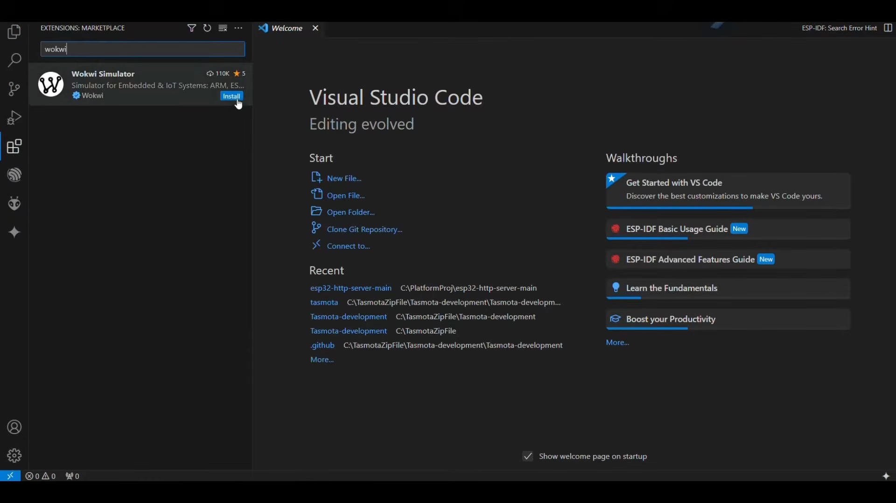

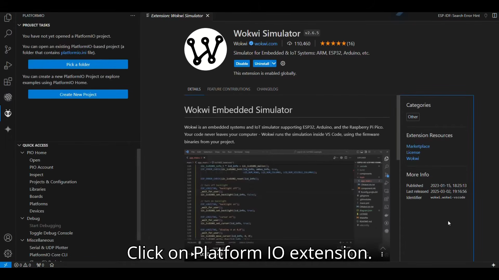

---

## 📁 ขั้นตอนที่ 2: สร้างโปรเจกต์ใหม่ด้วย PlatformIO

1. คลิกที่ไอคอน **PlatformIO** (ไอคอนหัวมด) ที่แถบเมนูด้านซ้าย
2. คลิกที่ **PIO Home** -> เลือก **Open** หรือกดปุ่ม **Create New Project**
3. ในหน้าต่าง **Project Wizard** ให้กรอกข้อมูลดังนี้:
   - **Name:** ตั้งชื่อโปรเจกต์ เช่น `Test`
   - **Board:** เลือก `DOIT ESP32 DEVKIT V1` (หรือ `Espressif ESP32 Dev Module`)
   - **Framework:** เลือก `Arduino`
   - **Location:** ติ๊กเลือก `Use default location` (หรือเลือกโฟลเดอร์ที่ต้องการ)
4. คลิกปุ่ม **Finish** แล้วรอให้ PlatformIO สร้างโครงสร้างโปรเจกต์จนเสร็จสมบูรณ์

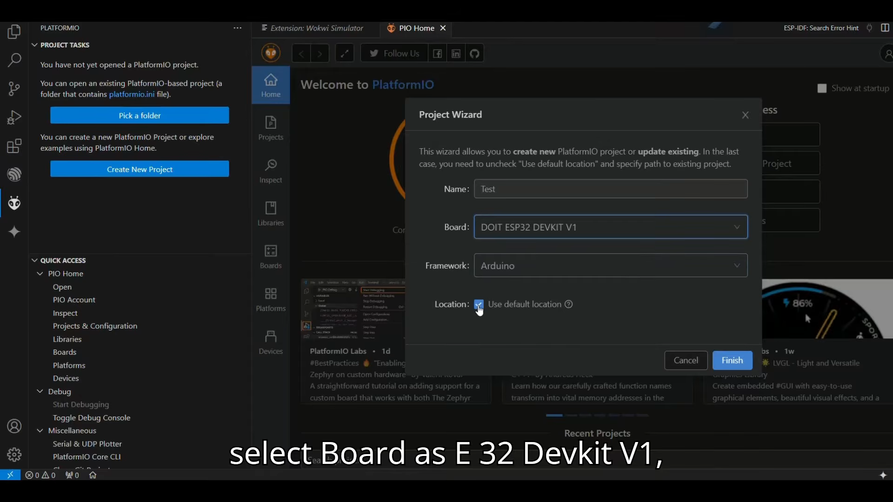

---

## 💻 ขั้นตอนที่ 3: เขียนโค้ดทดสอบใน `src/main.cpp`

1. ในหน้าต่าง Explorer ด้านซ้าย เข้าไปที่โฟลเดอร์ `src` แล้วเปิดไฟล์ `main.cpp`
2. ใส่โค้ดตัวอย่างควบคุมไฟกระพริบ LED (ตัวอย่างเชื่อมต่อที่ขา **GPIO 12**):

```cpp
#include <Arduino.h>

#define LED1 12

void setup() {
  // กำหนดให้ขา LED1 (GPIO 12) เป็น OUTPUT
  pinMode(LED1, OUTPUT);
}

void loop() {
  digitalWrite(LED1, HIGH);   // เปิดไฟ LED (จ่ายแรงดัน HIGH)
  delay(1000);                // หน่วงเวลา 1 วินาที
  digitalWrite(LED1, LOW);    // ปิดไฟ LED (จ่ายแรงดัน LOW)
  delay(1000);                // หน่วงเวลา 1 วินาที
}
```

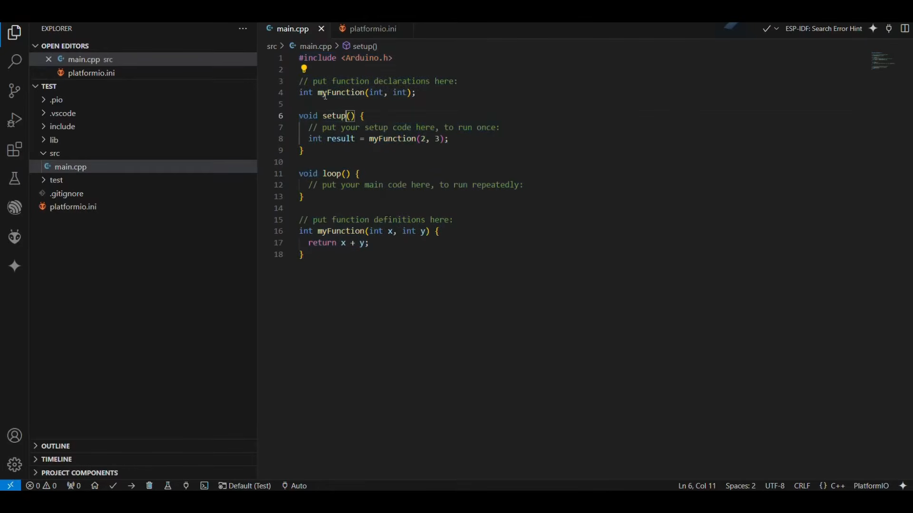

---

## ⚙️ ขั้นตอนที่ 4: Compile / Build โปรเจกต์

1. กดปุ่ม **Build** (ไอคอนเครื่องหมายถูก `✓` ที่แถบ Status Bar ด้านล่าง หรือคลิก `PlatformIO: Build` ในแถบคำสั่ง)
2. สังเกต Terminal ด้านล่าง ระบบจะคอมไพล์โค้ดจนขึ้นข้อความ `[SUCCESS]`
3. ระบบจะสร้างไฟล์ไบนารีสำหรับจำลองไว้ที่โฟลเดอร์:
   - `.pio/build/esp32doit-devkit-v1/firmware.bin`
   - `.pio/build/esp32doit-devkit-v1/firmware.elf`

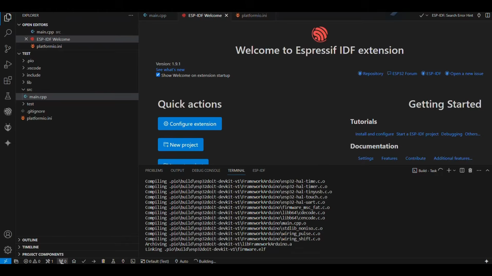

---

## 🔑 ขั้นตอนที่ 5: ขอรับและเปิดใช้งาน Wokwi License

1. กดปุ่ม `F1` หรือ `Ctrl+Shift+P` (Mac: `Cmd+Shift+P`) เพื่อเปิด Command Palette
2. พิมพ์ค้นหาและเลือกคำสั่ง **`Wokwi: Request a New License`**
3. เบราว์เซอร์จะเปิดหน้าเว็บ Wokwi ขึ้นมาโดยอัตโนมัติ ให้คลิกปุ่ม **"GET YOUR LICENSE"**
4. หน้าต่างเบราว์เซอร์จะแจ้งเตือนเพื่อเปิดกลับมายัง VS Code ให้กดยืนยัน **"Open"** หรือ **"Allow"**
5. ใน VS Code จะมีกล่องข้อความถามยืนยัน ให้คลิก **"Open"** ระบบจะเปิดใช้งาน Community License สำเร็จ

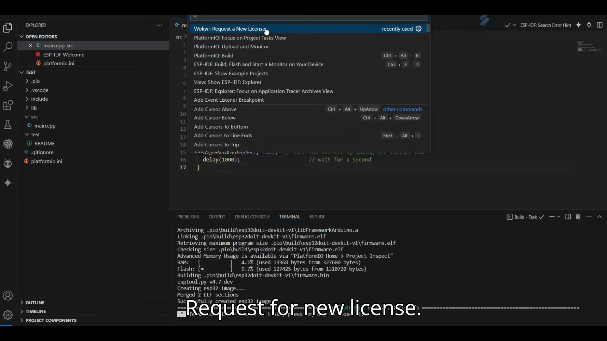

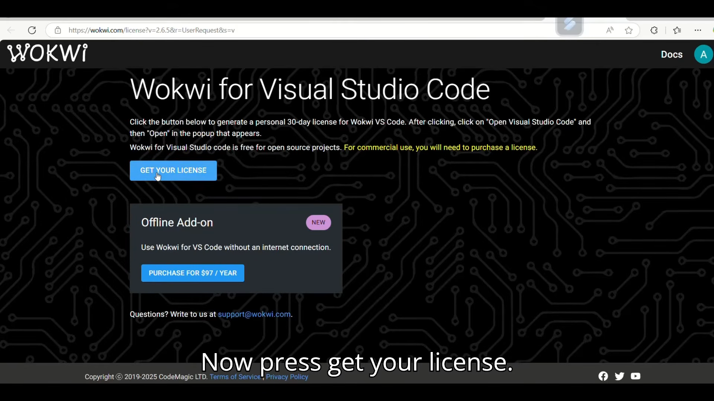

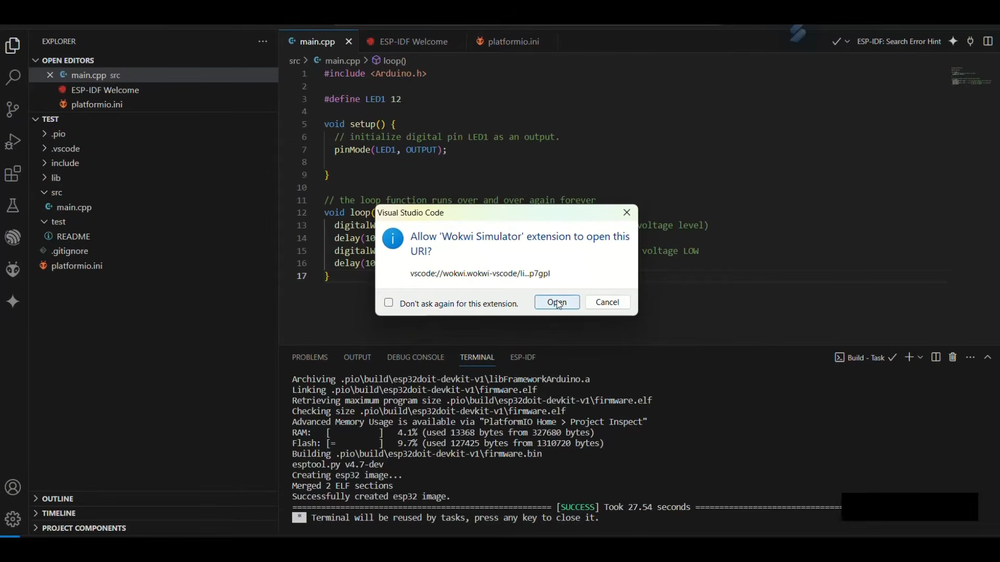

---

## 🔌 ขั้นตอนที่ 6: สร้างไฟล์วงจรจำลอง `diagram.json`

1. สร้างไฟล์ใหม่ชื่อ **`diagram.json`** ไว้ที่โฟลเดอร์ Root ของโปรเจกต์
2. คลิกขวาที่ไฟล์ `diagram.json` -> เลือก **Open With...** -> เลือก **Text Editor** (หรือเปิดแก้ไขไฟล์ตามปกติ)
3. ใส่เนื้อหา JSON สำหรับกำหนดอุปกรณ์และจุดเชื่อมต่อสายไฟ:

```json
{
  "version": 1,
  "author": "Anonymous maker",
  "editor": "wokwi",
  "parts": [
    { "type": "board-esp32-devkit-c-v4", "id": "esp", "top": 0, "left": 0, "attrs": {} },
    {
      "type": "wokwi-led",
      "id": "led1",
      "top": 102,
      "left": -111,
      "attrs": { "color": "red", "flip": "1" }
    },
    {
      "type": "wokwi-resistor",
      "id": "r1",
      "top": 138.35,
      "left": -67.2,
      "attrs": { "value": "1000" }
    },
    { "type": "wokwi-vcc", "id": "vcc1", "top": 106.36, "left": -153.6, "attrs": {} }
  ],
  "connections": [
    [ "esp:TX", "$serialMonitor:RX", "", [] ],
    [ "esp:RX", "$serialMonitor:TX", "", [] ],
    [ "vcc1:VCC", "led1:A", "red", [ "v0" ] ],
    [ "led1:C", "r1:1", "green", [ "v0" ] ],
    [ "esp:12", "r1:2", "green", [ "v0" ] ]
  ],
  "dependencies": {}
}
```

4. เมื่อบันทึกไฟล์และเปิดดู `diagram.json` ในหน้าต่าง Wokwi Diagram Editor จะเห็นภาพบอร์ด ESP32, ตัวต้านทาน (Resistor), หลอด LED สีแดง และสายไฟเชื่อมต่ออย่างชัดเจน

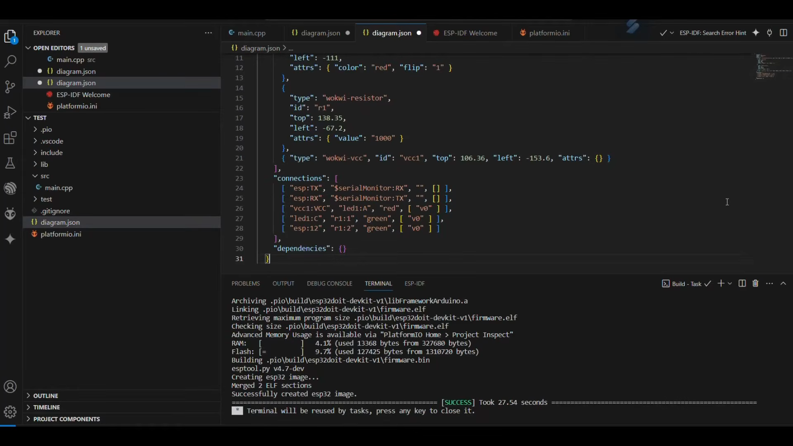

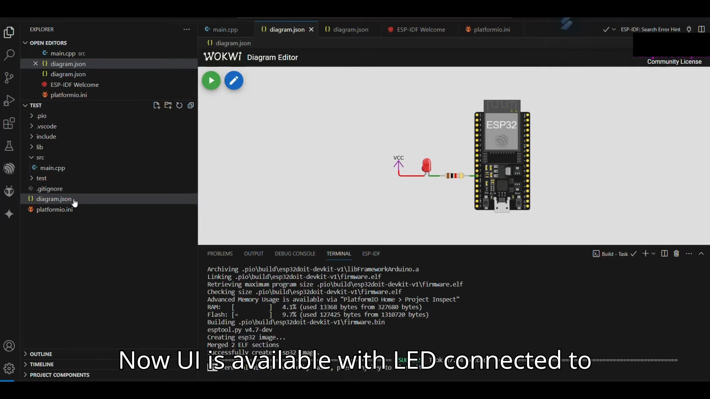

---

## 📄 ขั้นตอนที่ 7: สร้างไฟล์ตั้งค่า `wokwi.toml`

1. สร้างไฟล์ใหม่ชื่อ **`wokwi.toml`** ไว้ที่โฟลเดอร์ Root ของโปรเจกต์
2. ใส่การกำหนดค่าเพื่อชี้พาธไปยังไฟล์ไบนารีที่คอมไพล์จาก PlatformIO:

```toml
[wokwi]
version = 1
firmware = '.pio/build/esp32doit-devkit-v1/firmware.bin'
elf = '.pio/build/esp32doit-devkit-v1/firmware.elf'
```

> [!NOTE]
> บน Windows สามารถใช้ได้ทั้งเครื่องหมาย `/` หรือ `\` (เช่น `.pio\build\esp32doit-devkit-v1\firmware.bin`) ส่วนบน macOS/Linux ให้ใช้ `/`

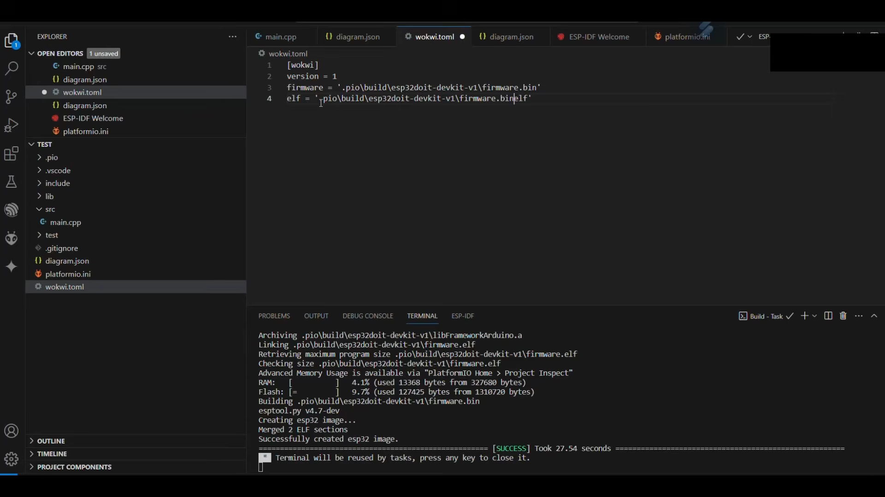

---

## ▶️ ขั้นตอนที่ 8: เริ่มรันการจำลอง (Run Simulation)

1. คลิกเปิดไฟล์ **`diagram.json`**
2. คลิกปุ่ม **Start Simulation (ปุ่ม Play สีเขียว)** ที่มุมบนซ้ายของหน้าจอ Wokwi
3. สังเกตไฟ LED สีแดงบนหน้าจอจำลองจะเริ่มกระพริบติด-ดับสลับกันทุก 1 วินาทีตามที่โค้ดสั่งการ
4. หน้าต่าง Terminal ด้านล่างจะแสดงสถานะการบูตของชิป ESP32

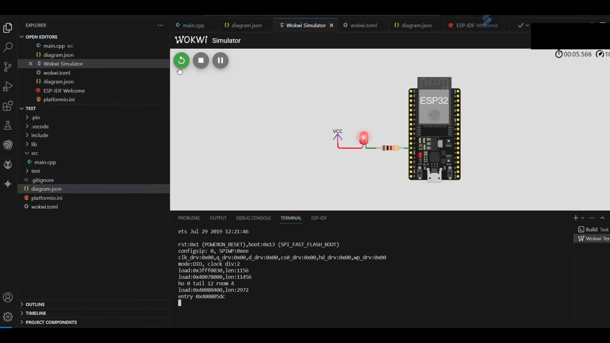

---

## 📡 ขั้นตอนที่ 9: ทดสอบการทำงานร่วมกับ Serial Monitor

1. แก้ไขไฟล์ `src/main.cpp` เพื่อเพิ่มการส่งข้อความผ่าน Serial Port:

```cpp
#include <Arduino.h>

#define LED1 12

void setup() {
  // กำหนดโหมดขาและเริ่มต้น Serial
  pinMode(LED1, OUTPUT);
  Serial.begin(9600);
}

void loop() {
  digitalWrite(LED1, HIGH);   // เปิดไฟ LED
  Serial.println("LED HIGH");
  delay(1000);

  digitalWrite(LED1, LOW);    // ปิดไฟ LED
  Serial.println("LED LOW");
  delay(1000);
}
```

2. กด **Build** โปรเจกต์ใหม่อีกครั้ง
3. กลับไปที่หน้า `diagram.json` แล้วกดปุ่ม **Start / Restart Simulation**
4. ในหน้าต่าง Wokwi Terminal ด้านล่าง จะเห็นข้อความ `LED HIGH` และ `LED LOW` ปรากฏขึ้นสลับกันแบบ Real-time

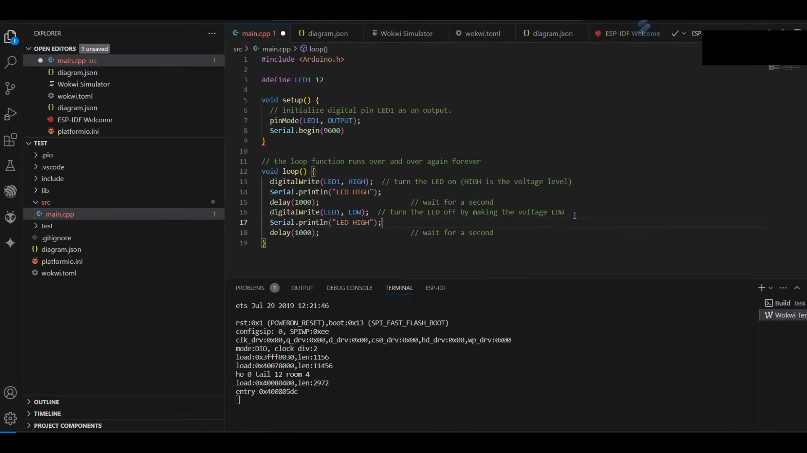


---

## 💡 สรุปโครงสร้างไฟล์โปรเจกต์ทั้งหมด

```text
Test/
├── .pio/
│   └── build/
│       └── esp32doit-devkit-v1/
│           ├── firmware.bin     <-- สร้างจากการ Build
│           └── firmware.elf     <-- สร้างจากการ Build
├── src/
│   └── main.cpp                 <-- โค้ดโปรแกรม Arduino C++
├── diagram.json                 <-- วงจรจำลองอุปกรณ์และสายไฟ
├── platformio.ini               <-- การตั้งค่าบอร์ด PlatformIO
└── wokwi.toml                   <-- ชี้ตำแหน่ง Firmware ให้ Wokwi
```
