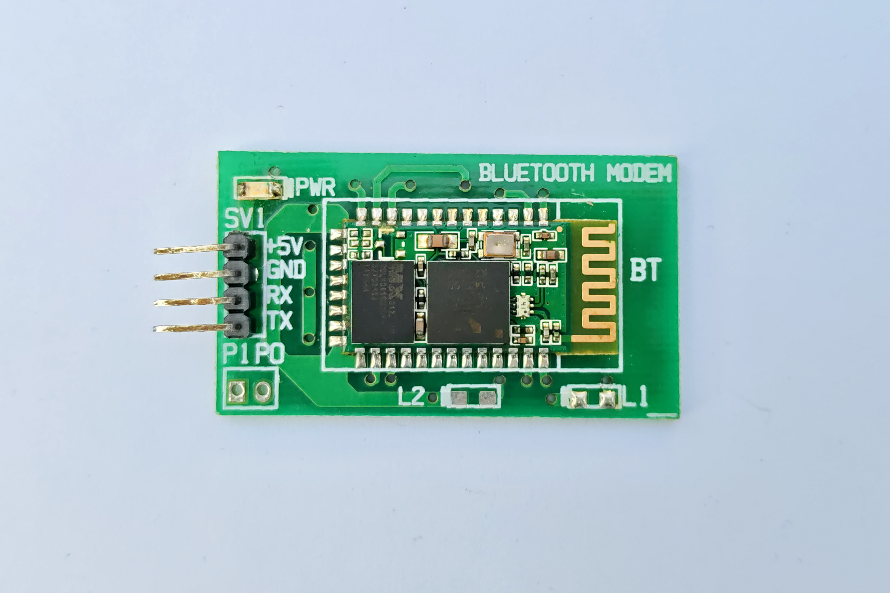
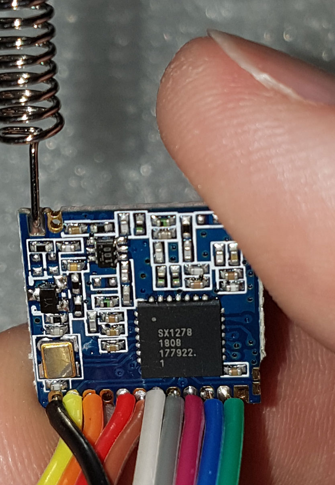
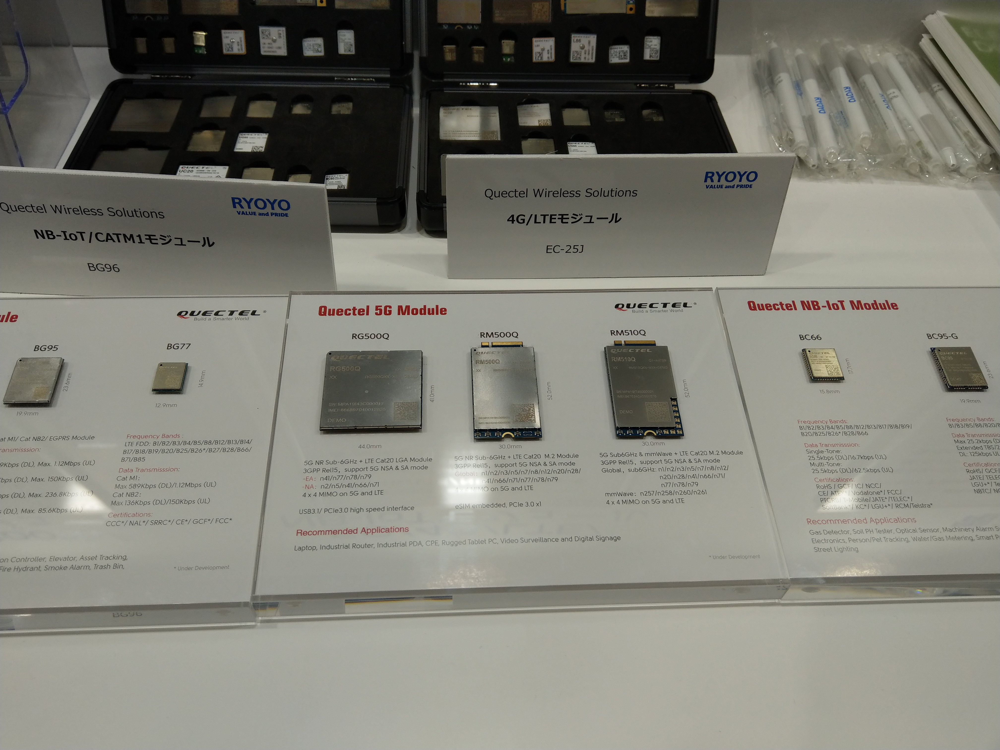

# Chapter 7: เทคโนโลยีไร้สายสำหรับ IoT
## Wireless Technologies for IoT

---

**วัตถุประสงค์การเรียนรู้ (Learning Objectives)**

1. อธิบายหลักการพื้นฐานของการสื่อสารไร้สาย ได้แก่ คลื่นความถี่ แบนด์วิดท์ ย่าน ISM และกลไกการลดทอนสัญญาณทางคณิตศาสตร์
2. เข้าใจและอธิบายรายละเอียดทางเทคนิคของเทคโนโลยี Wi-Fi, Bluetooth/BLE, Zigbee, LoRa/LoRaWAN และ Cellular IoT (NB-IoT/LTE-M/5G)
3. วิเคราะห์สถาปัตยกรรมการทำงานระดับโปรโตคอล เช่น โครงสร้าง GATT ของ BLE, โครงข่าย Mesh ของ Zigbee, การมอดูเลตแบบ CSS ของ LoRa และกระบวนการเชื่อมต่อ Wi-Fi (Handshake)
4. ประยุกต์ใช้ความรู้ด้านเทคโนโลยีไร้สายเพื่อออกแบบสถาปัตยกรรมระบบ IoT สำหรับงานทางวิศวกรรมเครื่องกลและอุตสาหกรรม (Mechanical and Industrial Engineering Case Studies)
5. พัฒนาและดีบักโค้ด Arduino C++ สำหรับบอร์ด ESP32 เพื่อเชื่อมต่อ Wi-Fi (DHCP/Static IP, Non-blocking Reconnection) และสร้าง BLE GATT Server ได้อย่างถูกต้องตามแนวปฏิบัติที่ดีที่สุด

---

<div class="chapter-tab-content" data-tab-name="Concept" data-tab-icon="💡" id="concept" markdown="1">

## 7.1 พื้นฐานการสื่อสารไร้สาย (Wireless Communication Fundamentals)

การสื่อสารไร้สาย (Wireless Communication) คือกระบวนการส่งและรับข้อมูลระหว่างอุปกรณ์โดยอาศัยคลื่นแม่เหล็กไฟฟ้า (Electromagnetic Waves) ซึ่งจะแพร่กระจายผ่านตัวกลางที่เป็นอากาศหรืออวกาศ แทนการใช้สายสัญญาณทางกายภาพ (เช่น สายทองแดง หรือสายไฟเบอร์ออปติก) การสื่อสารไร้สายคือหัวใจสำคัญในการปลดล็อกระบบ IoT เนื่องจากอุปกรณ์เซ็นเซอร์ในโรงงานอุตสาหกรรมหรือพื้นที่เกษตรกรรมมักติดตั้งอยู่ในจุดที่เคลื่อนไหว เข้าถึงยาก หรือมีค่าใช้จ่ายสูงหากต้องเดินสายสัญญาณ

### 7.1.1 คลื่นความถี่และย่าน ISM (RF & ISM Bands)

คลื่นวิทยุ (Radio Frequency — RF) เป็นส่วนหนึ่งของสเปกตรัมแม่เหล็กไฟฟ้า (Electromagnetic Spectrum) ที่อยู่ระหว่างความถี่ 3 kHz ถึง 300 GHz อุปกรณ์วิทยุทั่วไปจำเป็นต้องได้รับการควบคุมการใช้งานความถี่โดยหน่วยงานของรัฐ (เช่น กสทช. ในประเทศไทย) เพื่อป้องกันไม่ให้สัญญาณรบกวนกัน

อย่างไรก็ตาม เพื่อส่งเสริมการพัฒนาเทคโนโลยีและการใช้งานเชิงสาธารณะ จึงมีการกำหนดระดับสากลให้มี **ย่านความถี่ ISM (Industrial, Scientific, and Medical Band)** ซึ่งเป็นย่านความถี่ที่ไม่ต้องขอใบอนุญาต (Unlicensed Band) อนุญาตให้ทุกคนสามารถพัฒนาและใช้อุปกรณ์ส่งสัญญาณวิทยุในย่านนี้ได้ภายใต้ข้อกำหนดเรื่องกำลังส่งสูงสุด (Transmit Power Limit) ย่านความถี่ ISM ที่สำคัญในงาน IoT ได้แก่:

*   **ย่าน Sub-GHz (ความถี่ต่ำกว่า 1 GHz):**
    *   **433 MHz:** นิยมใช้ในรีโมตคอนโทรลรถยนต์ ระบบเปิด-ปิดประตูอัตโนมัติ และระบบสื่อสารระยะสั้น
    *   **868 MHz (ยุโรป) / 915 MHz (อเมริกา) / 920-925 MHz (ประเทศไทย - อ้างอิงตามมาตรฐาน กสทช. มท. 1031-2562):** เป็นย่านหลักสำหรับเทคโนโลยีระยะไกลพลังงานต่ำ เช่น LoRa และ Zigbee บางประเภท
    *   *ลักษณะเด่น:* ความยาวคลื่น (Wavelength) มีขนาดใหญ่ ทำให้สามารถสะท้อน เลี้ยวเบน (Diffraction) และทะลุผ่านสิ่งกีดขวาง เช่น ผนังคอนกรีต ต้นไม้ หรือโครงสร้างเหล็กได้ดีมาก มีระยะทางส่งไกลกว่าย่านความถี่สูงที่กำลังส่งเท่ากัน แต่แบนด์วิดท์ต่ำกว่า
*   **ย่าน 2.4 GHz (ความถี่ 2.400 GHz ถึง 2.4835 GHz):**
    *   เป็นย่านที่ใช้งานทั่วโลก (Global License-free) ใช้สำหรับ Wi-Fi (802.11b/g/n), Bluetooth/BLE และ Zigbee
    *   *ลักษณะเด่น:* มีแบนด์วิดท์ที่กว้างกว่า ส่งข้อมูลได้เร็วกว่าย่าน Sub-GHz แต่ความยาวคลื่นมีขนาดสั้น (~12.5 cm) ทำให้ถูกดูดซับโดยสิ่งกีดขวางได้ง่าย โดยเฉพาะน้ำและความชื้น (เนื่องจากโมเลกุลของน้ำมี resonance frequency ในย่านความถี่นี้พอดี) อีกทั้งยังมีปัญหาการรบกวนของสัญญาณที่แออัดเนื่องจากมีอุปกรณ์ใช้งานหนาแน่น
*   **ย่าน 5 GHz และ 6 GHz:**
    *   ใช้สำหรับ Wi-Fi ความเร็วสูง (Wi-Fi 5/6/7) มีช่องสัญญาณกว้างและไม่มีสัญญาณรบกวนจากอุปกรณ์บลูทูธ แต่ระยะทางส่งสั้นลงมากและมีความสามารถในการทะลุทะลวงผนังต่ำ

### 7.1.2 แบนด์วิดท์ (Bandwidth)

แบนด์วิดท์คือ **ความกว้างของช่วงความถี่ (Frequency Range)** ที่ใช้ในการรับส่งสัญญาณวิทยุ มีหน่วยวัดเป็นเฮิรตซ์ (Hz) เช่น ช่องสัญญาณ LoRa กว้าง 125 kHz ช่องสัญญาณ Wi-Fi กว้าง 20 MHz หรือ 40 MHz
ตามหลักการทางทฤษฎีสารสนเทศ (Shannon-Hartley Theorem):
$$C = B \log_2 \left(1 + \frac{S}{N}\right)$$
โดยที่ $C$ คือความจุช่องสัญญาณ (Channel Capacity - bps), $B$ คือแบนด์วิดท์ (Bandwidth - Hz) และ $S/N$ คืออัตราส่วนสัญญาณต่อสัญญาณรบกวน (Signal-to-Noise Ratio)
ดังนั้น ยิ่งแบนด์วิดท์กว้างขึ้น อัตราการรับส่งข้อมูล (Data Rate) สูงสุดก็จะยิ่งมากขึ้น แต่การใช้แบนด์วิดท์ที่กว้างจะทำให้อุปกรณ์รับสัญญาณรบกวน (Noise) เข้ามามากขึ้นเช่นกัน และจำเป็นต้องประมวลผลสัญญาณที่ซับซ้อนขึ้น ส่งผลให้กินพลังงานเพิ่มขึ้น

### 7.1.3 การลดทอนสัญญาณ (Signal Attenuation)

เมื่อคลื่นวิทยุเดินทางออกจากสายอากาศส่ง กำลังของสัญญาณจะลดทอนลงตามระยะทางและสิ่งแวดล้อม ปรากฏการณ์นี้อธิบายได้ด้วยทฤษฎีทางฟิสิกส์และคณิตศาสตร์ดังนี้:

#### 1. กฎกำลังสองผกผัน (Inverse Square Law)
ในสภาวะที่ไม่มีสิ่งกีดขวางและไม่มีการดูดซับของชั้นบรรยากาศ (Free Space) พลังงานคลื่นแม่เหล็กไฟฟ้าจะกระจายออกเป็นทรงกลมรอบสายอากาศแบบรอบตัว (Isotropic Antenna) ความเข้มของพลังงานต่อพื้นที่ผิวจะลดลงเป็นสัดส่วนผกผันกับระยะทางยกกำลังสอง:
$$P_r \propto \frac{P_t}{d^2}$$
โดยที่ $P_r$ คือกำลังสัญญาณที่ฝั่งรับ, $P_t$ คือกำลังสัญญาณที่ฝั่งส่ง และ $d$ คือระยะห่างระหว่างจุดส่งและจุดรับ

#### 2. แบบจำลองความสูญเสียในเส้นทางฟรีสเปซ (Free Space Path Loss — FSPL)
ความสูญเสียในเส้นทางฟรีสเปซ (FSPL) คือค่าการลดทอนของกำลังสัญญาณเมื่อคลื่นเดินทางผ่านพื้นที่ว่างโดยไม่มีสิ่งกีดขวาง คำนวณได้ดังนี้:
$$\text{FSPL} = \left(\frac{4\pi d}{\lambda}\right)^2 = \left(\frac{4\pi d f}{c}\right)^2$$
เมื่อแปลงให้อยู่ในรูปของสเกลลอการิทึม (เดซิเบล - dB) จะได้สูตรการคำนวณความสูญเสียดังนี้:
$$\text{FSPL (dB)} = 20\log_{10}(d) + 20\log_{10}(f) + 20\log_{10}\left(\frac{4\pi}{c}\right)$$
หากต้องการคำนวณกำลังสัญญาณที่ฝั่งรับ ($P_r$) โดยรวมผลของกำลังส่ง ($P_t$) และกำลังขยายของสายอากาศส่งและรับ ($G_t, G_r$ ในหน่วย dBi) จะใช้ **สมการส่งผ่านของฟรีส (Friis Transmission Equation)** ดังนี้:
$$P_r\text{ (dBm)} = P_t\text{ (dBm)} + G_t\text{ (dBi)} + G_r\text{ (dBi)} - \text{FSPL (dB)}$$

หากสมมติให้กำลังขยายของสายอากาศส่งและรับ ($G_t, G_r$) เท่ากับ $0\text{ dBi}$ และแทนค่าความเร็วแสง $c \approx 3 \times 10^8\text{ m/s}$ จะได้สูตรแบบง่ายเมื่อระยะทาง $d$ เป็นเมตร (m) และความถี่ $f$ เป็นเฮิรตซ์ (Hz):
$$\text{FSPL (dB)} = 20\log_{10}(d) + 20\log_{10}(f) - 147.56$$
และหากแปลงหน่วยระยะทางเป็นกิโลเมตร ($d_{\text{km}}$) และความถี่เป็นเมกะเฮิรตซ์ ($f_{\text{MHz}}$) จะได้สูตรมาตรฐานที่ใช้ในงานวิศวกรรมวิทยุ:
$$\text{FSPL (dB)} = 20\log_{10}(d_{\text{km}}) + 20\log_{10}(f_{\text{MHz}}) + 32.44$$
*การวิเคราะห์จากสมการ:* หากความถี่สูงขึ้น ($f$ เพิ่มขึ้น) ความสูญเสียในสเปซจะเพิ่มขึ้นตามลอการิทึม นี่เป็นเหตุผลว่าทำไมย่าน Sub-GHz (เช่น 923 MHz) จึงมีค่าการลดทอนที่ต่ำกว่าและเดินทางได้ไกลกว่าย่าน 2.4 GHz มากที่ระดับกำลังส่งเท่ากัน

#### 3. ค่า RSSI (Received Signal Strength Indicator)
RSSI คือระดับกำลังสัญญาณที่เครื่องรับสแกนและวัดได้ มีหน่วยเป็น **dBm (Decibels relative to 1 milliwatt)** เป็นค่าลอการิทึมที่เทียบกำลังไฟกับ 1 มิลลิวัตต์:
$$\text{Power (dBm)} = 10\log_{10}\left(\frac{P_{\text{mW}}}{1\text{ mW}}\right)$$
*   $0\text{ dBm} = 1\text{ mW}$
*   $-30\text{ dBm} = 1\text{ }\mu\text{W}$ (ระดับสัญญาณดีเยี่ยม มักอยู่ใกล้เครื่องส่งมาก)
*   $-70\text{ dBm} = 0.1\text{ nW}$ (ระดับสัญญาณปานกลาง ใช้งานทั่วไปได้เสถียร)
*   $-90\text{ dBm}$ ถึง $-100\text{ dBm}$ (ระดับสัญญาณอ่อนมาก มีโอกาสที่ข้อมูลจะสูญหายสูง หรือเชื่อมต่อหลุด)
*   $-120\text{ dBm}$ ขึ้นไป (สัญญาณต่ำมากจนใกล้เคียงระดับ Noise Floor วิทยุทั่วไปไม่สามารถถอดรหัสได้ ยกเว้น LoRa ที่มีกลไกพิเศษ)

#### 4. SNR (Signal-to-Noise Ratio)
SNR คืออัตราส่วนระหว่างกำลังของสัญญาณที่ต้องการรับเทียบกับกำลังของสัญญาณรบกวน (Noise floor) มีหน่วยเป็นเดซิเบล (dB):
$$\text{SNR (dB)} = P_{\text{signal (dBm)}} - P_{\text{noise (dBm)}}$$
*   **ค่า SNR เป็นบวก (เช่น +10 dB):** สัญญาณมีความแรงกว่าสัญญาณรบกวน ถอดรหัสข้อมูลได้ง่าย
*   **ค่า SNR เป็นศูนย์หรือติดลบ (เช่น -5 dB):** สัญญาณมีความแรงเท่ากันหรือน้อยกว่าสัญญาณรบกวน ในวิทยุทั่วไป (เช่น Wi-Fi) จะไม่สามารถใช้งานได้ แต่ LoRa สามารถถอดรหัสสัญญาณที่ติดลบได้ถึง -20 dB เนื่องจากประสิทธิภาพของการมอดูเลตแบบ CSS

---

## 7.2 Wi-Fi

Wi-Fi คือเทคโนโลยีเครือข่ายไร้สายระยะใกล้ถึงปานกลางที่ได้รับความนิยมสูงที่สุด ออกแบบมาตามมาตรฐานของสมาคม IEEE ในรหัสกลุ่ม **802.11** โดยเน้นการให้บริการรับส่งข้อมูลความเร็วสูงและเชื่อมโยงเข้ากับเครือข่ายอินเทอร์เน็ตผ่านโครงสร้างพื้นฐานที่มีอยู่เดิม (Access Point และ Router)

### 7.2.1 รายละเอียดมาตรฐาน IEEE 802.11 แต่ละยุค

ความต้องการใช้งานในระบบ IoT แตกต่างจากคอมพิวเตอร์ทั่วไป บางงานต้องการอัตราข้อมูลที่สูงมาก (เช่น กล้องวงจรปิด IP) แต่บางงานต้องการระยะทางไกลและการประหยัดพลังงาน มาตรฐานวิทยุ 802.11 จึงได้รับการปรับปรุงและพัฒนาออกมาหลายรุ่นย่อย ดังแสดงในตารางเปรียบเทียบ:

| มาตรฐาน | ชื่อยุค (Generational Name) | ช่วงความถี่หลัก (Frequency) | ความกว้างช่องสัญญาณ (Channel Width) | อัตราส่งข้อมูลสูงสุด (Max Data Rate) | ระยะทางใช้งานทั่วไป (Typical Range) | จุดประสงค์และลักษณะการใช้งานในระบบ IoT |
|---|---|---|---|---|---|---|
| **802.11b** | Wi-Fi 1 | 2.4 GHz | 22 MHz | 11 Mbps | ~35 m (ในอาคาร) | ยุคบุกเบิก ใช้การมอดูเลตแบบ DSSS ทนทานต่อการรบกวนระดับหนึ่ง แต่ความเร็วต่ำมาก ปัจจุบันยังพบในระบบ legacy |
| **802.11g** | Wi-Fi 3 | 2.4 GHz | 20 MHz | 54 Mbps | ~38 m (ในอาคาร) | เปลี่ยนมาใช้การมอดูเลตแบบ OFDM อัตราข้อมูลสูงขึ้น เข้ากันได้กับอุปกรณ์ 802.11b ยึดเป็นมาตรฐานวิทยุพื้นฐาน |
| **802.11n** | Wi-Fi 4 | 2.4 GHz / 5 GHz | 20 MHz, 40 MHz | 72 - 600 Mbps | ~70 m (ในอาคาร) | **รองรับโดยชิป ESP32** เพิ่มเทคโนโลยี MIMO (Multi-Input Multi-Output) ใช้สายอากาศหลายต้น ส่งสัญญาณครอบคลุมและมีประสิทธิภาพสูงสุดในย่าน 2.4 GHz |
| **802.11ac** | Wi-Fi 5 | 5 GHz | 20, 40, 80, 160 MHz | 433 Mbps - 6.93 Gbps | ~35 m (ในอาคาร) | เน้นส่งข้อมูลเร็วสูงมากเฉพาะในย่าน 5 GHz ลดสัญญาณรบกวนจากอุปกรณ์อื่น แต่ระยะทางสั้นลงและทะลุผนังปูนได้แย่ |
| **802.11ax** | Wi-Fi 6 / 6E | 2.4 GHz / 5 GHz / 6 GHz | 20 - 160 MHz | Up to 9.6 Gbps | ~30 m (ในอาคาร) | ใช้เทคโนโลยี OFDMA และ 1024-QAM จัดการช่องสัญญาณที่มีอุปกรณ์หนาแน่นได้ดีขึ้น เหมาะกับโรงงานอัจฉริยะที่มีจุดเซ็นเซอร์ Wi-Fi เป็นร้อยจุด |
| **802.11ah** | Wi-Fi HaLow | Sub-1 GHz (920-925 MHz ในไทย) | 1, 2, 4, 8, 16 MHz | 150 kbps - 8.7 Mbps | **~1 km** | **พัฒนาเพื่อ IoT โดยเฉพาะ** ทำงานที่ย่านความถี่ต่ำ ประหยัดพลังงานมาก รองรับโหมด Sleep ระยะไกลมาก เหมาะกับงานเกษตรกรรมและโรงงานขนาดใหญ่ |

### 7.2.2 สถาปัตยกรรมการทำงานของ Wi-Fi ใน ESP32

ไมโครคอนโทรลเลอร์ ESP32 มีชิปวิทยุ Wi-Fi 802.11b/g/n ในตัว รองรับโหมดการทำงาน 3 รูปแบบหลัก ซึ่งนักพัฒนาสามารถประยุกต์ใช้งานได้ตามความเหมาะสม:

1.  **Station Mode (STA):** ESP32 ทำงานเป็นอุปกรณ์ลูกข่าย (Client) เชื่อมต่อเข้ากับ Access Point (AP) หรือเราเตอร์ในบ้านหรือโรงงานเพื่อเข้าสู่เครือข่าย LAN/Internet โหมดนี้เหมาะสำหรับส่งข้อมูลขึ้น Cloud
2.  **Access Point Mode (AP):** ESP32 ทำหน้าที่เป็นจุดกระจายสัญญาณ สร้างเครือข่าย Wi-Fi ท้องถิ่นของตัวเองและจ่าย IP Address ให้อุปกรณ์อื่น (เช่น โน้ตบุ๊ก หรือ สมาร์ตโฟน) เชื่อมต่อเข้ามา โหมดนี้มักนิยมใช้ในการกำหนดค่าเริ่มต้นให้บอร์ด (Configuration Mode) เช่น ผู้ใช้ต่อ Wi-Fi ของบอร์ดเพื่อกรอกรหัสผ่าน Wi-Fi บ้านผ่านหน้าเว็บเบราว์เซอร์
3.  **AP+STA Dual Mode:** ESP32 ทำงานทั้งสองโหมดพร้อมกัน ช่วยให้บอร์ดสามารถเชื่อมต่อเครือข่ายภายนอกเพื่อทำงานหลักได้ ในขณะเดียวกันก็ยังเปิดช่องทางให้ช่างเทคนิคเชื่อมต่อไร้สายเข้ามาตรวจสอบหรือตั้งค่าการทำงาน (Diagnostic Interface) ได้โดยตรง

### 7.2.3 ขั้นตอนการเชื่อมต่อเครือข่าย Wi-Fi (Wi-Fi Connection Process)

ก่อนที่อุปกรณ์ Wi-Fi Client (เช่น ESP32) จะสามารถส่งข้อมูลผ่านเครือข่ายได้ จะต้องผ่านกระบวนการเชื่อมต่อ (Link Layer Connection) 4 ขั้นตอนดังนี้:

<div style="text-align: center; margin: 20px 0;">
<svg id="ch6-svg1" viewBox="0 0 760 510" width="100%" height="auto" xmlns="http://www.w3.org/2000/svg" font-family="'IBM Plex Sans Thai', system-ui, sans-serif">
  <title>กระบวนการ Wi-Fi Handshake</title>
  <style>
    #ch6-svg1 .svg1-bg { fill: #f8fafc; stroke: #cbd5e1; stroke-width: 1.5; }
    #ch6-svg1 .svg1-mcu { fill: #faf5ff; stroke: #7c3aed; stroke-width: 2; }
    #ch6-svg1 .svg1-comp { fill: #ffffff; stroke: #334155; stroke-width: 2; }
    #ch6-svg1 .svg1-title { font-size: 14px; font-weight: 700; fill: #7c3aed; text-anchor: middle; }
    #ch6-svg1 .svg1-sub { font-size: 11px; fill: #334155; text-anchor: middle; }
    #ch6-svg1 .svg1-lifeline { stroke: #334155; stroke-width: 2; stroke-dasharray: 5 4; }
    #ch6-svg1 .svg1-arrow { stroke: #334155; stroke-width: 2.5; stroke-linecap: round; }
    #ch6-svg1 .svg1-head { fill: #334155; }
    #ch6-svg1 .svg1-msg { font-size: 11px; fill: #334155; font-weight: 600; text-anchor: middle; }
    #ch6-svg1 .svg1-num-bg { fill: #ffffff; stroke: #334155; stroke-width: 1.5; }
    #ch6-svg1 .svg1-num { font-size: 10px; fill: #334155; font-weight: bold; text-anchor: middle; }
    #ch6-svg1 .svg1-phase { font-size: 10.5px; fill: #334155; font-weight: bold; text-anchor: middle; }
    #ch6-svg1 .svg1-pkt-req {
      fill: none; stroke: #f59e0b; stroke-width: 3.5; stroke-linecap: round;
      stroke-dasharray: 10 12;
      animation: svg1-march-r 2.4s linear infinite;
    }
    #ch6-svg1 .svg1-pkt-resp {
      fill: none; stroke: #16a34a; stroke-width: 3.5; stroke-linecap: round;
      stroke-dasharray: 10 12;
      animation: svg1-march-l 2.4s linear infinite;
    }
    #ch6-svg1 .svg1-pkt-both {
      fill: none; stroke: #7c3aed; stroke-width: 3.5; stroke-linecap: round;
      stroke-dasharray: 10 12;
      animation: svg1-march-r 2s linear infinite;
    }
    @keyframes svg1-march-r { to { stroke-dashoffset: -44; } }
    @keyframes svg1-march-l { to { stroke-dashoffset: 44; } }
  </style>
  <rect x="5" y="5" width="750" height="500" rx="12" class="svg1-bg"/>
  <rect x="18" y="110" width="100" height="78" rx="4" class="svg1-comp"/>
  <text x="68" y="137" class="svg1-phase">① สแกนสัญญาณ</text>
  <text x="68" y="153" class="svg1-phase">(Scanning)</text>
  <text x="68" y="169" class="svg1-phase">Probe Req/Resp</text>
  <rect x="18" y="205" width="100" height="60" rx="4" class="svg1-comp"/>
  <text x="68" y="228" class="svg1-phase">② พิสูจน์สิทธิ์</text>
  <text x="68" y="244" class="svg1-phase">(Authentication)</text>
  <rect x="18" y="280" width="100" height="60" rx="4" class="svg1-comp"/>
  <text x="68" y="303" class="svg1-phase">③ เชื่อมโยง</text>
  <text x="68" y="319" class="svg1-phase">(Association)</text>
  <rect x="18" y="355" width="100" height="120" rx="4" class="svg1-comp"/>
  <text x="68" y="378" class="svg1-phase">④ เข้ารหัสลับ</text>
  <text x="68" y="394" class="svg1-phase">4-Way Handshake</text>
  <text x="68" y="410" class="svg1-phase">(WPA2/WPA3)</text>
  <line x1="210" y1="95" x2="210" y2="490" class="svg1-lifeline"/>
  <line x1="570" y1="95" x2="570" y2="490" class="svg1-lifeline"/>
  <rect x="140" y="28" width="140" height="58" rx="8" class="svg1-mcu"/>
  <text x="210" y="52" class="svg1-title">ลูกข่าย Wi-Fi</text>
  <text x="210" y="70" class="svg1-sub">(ESP32 Station)</text>
  <rect x="500" y="28" width="140" height="58" rx="8" class="svg1-mcu"/>
  <text x="570" y="52" class="svg1-title">จุดเข้าใช้งาน</text>
  <text x="570" y="70" class="svg1-sub">(Access Point — AP)</text>
  <line x1="210" y1="130" x2="558" y2="130" class="svg1-arrow"/>
  <polygon points="558,126 570,130 558,134" class="svg1-head"/>
  <path d="M 210 130 L 570 130" class="svg1-pkt-req"/>
  <circle cx="175" cy="130" r="10" class="svg1-num-bg"/>
  <text x="175" y="134" class="svg1-num">1</text>
  <text x="390" y="122" class="svg1-msg">Probe Request — ค้นหาสัญญาณ AP</text>
  <line x1="570" y1="165" x2="222" y2="165" class="svg1-arrow"/>
  <polygon points="222,161 210,165 222,169" class="svg1-head"/>
  <path d="M 570 165 L 210 165" class="svg1-pkt-resp"/>
  <circle cx="605" cy="165" r="10" class="svg1-num-bg"/>
  <text x="605" y="169" class="svg1-num">2</text>
  <text x="390" y="157" class="svg1-msg">Probe Response — ตอบกลับความพร้อม</text>
  <line x1="210" y1="220" x2="558" y2="220" class="svg1-arrow"/>
  <polygon points="558,216 570,220 558,224" class="svg1-head"/>
  <path d="M 210 220 L 570 220" class="svg1-pkt-req"/>
  <circle cx="175" cy="220" r="10" class="svg1-num-bg"/>
  <text x="175" y="224" class="svg1-num">3</text>
  <text x="390" y="212" class="svg1-msg">Authentication Request — ขอพิสูจน์สิทธิ์</text>
  <line x1="570" y1="253" x2="222" y2="253" class="svg1-arrow"/>
  <polygon points="222,249 210,253 222,257" class="svg1-head"/>
  <path d="M 570 253 L 210 253" class="svg1-pkt-resp"/>
  <circle cx="605" cy="253" r="10" class="svg1-num-bg"/>
  <text x="605" y="257" class="svg1-num">4</text>
  <text x="390" y="245" class="svg1-msg">Authentication Response — ยืนยันสิทธิ์เบื้องต้น</text>
  <line x1="210" y1="294" x2="558" y2="294" class="svg1-arrow"/>
  <polygon points="558,290 570,294 558,298" class="svg1-head"/>
  <path d="M 210 294 L 570 294" class="svg1-pkt-req"/>
  <circle cx="175" cy="294" r="10" class="svg1-num-bg"/>
  <text x="175" y="298" class="svg1-num">5</text>
  <text x="390" y="286" class="svg1-msg">Association Request — ขอเชื่อมต่อลิงก์</text>
  <line x1="570" y1="327" x2="222" y2="327" class="svg1-arrow"/>
  <polygon points="222,323 210,327 222,331" class="svg1-head"/>
  <path d="M 570 327 L 210 327" class="svg1-pkt-resp"/>
  <circle cx="605" cy="327" r="10" class="svg1-num-bg"/>
  <text x="605" y="331" class="svg1-num">6</text>
  <text x="390" y="319" class="svg1-msg">Association Response — ยอมรับลิงก์สำเร็จ</text>
  <rect x="185" y="356" width="400" height="118" rx="4" class="svg1-comp"/>
  <text x="385" y="375" class="svg1-msg">กระบวนการ EAPOL 4-Way Handshake (WPA2/WPA3)</text>
  <line x1="210" y1="393" x2="558" y2="393" class="svg1-arrow"/>
  <polygon points="558,389 570,393 558,397" class="svg1-head"/>
  <path d="M 210 393 L 570 393" class="svg1-pkt-both"/>
  <text x="390" y="387" class="svg1-msg" style="font-size:9.5px;">Msg 1: ANonce (AP → Client)</text>
  <line x1="570" y1="418" x2="222" y2="418" class="svg1-arrow"/>
  <polygon points="222,414 210,418 222,422" class="svg1-head"/>
  <path d="M 570 418 L 210 418" class="svg1-pkt-both" style="animation-direction:reverse;"/>
  <text x="390" y="412" class="svg1-msg" style="font-size:9.5px;">Msg 2: SNonce + MIC (Client → AP)</text>
  <line x1="210" y1="443" x2="558" y2="443" class="svg1-arrow"/>
  <polygon points="558,439 570,443 558,447" class="svg1-head"/>
  <path d="M 210 443 L 570 443" class="svg1-pkt-both"/>
  <text x="390" y="437" class="svg1-msg" style="font-size:9.5px;">Msg 3: GTK + MIC (AP → Client)</text>
  <line x1="570" y1="462" x2="222" y2="462" class="svg1-arrow"/>
  <polygon points="222,458 210,462 222,466" class="svg1-head"/>
  <path d="M 570 462 L 210 462" class="svg1-pkt-both" style="animation-direction:reverse;"/>
  <text x="390" y="456" class="svg1-msg" style="font-size:9.5px;">Msg 4: ACK — คีย์ PTK ใช้งานได้แล้ว</text>
  <circle cx="175" cy="415" r="10" class="svg1-num-bg"/>
  <text x="175" y="419" class="svg1-num">7</text>
</svg>
</div>

1.  **Scanning (การค้นหาสัญญาณ):** Client ทำการกวาดช่องความถี่เพื่อค้นหา AP ที่กำลังทำงาน
    *   *Passive Scanning:* รอฟังสัญญาณ **Beacon Frame** ที่ AP ส่งออกมาเป็นรอบเวลาปกติ (ปกติทุก 100 ms)
    *   *Active Scanning:* Client ส่งเฟรม **Probe Request** ออกไปในทุกช่องความถี่ แล้วรอฟัง **Probe Response** ตอบกลับจาก AP ที่มี SSID ตรงกับที่ต้องการค้นหา
2.  **Authentication (การพิสูจน์สิทธิ์ระดับลิงก์):** เป็นขั้นตอนเริ่มต้นเพื่อสร้างความน่าเชื่อถือระดับวิทยุ ซึ่งส่วนใหญ่มักเป็นระบบ *Open System Authentication* (ยอมรับการเชื่อมต่อวิทยุกับอุปกรณ์ทุกตัวโดยยังไม่ได้ตรวจสอบรหัสผ่านจริง)
3.  **Association (การเชื่อมโยงสถานะ):** Client ส่งเฟรม **Association Request** เพื่อขอบันทึกสถานะการเชื่อมต่อกับ AP เมื่อ AP ตอบรับด้วย **Association Response** ทั้งคู่จะถือว่ามีการเชื่อมต่อทางกายภาพทางวิทยุสำเร็จ
4.  **4-Way Handshake (กระบวนการแลกเปลี่ยนกุญแจเข้ารหัสลับ):** ในกรณีที่เครือข่ายใช้การเข้ารหัสแบบความปลอดภัยสูง (เช่น WPA2 หรือ WPA3 Personal) จะเกิดการแลกเปลี่ยนข้อมูล 4 ขั้นตอนระหว่าง AP และ Client โดยไม่มีการส่งรหัสผ่านจริงผ่านอากาศ แต่ใช้รหัสผ่าน (PSK) ร่วมกับค่าสุ่ม (ANonce และ SNonce) เพื่อคำนวณและสร้างคีย์ชั่วคราว **PTK (Pairwise Transient Key)** เพื่อใช้เข้ารหัสข้อมูลในการสื่อสารหลังจากนั้น ป้องกันการดักจับข้อมูลและการโจมตีแบบ Replay Attack

### 7.2.4 ความปลอดภัย WPA3 และ MU-MIMO

#### WPA3 (Wi-Fi Protected Access 3)
WPA3 เป็นมาตรฐานความปลอดภัยล่าสุดที่ประกาศโดย Wi-Fi Alliance ในปี 2018 มีการปรับปรุงสำคัญเหนือ WPA2:

*   **SAE (Simultaneous Authentication of Equals):** แทนที่ PSK handshake แบบเดิม ใช้กลไก Dragonfly Key Exchange ซึ่งทนทานต่อการโจมตีแบบ Offline Dictionary Attack และ KRACK (Key Reinstallation Attack) เนื่องจากแต่ละ session ใช้คีย์ชั่วคราวที่ไม่ซ้ำกัน (Forward Secrecy)
*   **Enhanced Open (OWE):** สำหรับเครือข่ายสาธารณะที่ไม่ต้องใช้รหัสผ่าน OWE ยังคงเข้ารหัสข้อมูลแต่ละการเชื่อมต่อแยกกัน ป้องกันการดักจับของผู้ร่วมใช้เครือข่ายเดียวกัน
*   **192-bit Security Suite:** สำหรับองค์กรระดับสูง รองรับ GCMP-256 และ HMAC-SHA-384

#### MU-MIMO (Multi-User MIMO)
เทคโนโลยี MIMO ใน Wi-Fi 4 (802.11n) เป็นแบบ **SU-MIMO (Single-User MIMO)** ซึ่ง AP สามารถส่งสัญญาณหาอุปกรณ์เดียวต่อรอบเวลาเท่านั้น ส่วน **MU-MIMO (Multi-User MIMO)** ที่เริ่มใช้ใน Wi-Fi 5 (802.11ac Wave 2) และปรับปรุงใน Wi-Fi 6 (802.11ax) ช่วยให้ AP สามารถ:

*   ส่งสัญญาณหาอุปกรณ์หลายตัวพร้อมกัน **ในรอบเวลาเดียว** โดยใช้ Beamforming ชี้ทิศทางสัญญาณแยกกัน
*   Wi-Fi 6 รองรับ **8×8 Downlink MU-MIMO** และ **4×4 Uplink MU-MIMO** ทำให้ throughput รวมของ AP เพิ่มขึ้นอย่างมากในสภาพแวดล้อมที่มีอุปกรณ์หนาแน่น

| เทคโนโลยี | จำนวน Spatial Streams | ทิศทาง | ประโยชน์หลัก |
|---|---|---|---|
| SU-MIMO (Wi-Fi 4) | สูงสุด 4 streams ต่อ 1 user | DL เท่านั้น | เพิ่ม throughput ต่ออุปกรณ์ |
| DL MU-MIMO (Wi-Fi 5) | 4 users × 4 streams | DL เท่านั้น | ลดคอขวดใน Downlink |
| UL+DL MU-MIMO (Wi-Fi 6) | 8 users × 8 streams | DL + UL | ประสิทธิภาพสูงสุดในโรงงาน IoT |

### 7.2.5 โหมดการประหยัดพลังงาน Wi-Fi ของ ESP32

ESP32 มีโหมดจัดการพลังงานสำหรับวิทยุ Wi-Fi อยู่ 3 ระดับ นักพัฒนาสามารถเลือกให้เหมาะกับงานได้:

| โหมด | กลไก | การสิ้นเปลืองกระแส (approx.) | กรณีใช้งาน |
|---|---|---|---|
| **Modem Sleep** | วงจร Wi-Fi ปิด-เปิดตามกรอบ DTIM Beacon (ตั้งค่าได้ 1-10) แต่ CPU ยังทำงาน | ~15-20 mA (เฉลี่ย) | เซ็นเซอร์ที่ต้องส่งข้อมูลทุกไม่กี่วินาที |
| **Light Sleep** | CPU หยุดชั่วคราว วิทยุปิดระหว่างรอ DTIM ระบบตื่นจากตัวจับเวลาหรือ GPIO | ~0.8-2 mA (เฉลี่ย) | งานที่ตื่น-หลับเป็นรอบ ยังต้องรักษาการเชื่อมต่อ Wi-Fi |
| **Deep Sleep** | ปิดทุกอย่างยกเว้น RTC (Real-Time Clock) วิทยุตัดการเชื่อมต่อทั้งหมด | ~10-150 µA | เซ็นเซอร์แบตเตอรี่ที่ส่งข้อมูลเป็นนาทีหรือชั่วโมง ต้องเชื่อมต่อ Wi-Fi ใหม่ทุกครั้ง |

```cpp
// ตัวอย่างการตั้งค่า Modem Sleep
WiFi.setSleep(true);  // เปิด Modem Sleep อัตโนมัติตาม DTIM

// ตัวอย่างการเข้า Light Sleep 10 วินาที
esp_sleep_enable_timer_wakeup(10 * 1000000ULL);
esp_light_sleep_start();

// ตัวอย่างการเข้า Deep Sleep 30 วินาที
esp_sleep_enable_timer_wakeup(30 * 1000000ULL);
esp_deep_sleep_start(); // หลังจากนี้ ESP32 จะ reset ใหม่เมื่อตื่น
```

### 7.2.6 การกำหนดค่า IP: DHCP vs Static IP

หลังจากเชื่อมโยงระดับลิงก์สำเร็จ อุปกรณ์จำเป็นต้องได้รับ IP Address ในระดับ Network Layer เพื่อให้สามารถจัดส่งแพ็กเกจข้อมูลในเครือข่าย TCP/IP ได้:

*   **DHCP (Dynamic Host Configuration Protocol):** เป็นค่าเริ่มต้นที่อุปกรณ์ใช้งานทั่วไป โดย ESP32 จะส่งคำขอแบบ Broadcast ไปในเครือข่ายเพื่อขอรับ IP Address, Subnet Mask, Gateway และ DNS Server จากอุปกรณ์เราเตอร์หรือ DHCP Server ขั้นตอนนี้มีข้อดีคือมีความยืดหยุ่นสูง ป้องกันปัญหา IP ซ้ำซ้อน (IP Conflict) แต่มีข้อจำกัดคือ IP ของ ESP32 อาจเปลี่ยนไปทุกครั้งที่บอร์ดรีบูตเครื่อง
*   **Static IP (ที่อยู่ IP คงที่):** เป็นการกำหนดค่าคงที่ลงในโค้ดของบอร์ดโดยตรง ข้อดีคือเราจะทราบ IP ของบอร์ดที่แน่นอนตลอดเวลา ทำให้เครื่องคอมพิวเตอร์หรือเซิร์ฟเวอร์ตัวอื่นสามารถวิ่งมาดึงข้อมูล (Pull Data) จาก ESP32 ได้อย่างถูกต้องโดยไม่ต้องสแกนหาตัวอุปกรณ์ในเครือข่าย เหมาะสำหรับการตั้งค่าบอร์ดเป็น Web Server หรือ TCP Server ในระบบควบคุมในโรงงาน

### 7.2.7 แนวคิดพอร์ต TCP (TCP Ports)

โปรโตคอล TCP (Transmission Control Protocol) ทำงานในชั้น Transport Layer ควบคุมการรับส่งข้อมูลแบบเน้นการเชื่อมต่อ (Connection-Oriented) โดยมีกลไกตรวจสอบความถูกต้องและการตอบรับข้อมูล (ACK)
ในการระบุว่าข้อมูลที่ได้รับจากเครือข่ายควรถูกส่งไปยังแอปพลิเคชันใดในระบบปฏิบัติการ จะมีการระบุหมายเลข **Port (พอร์ต)** ซึ่งเป็นค่าตัวเลขขนาด 16 บิต (มีค่าระหว่าง 1 ถึง 65535) พอร์ตที่สำคัญในงาน IoT ได้แก่:
*   **Port 80 (HTTP):** ใช้สำหรับการสื่อสารเว็บเพจทั่วไปแบบไม่เข้ารหัส
*   **Port 443 (HTTPS):** ใช้สำหรับเว็บเพจที่มีการเข้ารหัส SSL/TLS เพื่อความปลอดภัย
*   **Port 1883 (MQTT):** ใช้สำหรับการสื่อสารของโปรโตคอล MQTT แบบมาตรฐาน
*   **Port 8883 (MQTTS):** ใช้สำหรับ MQTT ที่เข้ารหัสความปลอดภัยด้วย SSL/TLS
*   **Port 502 (Modbus TCP):** ใช้สำหรับการรับส่งข้อมูลอุตสาหกรรมด้วยโปรโตคอล Modbus ผ่านเครือข่าย Ethernet หรือ Wi-Fi

---

### 7.2.8 ตัวอย่างโค้ด ESP32 Wi-Fi (Non-blocking & Static IP / DHCP Web Server)

ตัวอย่างโค้ดด้านล่างแสดงการออกแบบการเชื่อมต่อ Wi-Fi ที่ดีที่สุดสำหรับอุตสาหกรรม โดยใช้หลักการทำงานแบบ **Non-blocking** และการตั้งค่า Static IP พร้อมฟังก์ชันป้องกันบอร์ดค้างจาก Client

```cpp
#include <WiFi.h>

#define USE_STATIC_IP

const char* ssid     = "Factory_Wi-Fi_Network";
const char* password = "ControlRoomSecurePass";

#ifdef USE_STATIC_IP
IPAddress local_IP(192, 168, 1, 200);
IPAddress gateway(192, 168, 1, 1);
IPAddress subnet(255, 255, 255, 0);
IPAddress dns_primary(8, 8, 8, 8);
#endif

WiFiServer server(80);

unsigned long lastAttemptTime = 0;
const unsigned long reconnectInterval = 10000;
bool isCurrentlyConnected = false;

const int COOLING_FAN_RELAY = 14;
bool fanState = false;

void setup() {
  Serial.begin(115200);
  pinMode(COOLING_FAN_RELAY, OUTPUT);
  digitalWrite(COOLING_FAN_RELAY, LOW);
  WiFi.setSleep(false);

  #ifdef USE_STATIC_IP
  if (!WiFi.config(local_IP, gateway, subnet, dns_primary)) {
    Serial.println("[Wi-Fi] ไม่สามารถกำหนดค่า Static IP ได้!");
  }
  #endif

  WiFi.begin(ssid, password);
  lastAttemptTime = millis();
  server.begin();
}

void loop() {
  unsigned long currentMillis = millis();

  if (WiFi.status() != WL_CONNECTED) {
    isCurrentlyConnected = false;
    if (currentMillis - lastAttemptTime >= reconnectInterval) {
      Serial.println("[Wi-Fi] พยายามเชื่อมใหม่...");
      WiFi.disconnect();
      WiFi.begin(ssid, password);
      lastAttemptTime = currentMillis;
    }
  } else {
    if (!isCurrentlyConnected) {
      Serial.print("IP Address: "); Serial.println(WiFi.localIP());
      Serial.print("RSSI: "); Serial.print(WiFi.RSSI()); Serial.println(" dBm");
      isCurrentlyConnected = true;
    }
  }

  WiFiClient client = server.available();
  if (client) {
    String currentLine = "";
    unsigned long connTime = millis();
    while (client.connected() && (millis() - connTime < 2500)) {
      if (client.available()) {
        char c = client.read();
        if (c == '\n') {
          if (currentLine.length() == 0) {
            client.println("HTTP/1.1 200 OK");
            client.println("Content-Type: text/html; charset=utf-8");
            client.println("Connection: close");
            client.println();
            client.println("<!DOCTYPE html><html><body>");
            if (fanState) {
              client.println("<p>พัดลม: <strong>ON</strong></p>");
              client.println("<a href='/fan/off'><button>ปิดพัดลม</button></a>");
            } else {
              client.println("<p>พัดลม: <strong>OFF</strong></p>");
              client.println("<a href='/fan/on'><button>เปิดพัดลม</button></a>");
            }
            client.println("</body></html>");
            break;
          } else {
            if (currentLine.indexOf("GET /fan/on") >= 0) {
              fanState = true; digitalWrite(COOLING_FAN_RELAY, HIGH);
            } else if (currentLine.indexOf("GET /fan/off") >= 0) {
              fanState = false; digitalWrite(COOLING_FAN_RELAY, LOW);
            }
            currentLine = "";
          }
        } else if (c != '\r') { currentLine += c; }
      }
    }
    client.stop();
  }
}
```

---

## 7.3 Bluetooth และ BLE (Bluetooth Low Energy)

<div style="text-align: center; margin: 20px 0;">
  
  <div style="font-size: 12px; color: #64748b; margin-top: 8px;">ภาพที่ 7.1 โมดูลรับส่งข้อมูลไร้สายระยะสั้น Bluetooth Transceiver Module รุ่น HC-05</div>
</div>

Bluetooth เป็นโปรโตคอลการสื่อสารไร้สายระยะสั้น (ปกติ < 100 เมตร) ทำงานที่ความถี่ 2.4 GHz เช่นเดียวกับ Wi-Fi แต่มีวัตถุประสงค์การออกแบบและพฤติกรรมการใช้งานที่แตกต่างกันโดยสิ้นเชิง

### 7.3.1 ความแตกต่างระหว่าง Bluetooth Classic และ BLE

| เกณฑ์เปรียบเทียบ (Parameters) | Bluetooth Classic (BR/EDR) | Bluetooth Low Energy (BLE) |
|---|---|---|
| **ช่องสัญญาณวิทยุ (Channels)** | 79 ช่องสัญญาณ (กว้างช่องละ 1 MHz) | 40 ช่องสัญญาณ (กว้างช่องละ 2 MHz) |
| **ความจุการส่งข้อมูล (Throughput)** | สูง (1 Mbps ถึง 3 Mbps) | ต่ำ (100 kbps ถึง 2 Mbps ระดับทางกายภาพ) |
| **รูปแบบการสื่อสาร (Traffic Pattern)** | **เน้นส่งข้อมูลต่อเนื่อง (Streaming)** เช่น ส่งสัญญาณเสียง ลำโพง | **เน้นส่งข้อมูลสั้น ๆ เป็นช่วงเวลา (Burst)** เช่น ค่าอุณหภูมิ สถานะปุ่ม |
| **การใช้พลังงาน (Power Consumption)** | ปานกลางถึงสูง (~1 วัตต์) | ต่ำมากเป็นพิเศษ (กระแสช่วงหลับ < 15 µA) |
| **ระยะเวลาเชื่อมต่อใหม่ (Latency/Setup Time)** | ช้ามาก (~3-5 วินาที) | เร็วมากเป็นพิเศษ (< 6-10 มิลลิวินาที) |
| **อายุการใช้งานแบตเตอรี่ (Battery Life)** | สั้น (ชั่วโมงถึงไม่กี่วัน) | ยาวนานมาก (เป็นปีหรือหลายปีจากถ่านกระดุม CR2032) |

### 7.3.2 BLE 5.0 — ฟีเจอร์ที่ปรับปรุงสำคัญ

Bluetooth 5.0 (ประกาศปี 2016) นำมาซึ่งการปรับปรุงชั้นกายภาพที่สำคัญ 3 รายการ:

#### 1. LE 2M PHY (2 Megabit PHY)
ชั้นกายภาพความเร็ว 2 Mbps เพิ่มอัตราข้อมูลเป็น 2 เท่าของ BLE 4.x (1M PHY) เหมาะสำหรับการส่งข้อมูลขนาดใหญ่ เช่น การอัปเดตเฟิร์มแวร์ OTA (Over-The-Air Firmware Update) หรือข้อมูลเซ็นเซอร์ที่มีความถี่สูง

#### 2. LE Coded PHY (Long Range PHY)
ชั้นกายภาพพิเศษที่เพิ่มระยะทางส่งสัญญาณได้ 2 เท่า (S=2) หรือ 4 เท่า (S=8) โดยแลกด้วยอัตราข้อมูลที่ลดลง:
*   **S=2 Coded PHY:** อัตราข้อมูล 500 kbps ระยะทางเพิ่มขึ้น 2× (~200-400 เมตร)
*   **S=8 Coded PHY:** อัตราข้อมูล 125 kbps ระยะทางเพิ่มขึ้น 4× (~400-800 เมตร)

ใช้กลไก FEC (Forward Error Correction) เพื่อถอดรหัสสัญญาณในสภาพแวดล้อมที่มีสัญญาณรบกวนสูง

#### 3. Extended Advertising (การโฆษณาแบบขยาย)
BLE 4.x จำกัดขนาดข้อมูล Advertising Packet ไว้ที่ 31 bytes ส่วน BLE 5.0 Extended Advertising รองรับสูงสุด **255 bytes** ทำให้ส่งข้อมูลเซ็นเซอร์จำนวนมากผ่าน Advertising โดยไม่ต้องเชื่อมต่อ (Connectionless)

| PHY Mode | อัตราข้อมูล | ระยะทาง (โดยประมาณ) | ใช้งานใน |
|---|---|---|---|
| LE 1M PHY (BLE 4.x) | 1 Mbps | ~50-100 m | ทั่วไป |
| LE 2M PHY (BLE 5.0) | 2 Mbps | ~30-70 m | OTA, ข้อมูลหนาแน่น |
| LE Coded S=2 | 500 kbps | ~150-400 m | Smart Home, Asset Tracking |
| LE Coded S=8 | 125 kbps | ~400-800 m | LPWAN-style BLE |

### 7.3.3 สถาปัตยกรรม GATT (Generic Attribute Profile)

BLE ใช้โครงสร้างข้อมูลที่เป็นรูปแบบชั้นสถาปัตยกรรมแบบ **GATT (Generic Attribute Profile)** เพื่อจัดระเบียบข้อมูลที่มีอยู่ภายในตัวเครื่องรับส่งสัญญาณ:

<div style="text-align: center; margin: 20px 0;">
<svg id="ch6-svg2" viewBox="0 0 760 430" width="100%" height="auto" xmlns="http://www.w3.org/2000/svg" font-family="'IBM Plex Sans Thai', system-ui, sans-serif">
  <title>BLE GATT Hierarchy</title>
  <style>
    #ch6-svg2 .svg2-bg { fill: #f8fafc; stroke: #cbd5e1; stroke-width: 1.5; }
    #ch6-svg2 .svg2-client-box { fill: #ffffff; stroke: #334155; stroke-width: 2; }
    #ch6-svg2 .svg2-client-screen { fill: #faf5ff; stroke: #7c3aed; stroke-width: 1.5; }
    #ch6-svg2 .svg2-profile-box { fill: #ffffff; stroke: #7c3aed; stroke-width: 2.5; }
    #ch6-svg2 .svg2-service-box { fill: #eff6ff; stroke: #2563eb; stroke-width: 2; }
    #ch6-svg2 .svg2-char-box { fill: #f0fdf4; stroke: #059669; stroke-width: 2; }
    #ch6-svg2 .svg2-value-box { fill: #fffbeb; stroke: #d97706; stroke-width: 1.5; }
    #ch6-svg2 .svg2-prop-pill { fill: #faf5ff; stroke: #7c3aed; stroke-width: 1; }
    #ch6-svg2 .svg2-prop-text { font-size: 9px; fill: #7c3aed; font-weight: bold; text-anchor: middle; }
    #ch6-svg2 .svg2-title { font-size: 12px; font-weight: 700; fill: #334155; }
    #ch6-svg2 .svg2-profile-title { font-size: 13px; font-weight: 800; fill: #7c3aed; }
    #ch6-svg2 .svg2-service-title { font-size: 12px; font-weight: 700; fill: #2563eb; }
    #ch6-svg2 .svg2-char-title { font-size: 11.5px; font-weight: 700; fill: #059669; }
    #ch6-svg2 .svg2-value-title { font-size: 11px; font-weight: 700; fill: #d97706; }
    #ch6-svg2 .svg2-uuid { font-size: 10px; font-family: monospace; fill: #475569; }
    #ch6-svg2 .svg2-sub { font-size: 10px; fill: #475569; }
    #ch6-svg2 .svg2-pulse-req {
      fill: none; stroke: #f59e0b; stroke-width: 2.5; stroke-linecap: round;
      stroke-dasharray: 7 5;
      animation: svg2-march-r 1.6s linear infinite;
    }
    #ch6-svg2 .svg2-pulse-notif {
      fill: none; stroke: #16a34a; stroke-width: 2.5; stroke-linecap: round;
      stroke-dasharray: 7 5;
      animation: svg2-march-l 1.6s linear infinite;
    }
    @keyframes svg2-march-r { to { stroke-dashoffset: -24; } }
    @keyframes svg2-march-l { to { stroke-dashoffset: 24; } }
  </style>
  <rect x="5" y="5" width="750" height="420" rx="12" class="svg2-bg"/>
  <rect x="20" y="40" width="145" height="340" rx="8" class="svg2-client-box"/>
  <text x="92" y="62" class="svg2-title" text-anchor="middle">GATT Client</text>
  <text x="92" y="76" class="svg2-sub" text-anchor="middle">(แอปมือถือ)</text>
  <rect x="32" y="90" width="121" height="270" rx="6" class="svg2-client-screen"/>
  <rect x="42" y="115" width="101" height="50" rx="4" class="svg2-client-box"/>
  <text x="92" y="135" class="svg2-title" text-anchor="middle" style="font-size:10.5px;">Read Request</text>
  <text x="92" y="150" class="svg2-sub" text-anchor="middle" style="fill:#f59e0b;font-weight:bold;">ส่งคำขออ่านค่า</text>
  <rect x="42" y="210" width="101" height="50" rx="4" class="svg2-client-box"/>
  <text x="92" y="230" class="svg2-title" text-anchor="middle" style="font-size:10.5px;">Notification</text>
  <text x="92" y="245" class="svg2-sub" text-anchor="middle" style="fill:#16a34a;font-weight:bold;">รับการแจ้งเตือน</text>
  <rect x="42" y="300" width="101" height="42" rx="4" class="svg2-client-box"/>
  <text x="92" y="320" class="svg2-title" text-anchor="middle" style="font-size:10px;">Write Command</text>
  <text x="92" y="333" class="svg2-sub" text-anchor="middle" style="fill:#7c3aed;font-weight:bold;">เขียนคำสั่ง</text>
  <path d="M 143 140 C 165 140 175 140 185 140" class="svg2-pulse-req"/>
  <path d="M 185 230 C 175 230 165 230 143 230" class="svg2-pulse-notif"/>
  <path d="M 143 320 C 165 320 175 320 185 320" class="svg2-pulse-req"/>
  <rect x="185" y="28" width="558" height="384" rx="8" class="svg2-profile-box"/>
  <text x="198" y="50" class="svg2-profile-title">BLE Profile — โครงร่างความต้องการของระบบ</text>
  <rect x="198" y="60" width="532" height="340" rx="6" class="svg2-service-box"/>
  <text x="212" y="82" class="svg2-service-title">Environmental Sensing Service</text>
  <text x="212" y="96" class="svg2-uuid">UUID: 0x181A</text>
  <rect x="212" y="110" width="504" height="100" rx="4" class="svg2-char-box"/>
  <text x="226" y="130" class="svg2-char-title">Characteristic: Temperature — ค่าอุณหภูมิ</text>
  <text x="226" y="145" class="svg2-uuid">UUID: 0x2A6E</text>
  <g transform="translate(226,155)">
    <rect x="0" y="0" width="38" height="16" rx="3" class="svg2-prop-pill"/>
    <text x="19" y="11" class="svg2-prop-text">Read</text>
    <rect x="44" y="0" width="42" height="16" rx="3" class="svg2-prop-pill"/>
    <text x="65" y="11" class="svg2-prop-text">Notify</text>
  </g>
  <rect x="540" y="115" width="165" height="88" rx="4" class="svg2-value-box"/>
  <text x="550" y="132" class="svg2-value-title">ค่า (Value)</text>
  <text x="550" y="148" class="svg2-uuid" style="fill:#d97706;font-size:11px;">28.50 °C</text>
  <text x="550" y="165" class="svg2-sub">Descriptor: CCCD</text>
  <text x="550" y="178" class="svg2-uuid">0x2902</text>
  <text x="550" y="193" class="svg2-sub">(เปิดโหมดแจ้งเตือน)</text>
  <rect x="212" y="222" width="504" height="95" rx="4" class="svg2-char-box"/>
  <text x="226" y="242" class="svg2-char-title">Characteristic: Humidity — ค่าความชื้น</text>
  <text x="226" y="257" class="svg2-uuid">UUID: 0x2A6F</text>
  <g transform="translate(226,267)">
    <rect x="0" y="0" width="38" height="16" rx="3" class="svg2-prop-pill"/>
    <text x="19" y="11" class="svg2-prop-text">Read</text>
    <rect x="44" y="0" width="42" height="16" rx="3" class="svg2-prop-pill"/>
    <text x="65" y="11" class="svg2-prop-text">Notify</text>
  </g>
  <rect x="540" y="227" width="165" height="82" rx="4" class="svg2-value-box"/>
  <text x="550" y="244" class="svg2-value-title">ค่า (Value)</text>
  <text x="550" y="260" class="svg2-uuid" style="fill:#d97706;font-size:11px;">65.20 %RH</text>
  <text x="550" y="275" class="svg2-sub">Descriptor: User Desc</text>
  <text x="550" y="290" class="svg2-uuid">0x2901</text>
  <rect x="212" y="328" width="504" height="62" rx="4" class="svg2-char-box" style="stroke:#7c3aed;"/>
  <text x="226" y="348" class="svg2-char-title" style="fill:#7c3aed;">Characteristic: Relay Control — คำสั่งรีเลย์ (Custom)</text>
  <text x="226" y="363" class="svg2-uuid">UUID: c3d69dd4-4d89-4cd7-bf53-9d41c888e2c2</text>
  <g transform="translate(226,372)">
    <rect x="0" y="0" width="42" height="16" rx="3" class="svg2-prop-pill"/>
    <text x="21" y="11" class="svg2-prop-text">Write</text>
  </g>
</svg>
</div>

*   **Profile:** ชุดการจัดวางบริการทั้งหมดที่ระบุพฤติกรรมโดยรวมและหน้าที่ของอุปกรณ์
*   **Service:** กลุ่มข้อมูลหรือฟังก์ชันที่มีความสัมพันธ์กัน ระบุด้วย **UUID (Universal Unique Identifier)**
*   **Characteristic:** ที่เก็บบันทึกข้อมูลดิบจริง ๆ มี Property กำหนดว่า Client ทำอะไรได้: **Read**, **Write**, **Notify**, **Indicate**
*   **Descriptor:** รายละเอียดเพิ่มเติมติดกับ Characteristic เช่น CCCD (0x2902) เปิด/ปิดโหมดแจ้งเตือน

### 7.3.4 กระบวนการสื่อสาร: Advertising vs Connection

#### 1. สถานะกระจายสัญญาณโฆษณา (Advertising State)
อุปกรณ์ Peripheral แพร่ **Advertising Packets** ผ่านช่องความถี่ 37, 38 และ 39 ทุกๆ ช่วง Advertising Interval อุปกรณ์ Central สแกนอ่านข้อมูลได้ทันทีโดยไม่ต้องสร้างการเชื่อมต่อ ช่วยประหยัดแบตเตอรี่

#### 2. สถานะสร้างการเชื่อมต่ออย่างเป็นทางการ (Connection State)
เมื่อ Central เชื่อมต่อกับ Peripheral อุปกรณ์ Peripheral ทำหน้าที่เป็น **GATT Server** ส่วน Central เป็น **GATT Client** การส่งข้อมูลใช้ Frequency Hopping ครอบคลุม 37 ช่องที่เหลือ

---

### 7.3.5 ตัวอย่างโค้ด ESP32 BLE GATT Server

```cpp
#include <BLEDevice.h>
#include <BLEUtils.h>
#include <BLEServer.h>
#include <BLE2902.h>

#define ENV_SERVICE_UUID      "0000181a-0000-1000-8000-00805f9b34fb"
#define TEMP_CHAR_UUID        "00002a6e-0000-1000-8000-00805f9b34fb"
#define CTRL_SERVICE_UUID     "9a48ec82-2e7a-422f-ad3d-c782782b54bf"
#define RELAY_CHAR_UUID       "c3d69dd4-4d89-4cd7-bf53-9d41c888e2c2"

BLEServer* pServer = NULL;
BLECharacteristic* pTempChar = NULL;
BLECharacteristic* pRelayChar = NULL;

bool isClientConnected = false;
bool wasClientConnected = false;
unsigned long prevNotifyTime = 0;
const unsigned long notifyPeriod = 3000;

class ServerStatusCallbacks: public BLEServerCallbacks {
    void onConnect(BLEServer* pServer) {
      isClientConnected = true;
      Serial.println("[BLE] Client เชื่อมต่อแล้ว");
    }
    void onDisconnect(BLEServer* pServer) {
      isClientConnected = false;
      Serial.println("[BLE] Client ตัดการเชื่อมต่อ");
    }
};

class CommandReceiverCallbacks: public BLECharacteristicCallbacks {
    void onWrite(BLECharacteristic *pCharacteristic) {
      std::string receivedData = pCharacteristic->getValue();
      if (receivedData.length() > 0) {
        if (receivedData == "ACTIVATE") {
          Serial.println("[BLE Control] เปิดทำงานระบบวาล์วน้ำหลัก");
        } else if (receivedData == "DEACTIVATE") {
          Serial.println("[BLE Control] ปิดการทำงานระบบวาล์วน้ำหลัก");
        }
      }
    }
};

void setup() {
  Serial.begin(115200);
  BLEDevice::init("ME_Telemetry_Node_01");
  pServer = BLEDevice::createServer();
  pServer->setCallbacks(new ServerStatusCallbacks());

  BLEService *pEnvService = pServer->createService(ENV_SERVICE_UUID);
  pTempChar = pEnvService->createCharacteristic(
                TEMP_CHAR_UUID,
                BLECharacteristic::PROPERTY_READ | BLECharacteristic::PROPERTY_NOTIFY);
  pTempChar->addDescriptor(new BLE2902());
  pEnvService->start();

  BLEService *pCtrlService = pServer->createService(CTRL_SERVICE_UUID);
  pRelayChar = pCtrlService->createCharacteristic(
                 RELAY_CHAR_UUID, BLECharacteristic::PROPERTY_WRITE);
  pRelayChar->setCallbacks(new CommandReceiverCallbacks());
  pCtrlService->start();

  BLEAdvertising *pAdvertising = BLEDevice::getAdvertising();
  pAdvertising->addServiceUUID(ENV_SERVICE_UUID);
  pAdvertising->addServiceUUID(CTRL_SERVICE_UUID);
  pAdvertising->setScanResponse(true);
  BLEDevice::startAdvertising();
  Serial.println("[BLE] ระบบพร้อมแพร่โฆษณา...");
}

void loop() {
  unsigned long now = millis();
  if (isClientConnected && (now - prevNotifyTime >= notifyPeriod)) {
    float simulatedTemp = 35.0 + (random(0, 100) / 50.0);
    int16_t tempPayload = (int16_t)(simulatedTemp * 100);
    pTempChar->setValue((uint8_t*)&tempPayload, 2);
    pTempChar->notify();
    Serial.print("[BLE] ส่งอุณหภูมิ: "); Serial.print(simulatedTemp); Serial.println(" C");
    prevNotifyTime = now;
  }
  if (!isClientConnected && wasClientConnected) {
    delay(500);
    BLEDevice::startAdvertising();
    Serial.println("[BLE] เริ่มโฆษณาใหม่...");
    wasClientConnected = isClientConnected;
  }
  if (isClientConnected && !wasClientConnected) {
    wasClientConnected = isClientConnected;
  }
}
```

---

## 7.4 Zigbee (IEEE 802.15.4)

Zigbee คือโปรโตคอลการสื่อสารไร้สายระยะสั้นถึงปานกลางที่ออกแบบมาเพื่อ **ประหยัดพลังงานเป็นพิเศษและมีความจุการเชื่อมโยงระบบสูง** ทำงานบนมาตรฐานสากล **IEEE 802.15.4**

### 7.4.1 มาตรฐานย่านความถี่และช่องสัญญาณ

*   **ย่าน 2.4 GHz:** ใช้งานแพร่หลายทั่วโลก มีช่องสัญญาณ 16 ช่อง (ช่องที่ 11 ถึง 26) อัตราส่งข้อมูล **250 kbps**
*   **ย่าน 915 MHz:** ใช้งานในโซนอเมริกา อัตราส่งข้อมูล 40 kbps
*   **ย่าน 868 MHz:** ใช้งานในยุโรป อัตราส่งข้อมูล 20 kbps

### 7.4.2 โทโพโลยีเครือข่ายแบบ Mesh และการค้นหาเส้นทาง

<div style="text-align: center; margin: 20px 0;">
<svg id="ch6-svg3" viewBox="0 0 760 360" width="100%" height="auto" xmlns="http://www.w3.org/2000/svg" font-family="'IBM Plex Sans Thai', system-ui, sans-serif">
  <title>Zigbee Mesh Self-Healing</title>
  <style>
    #ch6-svg3 .svg3-bg { fill: #f8fafc; stroke: #cbd5e1; stroke-width: 1.5; }
    #ch6-svg3 .svg3-zc { fill: #faf5ff; stroke: #7c3aed; stroke-width: 2; }
    #ch6-svg3 .svg3-zr { fill: #ffffff; stroke: #334155; stroke-width: 2; }
    #ch6-svg3 .svg3-zed { fill: #ffffff; stroke: #cbd5e1; stroke-width: 1.5; }
    #ch6-svg3 .svg3-link { stroke: #cbd5e1; stroke-width: 2; stroke-linecap: round; }
    #ch6-svg3 .svg3-title { font-size: 12px; font-weight: 700; fill: #334155; text-anchor: middle; }
    #ch6-svg3 .svg3-sub { font-size: 10px; fill: #475569; text-anchor: middle; }
    #ch6-svg3 .svg3-zr2-fail {
      fill: #ffffff; stroke: #334155; stroke-width: 2;
      animation: svg3-router-fail 8s infinite;
    }
    #ch6-svg3 .svg3-cross {
      stroke: #dc2626; stroke-width: 3; stroke-linecap: round;
      opacity: 0;
      animation: svg3-cross-appear 8s infinite;
    }
    #ch6-svg3 .svg3-link-normal {
      stroke: #f59e0b; stroke-width: 2.5;
      animation: svg3-link-n 8s infinite;
    }
    #ch6-svg3 .svg3-link-heal {
      stroke: #cbd5e1; stroke-width: 2; stroke-dasharray: 4 4;
      animation: svg3-link-h 8s infinite;
    }
    #ch6-svg3 .svg3-pkt-normal {
      fill: none; stroke: #f59e0b; stroke-width: 4; stroke-linecap: round;
      stroke-dasharray: 12 300; stroke-dashoffset: 0;
      animation: svg3-pkt-n 8s infinite linear;
    }
    #ch6-svg3 .svg3-pkt-heal {
      fill: none; stroke: #16a34a; stroke-width: 4; stroke-linecap: round;
      stroke-dasharray: 12 600; stroke-dashoffset: 0;
      opacity: 0;
      animation: svg3-pkt-h 8s infinite linear;
    }
    #ch6-svg3 .svg3-status-box { fill: #334155; }
    #ch6-svg3 .svg3-status-text { font-size: 11.5px; fill: #ffffff; font-weight: bold; text-anchor: middle; }
    #ch6-svg3 .svg3-lbl-n { opacity: 0; animation: svg3-show-n 8s infinite; }
    #ch6-svg3 .svg3-lbl-f { opacity: 0; animation: svg3-show-f 8s infinite; }
    #ch6-svg3 .svg3-lbl-h { opacity: 0; animation: svg3-show-h 8s infinite; }
    @keyframes svg3-router-fail {
      0%,39%  { fill:#ffffff; stroke:#334155; }
      40%,89% { fill:#fff1f2; stroke:#dc2626; }
      90%,100%{ fill:#ffffff; stroke:#334155; }
    }
    @keyframes svg3-cross-appear {
      0%,39%  { opacity:0; }
      40%,89% { opacity:1; }
      90%,100%{ opacity:0; }
    }
    @keyframes svg3-link-n {
      0%,39%  { stroke:#f59e0b; stroke-width:2.5; stroke-dasharray:none; }
      40%,100%{ stroke:#cbd5e1; stroke-width:1.5; stroke-dasharray:4 4; }
    }
    @keyframes svg3-link-h {
      0%,39%  { stroke:#cbd5e1; stroke-width:1.5; stroke-dasharray:4 4; }
      40%,89% { stroke:#16a34a; stroke-width:2.5; stroke-dasharray:none; }
      90%,100%{ stroke:#cbd5e1; stroke-width:1.5; stroke-dasharray:4 4; }
    }
    @keyframes svg3-pkt-n {
      0%       { stroke-dashoffset:0; opacity:0; }
      3%       { opacity:1; }
      32%      { stroke-dashoffset:-210; opacity:1; }
      33%,100% { stroke-dashoffset:-210; opacity:0; }
    }
    @keyframes svg3-pkt-h {
      0%,44%   { stroke-dashoffset:0; opacity:0; }
      47%      { opacity:1; }
      82%      { stroke-dashoffset:-480; opacity:1; }
      83%,100% { stroke-dashoffset:-480; opacity:0; }
    }
    @keyframes svg3-show-n {
      0%,37%  { opacity:1; }
      38%,100%{ opacity:0; }
    }
    @keyframes svg3-show-f {
      0%,38%  { opacity:0; }
      39%,58% { opacity:1; }
      59%,100%{ opacity:0; }
    }
    @keyframes svg3-show-h {
      0%,58%  { opacity:0; }
      59%,88% { opacity:1; }
      89%,100%{ opacity:0; }
    }
  </style>
  <rect x="5" y="5" width="750" height="350" rx="12" class="svg3-bg"/>
  <line x1="225" y1="168" x2="145" y2="268" class="svg3-link"/>
  <line x1="225" y1="168" x2="265" y2="268" class="svg3-link"/>
  <line x1="545" y1="168" x2="545" y2="268" class="svg3-link"/>
  <line x1="385" y1="68" x2="225" y2="168" class="svg3-link"/>
  <line x1="385" y1="68" x2="385" y2="168" class="svg3-link-normal"/>
  <line x1="385" y1="168" x2="385" y2="268" class="svg3-link-normal"/>
  <line x1="385" y1="268" x2="545" y2="168" class="svg3-link-heal"/>
  <line x1="545" y1="168" x2="225" y2="168" class="svg3-link-heal"/>
  <path d="M 385 268 L 385 168 L 385 68" class="svg3-pkt-normal"/>
  <path d="M 385 268 L 545 168 L 225 168 L 385 68" class="svg3-pkt-heal"/>
  <g transform="translate(325,38)">
    <rect x="0" y="0" width="120" height="46" rx="8" class="svg3-zc"/>
    <text x="60" y="22" class="svg3-title" style="fill:#7c3aed;">Coordinator (ZC)</text>
    <text x="60" y="36" class="svg3-sub" style="fill:#7c3aed;font-weight:bold;">ผู้ประสานงานหลัก</text>
  </g>
  <g transform="translate(175,148)">
    <rect x="0" y="0" width="100" height="40" rx="6" class="svg3-zr"/>
    <text x="50" y="19" class="svg3-title">Router (ZR1)</text>
    <text x="50" y="31" class="svg3-sub">โหนดส่งต่อข้อมูล 1</text>
  </g>
  <g transform="translate(335,148)">
    <rect x="0" y="0" width="100" height="40" rx="6" class="svg3-zr2-fail"/>
    <text x="50" y="19" class="svg3-title">Router (ZR2)</text>
    <text x="50" y="31" class="svg3-sub">โหนดส่งต่อข้อมูล 2</text>
    <line x1="12" y1="8" x2="88" y2="32" class="svg3-cross"/>
    <line x1="88" y1="8" x2="12" y2="32" class="svg3-cross"/>
  </g>
  <g transform="translate(495,148)">
    <rect x="0" y="0" width="100" height="40" rx="6" class="svg3-zr"/>
    <text x="50" y="19" class="svg3-title">Router (ZR3)</text>
    <text x="50" y="31" class="svg3-sub">โหนดส่งต่อข้อมูล 3</text>
  </g>
  <g transform="translate(100,248)">
    <rect x="0" y="0" width="88" height="34" rx="4" class="svg3-zed"/>
    <text x="44" y="16" class="svg3-title" style="font-size:10.5px;">End Device 1</text>
    <text x="44" y="27" class="svg3-sub" style="font-size:9px;">ZED1</text>
  </g>
  <g transform="translate(220,248)">
    <rect x="0" y="0" width="88" height="34" rx="4" class="svg3-zed"/>
    <text x="44" y="16" class="svg3-title" style="font-size:10.5px;">End Device 2</text>
    <text x="44" y="27" class="svg3-sub" style="font-size:9px;">ZED2</text>
  </g>
  <g transform="translate(330,244)">
    <rect x="0" y="0" width="110" height="40" rx="4" class="svg3-zed" style="stroke:#7c3aed;fill:#faf5ff;stroke-width:2;"/>
    <text x="55" y="17" class="svg3-title" style="font-size:10.5px;fill:#7c3aed;">ZED3 (เซ็นเซอร์)</text>
    <text x="55" y="30" class="svg3-sub" style="font-size:9px;fill:#7c3aed;font-weight:bold;">โหนดเริ่มส่งข้อมูล</text>
  </g>
  <g transform="translate(500,248)">
    <rect x="0" y="0" width="88" height="34" rx="4" class="svg3-zed"/>
    <text x="44" y="16" class="svg3-title" style="font-size:10.5px;">End Device 4</text>
    <text x="44" y="27" class="svg3-sub" style="font-size:9px;">ZED4</text>
  </g>
  <g transform="translate(180,300)">
    <rect x="0" y="0" width="400" height="32" rx="6" class="svg3-status-box"/>
    <g class="svg3-lbl-n">
      <circle cx="20" cy="16" r="5" fill="#16a34a"/>
      <text x="200" y="20" class="svg3-status-text">สถานะ: ปกติ — ZED3 → ZR2 → ZC</text>
    </g>
    <g class="svg3-lbl-f">
      <circle cx="20" cy="16" r="5" fill="#dc2626"/>
      <text x="200" y="20" class="svg3-status-text" style="fill:#fca5a5;">ขัดข้อง: ZR2 ล้มเหลว / ตัดการทำงาน</text>
    </g>
    <g class="svg3-lbl-h">
      <circle cx="20" cy="16" r="5" fill="#f59e0b"/>
      <text x="200" y="20" class="svg3-status-text" style="fill:#fde68a;">เยียวยาตนเอง: ZED3 → ZR3 → ZR1 → ZC</text>
    </g>
  </g>
</svg>
</div>

*   **การส่งแบบ Multi-hop:** โหนดสามารถส่งข้อมูลผ่านโหนดอื่นเป็นทอด ๆ เพิ่มระยะทางโดยไม่ต้องเพิ่มกำลังส่ง
*   **Self-Healing:** หากโหนดเส้นทางปกติขัดข้อง เครือข่ายจะค้นหาเส้นทางใหม่อัตโนมัติ (AODV Routing)

### 7.4.3 บทบาทหน้าที่ของอุปกรณ์ในระบบ Zigbee

1.  **Zigbee Coordinator (ZC):** ต้องมีเพียง 1 ตัวในหนึ่งเครือข่าย สร้างโครงร่างระบบ เลือกช่องความถี่ จ่าย Security Keys และกำหนด Network Address ให้สมาชิก
2.  **Zigbee Router (ZR):** กระจายสัญญาณและสลับเส้นทาง ต้องการไฟเลี้ยงคงที่เพราะต้องเปิดรับวิทยุตลอดเวลา
3.  **Zigbee End Device (ZED):** เซ็นเซอร์หรือสวิตช์ปลายทาง สื่อสารเฉพาะกับโหนดแม่ของตน สามารถเข้า Deep Sleep เพื่อประหยัดพลังงานสูงสุด

---

## 7.5 LoRa และ LoRaWAN

<div style="text-align: center; margin: 20px 0;">
  
  <div style="font-size: 12px; color: #64748b; margin-top: 8px;">ภาพที่ 7.2 โมดูลสื่อสารไร้สายระยะไกลพลังงานต่ำ LoRa (Long Range) พร้อมต่อสายอากาศภายนอก</div>
</div>

LoRa และ LoRaWAN จัดอยู่ในกลุ่ม **LPWAN (Low Power Wide Area Network)** มุ่งเน้นการส่งสัญญาณข้อมูลระยะไกลด้วยพลังงานต่ำ

### 7.5.1 การมอดูเลตแบบ LoRa (Chirp Spread Spectrum)

**LoRa** คือเทคโนโลยีชั้นกายภาพที่พัฒนาโดย Semtech ใช้การเปลี่ยนรูปแบบสัญญาณแบบ **Chirp Spread Spectrum (CSS)** กวาดความถี่สูงขึ้นหรือต่ำลงตามช่วงเวลา:

<div style="text-align: center; margin: 20px 0;">
<svg id="ch6-svg4" viewBox="0 0 760 290" width="100%" height="auto" xmlns="http://www.w3.org/2000/svg" font-family="'IBM Plex Sans Thai', system-ui, sans-serif">
  <title>LoRa CSS Up-Chirps</title>
  <style>
    #ch6-svg4 .svg4-bg { fill: #f8fafc; stroke: #cbd5e1; stroke-width: 1.5; }
    #ch6-svg4 .svg4-grid { stroke: #e2e8f0; stroke-width: 1; stroke-dasharray: 4 4; }
    #ch6-svg4 .svg4-axis { stroke: #334155; stroke-width: 2.5; stroke-linecap: round; }
    #ch6-svg4 .svg4-axis-lbl { font-size: 11px; fill: #475569; font-weight: bold; }
    #ch6-svg4 .svg4-title { font-size: 13px; fill: #334155; font-weight: bold; }
    #ch6-svg4 .svg4-desc { font-size: 10.5px; fill: #64748b; }
    #ch6-svg4 .svg4-chirp-base { fill: none; stroke: #e2e8f0; stroke-width: 2.5; stroke-linecap: round; }
    #ch6-svg4 .svg4-chirp-active {
      fill: none; stroke: #7c3aed; stroke-width: 4; stroke-linecap: round;
      stroke-dasharray: 185; stroke-dashoffset: 185;
    }
    #ch6-svg4 .svg4-c1 { animation: svg4-sweep 2.4s 0.0s infinite linear; }
    #ch6-svg4 .svg4-c2 { animation: svg4-sweep 2.4s 0.35s infinite linear; }
    #ch6-svg4 .svg4-c3 { animation: svg4-sweep 2.4s 0.70s infinite linear; }
    #ch6-svg4 .svg4-c4 { animation: svg4-sweep 2.4s 1.05s infinite linear; }
    #ch6-svg4 .svg4-c5 { animation: svg4-sweep 2.4s 1.40s infinite linear; }
    #ch6-svg4 .svg4-c6 { animation: svg4-sweep 2.4s 1.75s infinite linear; }
    #ch6-svg4 .svg4-c7 { animation: svg4-sweep 2.4s 2.10s infinite linear; }
    @keyframes svg4-sweep {
      0%   { stroke-dashoffset:185; opacity:0.15; }
      10%  { opacity:1; }
      88%  { opacity:1; }
      100% { stroke-dashoffset:0; opacity:0.15; }
    }
    #ch6-svg4 .svg4-freq-lbl { font-size: 9px; fill: #94a3b8; }
  </style>
  <rect x="5" y="5" width="750" height="280" rx="12" class="svg4-bg"/>
  <line x1="85" y1="185" x2="715" y2="185" class="svg4-grid"/>
  <line x1="85" y1="135" x2="715" y2="135" class="svg4-grid"/>
  <line x1="85" y1="85" x2="715" y2="85" class="svg4-grid"/>
  <line x1="175" y1="52" x2="175" y2="235" class="svg4-grid"/>
  <line x1="265" y1="52" x2="265" y2="235" class="svg4-grid"/>
  <line x1="355" y1="52" x2="355" y2="235" class="svg4-grid"/>
  <line x1="445" y1="52" x2="445" y2="235" class="svg4-grid"/>
  <line x1="535" y1="52" x2="535" y2="235" class="svg4-grid"/>
  <line x1="625" y1="52" x2="625" y2="235" class="svg4-grid"/>
  <text x="72" y="238" class="svg4-freq-lbl" text-anchor="end">923.0</text>
  <text x="72" y="188" class="svg4-freq-lbl" text-anchor="end">923.3</text>
  <text x="72" y="138" class="svg4-freq-lbl" text-anchor="end">923.5</text>
  <text x="72" y="88" class="svg4-freq-lbl" text-anchor="end">923.8</text>
  <path d="M 90 230 L 175 60" class="svg4-chirp-base"/>
  <path d="M 175 230 L 265 60" class="svg4-chirp-base"/>
  <path d="M 265 230 L 355 60" class="svg4-chirp-base"/>
  <path d="M 355 230 L 445 60" class="svg4-chirp-base"/>
  <path d="M 445 230 L 535 60" class="svg4-chirp-base"/>
  <path d="M 535 230 L 625 60" class="svg4-chirp-base"/>
  <path d="M 625 230 L 715 60" class="svg4-chirp-base"/>
  <path d="M 90 230 L 175 60" class="svg4-chirp-active svg4-c1"/>
  <path d="M 175 230 L 265 60" class="svg4-chirp-active svg4-c2"/>
  <path d="M 265 230 L 355 60" class="svg4-chirp-active svg4-c3"/>
  <path d="M 355 230 L 445 60" class="svg4-chirp-active svg4-c4"/>
  <path d="M 445 230 L 535 60" class="svg4-chirp-active svg4-c5"/>
  <path d="M 535 230 L 625 60" class="svg4-chirp-active svg4-c6"/>
  <path d="M 625 230 L 715 60" class="svg4-chirp-active svg4-c7"/>
  <line x1="85" y1="235" x2="718" y2="235" class="svg4-axis"/>
  <line x1="85" y1="48" x2="85" y2="235" class="svg4-axis"/>
  <polygon points="81,53 85,43 89,53" fill="#334155"/>
  <polygon points="713,231 723,235 713,239" fill="#334155"/>
  <text x="52" y="145" class="svg4-axis-lbl" text-anchor="middle" transform="rotate(-90 52 145)">แกน Y: ความถี่ (MHz)</text>
  <text x="670" y="258" class="svg4-axis-lbl">แกน X: เวลา (ms)</text>
  <text x="96" y="34" class="svg4-title">สัญญาณการมอดูเลตแบบ LoRa CSS — Up-Chirps</text>
  <text x="96" y="48" class="svg4-desc">กวาดความถี่สูงขึ้นตามเวลา (Sweep up) — BW = 125 kHz, SF7</text>
</svg>
</div>

LoRa สามารถถอดรหัสสัญญาณที่จมต่ำกว่า Noise Floor ได้ถึง -20 dB ตัวแปรสำคัญ:
*   **Spreading Factor (SF7-SF12):** SF ต่ำ → ส่งเร็ว ระยะสั้น; SF สูง → ส่งช้า ระยะไกล
*   **Bandwidth (BW):** 125 kHz, 250 kHz หรือ 500 kHz
*   **Coding Rate (CR):** 4/5, 4/6, 4/7, 4/8

### 7.5.2 สมการ Link Budget และ Spreading Factor vs. Data Rate

#### LoRa Link Budget Calculation
$$\text{Link Budget (dB)} = P_{tx} + G_{tx} + G_{rx} - L_{cable} - \text{FSPL} - L_{obstacles}$$
$$\text{Link Margin (dB)} = \text{Received Power (dBm)} - \text{Sensitivity (dBm)}$$

ค่า Link Margin ต้องเป็นบวก (ออกแบบให้มี margin ≥ 10 dB) ตัวอย่าง:
- $P_{tx}$ = +14 dBm, $G_{tx} = G_{rx}$ = 2 dBi
- FSPL ที่ 923 MHz, 5 km = 20log(5) + 20log(923) + 32.44 = **105.7 dB**
- Received Power = 14 + 2 + 2 − 105.7 = **−87.7 dBm**
- Sensitivity SF12 = −137 dBm → Link Margin = **+49.3 dB** ✓

#### ตารางเปรียบเทียบ Spreading Factor

| Spreading Factor | อัตราข้อมูล (BW=125kHz) | Time-on-Air (10 bytes) | Sensitivity | ระยะทาง (โล่ง) |
|---|---|---|---|---|
| **SF7** | 5,470 bps | ~36 ms | −123 dBm | ~2 km |
| **SF8** | 3,125 bps | ~62 ms | −126 dBm | ~3 km |
| **SF9** | 1,760 bps | ~124 ms | −129 dBm | ~5 km |
| **SF10** | 980 bps | ~247 ms | −132 dBm | ~8 km |
| **SF11** | 537 bps | ~495 ms | −134.5 dBm | ~11 km |
| **SF12** | 293 bps | ~991 ms | −137 dBm | ~15 km |

### 7.5.3 สถาปัตยกรรมเครือข่าย LoRaWAN (Star-of-Stars)

<div style="text-align: center; margin: 20px 0;">
<svg id="ch6-svg5" viewBox="0 0 760 330" width="100%" height="auto" xmlns="http://www.w3.org/2000/svg" font-family="'IBM Plex Sans Thai', system-ui, sans-serif">
  <title>LoRaWAN Star-of-Stars Topology</title>
  <style>
    #ch6-svg5 .svg5-bg { fill: #f8fafc; stroke: #cbd5e1; stroke-width: 1.5; }
    #ch6-svg5 .svg5-mcu { fill: #faf5ff; stroke: #7c3aed; stroke-width: 2; }
    #ch6-svg5 .svg5-comp { fill: #ffffff; stroke: #334155; stroke-width: 2; }
    #ch6-svg5 .svg5-lbl-title { font-size: 12px; font-weight: 700; fill: #7c3aed; text-anchor: middle; }
    #ch6-svg5 .svg5-lbl-sub { font-size: 10px; fill: #334155; text-anchor: middle; }
    #ch6-svg5 .svg5-lbl-tech { font-size: 9.5px; font-weight: bold; text-anchor: middle; }
    #ch6-svg5 .svg5-link-ip { stroke: #2563eb; stroke-width: 2.5; stroke-linecap: round; }
    #ch6-svg5 .svg5-link-lora { stroke: #7c3aed; stroke-dasharray: 5 4; stroke-width: 1.5; }
    #ch6-svg5 .svg5-pkt-lora {
      fill: none; stroke: #7c3aed; stroke-width: 3.5; stroke-linecap: round;
      stroke-dasharray: 8 100; stroke-dashoffset: 0;
      animation: svg5-lora 6s infinite ease-in-out;
    }
    #ch6-svg5 .svg5-pkt-ip1 {
      fill: none; stroke: #2563eb; stroke-width: 3.5; stroke-linecap: round;
      stroke-dasharray: 10 100; stroke-dashoffset: 0;
      animation: svg5-ip1 6s infinite ease-in-out;
    }
    #ch6-svg5 .svg5-pkt-ip2 {
      fill: none; stroke: #2563eb; stroke-width: 3.5; stroke-linecap: round;
      stroke-dasharray: 10 100; stroke-dashoffset: 0;
      animation: svg5-ip2 6s infinite ease-in-out;
    }
    @keyframes svg5-lora {
      0%   { stroke-dashoffset:0; opacity:0; }
      5%   { opacity:1; }
      27%,100% { stroke-dashoffset:-185; opacity:0; }
    }
    @keyframes svg5-ip1 {
      0%,28%  { stroke-dashoffset:0; opacity:0; }
      33%     { opacity:1; }
      57%,100%{ stroke-dashoffset:-210; opacity:0; }
    }
    @keyframes svg5-ip2 {
      0%,58%  { stroke-dashoffset:0; opacity:0; }
      63%     { opacity:1; }
      87%,100%{ stroke-dashoffset:-200; opacity:0; }
    }
  </style>
  <rect x="5" y="5" width="750" height="320" rx="12" class="svg5-bg"/>
  <text x="145" y="28" class="svg5-lbl-title">เครือข่าย LoRa (Sub-GHz)</text>
  <text x="145" y="42" class="svg5-lbl-sub">(ย่านความถี่ AS923 ประเทศไทย)</text>
  <line x1="268" y1="16" x2="268" y2="310" stroke="#e2e8f0" stroke-dasharray="4 4" stroke-width="1.5"/>
  <text x="510" y="28" class="svg5-lbl-title">เครือข่าย TCP/IP / Internet</text>
  <text x="510" y="42" class="svg5-lbl-sub">(สายเคเบิล / 4G Backhaul)</text>
  <line x1="285" y1="165" x2="488" y2="165" class="svg5-link-ip"/>
  <text x="386" y="155" class="svg5-lbl-tech" style="fill:#2563eb;">IP/TCP (MQTT over TLS)</text>
  <line x1="488" y1="165" x2="665" y2="165" class="svg5-link-ip"/>
  <text x="577" y="155" class="svg5-lbl-tech" style="fill:#2563eb;">IP/WebSocket</text>
  <line x1="88" y1="82" x2="285" y2="165" class="svg5-link-lora"/>
  <line x1="88" y1="165" x2="285" y2="165" class="svg5-link-lora"/>
  <line x1="88" y1="248" x2="285" y2="165" class="svg5-link-lora"/>
  <text x="168" y="108" class="svg5-lbl-tech" style="fill:#7c3aed;">LoRa RF</text>
  <text x="175" y="182" class="svg5-lbl-tech" style="fill:#7c3aed;">LoRa RF</text>
  <text x="168" y="230" class="svg5-lbl-tech" style="fill:#7c3aed;">LoRa RF</text>
  <path d="M 88 82 L 285 165" class="svg5-pkt-lora"/>
  <path d="M 88 165 L 285 165" class="svg5-pkt-lora" style="animation-delay:0.25s;"/>
  <path d="M 88 248 L 285 165" class="svg5-pkt-lora" style="animation-delay:0.5s;"/>
  <path d="M 285 165 L 488 165" class="svg5-pkt-ip1"/>
  <path d="M 488 165 L 665 165" class="svg5-pkt-ip2"/>
  <g transform="translate(38,57)">
    <rect x="0" y="0" width="100" height="50" rx="4" class="svg5-comp"/>
    <text x="50" y="22" class="svg5-lbl-sub" style="font-weight:bold;">End Device 1</text>
    <text x="50" y="38" class="svg5-lbl-sub" style="font-size:9px;">(เซ็นเซอร์ดิน)</text>
    <line x1="50" y1="0" x2="50" y2="-10" stroke="#334155" stroke-width="2"/>
    <circle cx="50" cy="-12" r="3" fill="#334155"/>
  </g>
  <g transform="translate(38,140)">
    <rect x="0" y="0" width="100" height="50" rx="4" class="svg5-comp"/>
    <text x="50" y="22" class="svg5-lbl-sub" style="font-weight:bold;">End Device 2</text>
    <text x="50" y="38" class="svg5-lbl-sub" style="font-size:9px;">(เซ็นเซอร์น้ำ)</text>
    <line x1="50" y1="0" x2="50" y2="-10" stroke="#334155" stroke-width="2"/>
    <circle cx="50" cy="-12" r="3" fill="#334155"/>
  </g>
  <g transform="translate(38,223)">
    <rect x="0" y="0" width="100" height="50" rx="4" class="svg5-comp"/>
    <text x="50" y="22" class="svg5-lbl-sub" style="font-weight:bold;">End Device 3</text>
    <text x="50" y="38" class="svg5-lbl-sub" style="font-size:9px;">(วาล์วน้ำ)</text>
    <line x1="50" y1="0" x2="50" y2="-10" stroke="#334155" stroke-width="2"/>
    <circle cx="50" cy="-12" r="3" fill="#334155"/>
  </g>
  <g transform="translate(235,130)">
    <rect x="0" y="0" width="100" height="70" rx="8" class="svg5-mcu"/>
    <text x="50" y="26" class="svg5-lbl-title">Gateway</text>
    <text x="50" y="42" class="svg5-lbl-sub" style="font-weight:bold;">เกตเวย์</text>
    <text x="50" y="57" class="svg5-lbl-sub" style="font-size:8.5px;">(RF ↔ TCP/IP)</text>
    <line x1="12" y1="0" x2="12" y2="-18" stroke="#7c3aed" stroke-width="2"/>
    <circle cx="12" cy="-20" r="3.5" fill="#7c3aed"/>
  </g>
  <g transform="translate(438,130)">
    <rect x="0" y="0" width="100" height="70" rx="8" class="svg5-mcu"/>
    <text x="50" y="26" class="svg5-lbl-title">Network</text>
    <text x="50" y="40" class="svg5-lbl-title">Server</text>
    <text x="50" y="57" class="svg5-lbl-sub" style="font-size:8.5px;">(ถอดรหัส / ADR)</text>
  </g>
  <g transform="translate(615,130)">
    <rect x="0" y="0" width="115" height="70" rx="8" class="svg5-mcu"/>
    <text x="57" y="26" class="svg5-lbl-title">App Server</text>
    <text x="57" y="42" class="svg5-lbl-sub" style="font-weight:bold;">เซิร์ฟเวอร์ปลายทาง</text>
    <text x="57" y="58" class="svg5-lbl-sub" style="font-size:8.5px;">(Dashboard / DB)</text>
  </g>
  <line x1="30" y1="300" x2="70" y2="300" stroke="#7c3aed" stroke-dasharray="5 4" stroke-width="2"/>
  <text x="78" y="304" class="svg5-lbl-tech" style="fill:#7c3aed;text-anchor:start;">ลิงก์ LoRa (Sub-GHz วิทยุ)</text>
  <line x1="250" y1="300" x2="290" y2="300" stroke="#2563eb" stroke-width="2.5"/>
  <text x="298" y="304" class="svg5-lbl-tech" style="fill:#2563eb;text-anchor:start;">ลิงก์ TCP/IP (อินเทอร์เน็ต)</text>
</svg>
</div>

1.  **End Device:** รับส่งสัญญาณวิทยุ LoRa รายงานตัวเลขไปยังเกตเวย์
2.  **Gateway:** รับสัญญาณ LoRa แปลงเป็น IP ส่งขึ้น Cloud
3.  **Network Server:** ถอดรหัส ตรวจสอบความปลอดภัย ควบคุม ADR
4.  **Application Server:** รับข้อมูลที่ถอดรหัสแล้วนำไปวิเคราะห์/แสดงผล

### 7.5.4 ประเภทการทำงาน Class A / B / C

*   **Class A:** เปิดรับ Downlink เฉพาะหลัง Uplink เท่านั้น — ประหยัดพลังงานสูงสุด
*   **Class B:** ตื่นรับ Downlink ตามช่วงเวลานัด (Beacon-synchronized) — ตอบสนองปานกลาง
*   **Class C:** เปิดรับ Downlink ตลอดเวลา — ตอบสนองเร็วสุด แต่กินไฟมากสุด เหมาะกับอุปกรณ์ที่มีไฟเลี้ยงหลัก

### 7.5.5 Duty Cycle และ Fair Access Policy

*   **Duty Cycle 1%:** ส่งสัญญาณ 1 วินาที → หยุดพัก 99 วินาที
*   **TTN Fair Access Policy:** Uplink ≤ 30 วินาที/วัน, Downlink ≤ 10 ข้อความ/วัน

---

## 7.6 เครือข่ายเซลลูลาร์สำหรับ IoT (Cellular IoT)

<div style="text-align: center; margin: 20px 0;">
  
  <div style="font-size: 12px; color: #64748b; margin-top: 8px;">ภาพที่ 7.3 โมดูลสื่อสารไร้สายเซลลูลาร์ความเร็วสูงระดับ 5G สำหรับระบบ IoT เครือข่ายโทรศัพท์เคลื่อนที่</div>
</div>

### 7.6.1 NB-IoT (Narrowband IoT)
*   Bandwidth 180 kHz ทำงานในช่อง Guard Band ของ LTE
*   **PSM (Power Saving Mode):** ประหยัดพลังงานสูงสุด หลับได้นานถึง 413 วัน
*   **eDRX:** รับสัญญาณเป็นรอบ ลดการใช้พลังงาน
*   Deep Indoor Coverage เพิ่ม +20 dB จากเครือข่ายทั่วไป

### 7.6.2 LTE-M (eMTC)
*   Bandwidth 1.4 MHz ความเร็วถึง 1 Mbps
*   รองรับ **Handover** ข้ามสถานีฐานแบบไร้รอยต่อ เหมาะกับ Logistics Tracking

### 7.6.3 5G สำหรับระบบ IoT (mMTC, URLLC, eMBB)

<div style="text-align: center; margin: 20px 0;">
<svg id="ch6-svg6" viewBox="0 0 760 360" width="100%" height="auto" xmlns="http://www.w3.org/2000/svg" font-family="'IBM Plex Sans Thai', system-ui, sans-serif">
  <title>5G Triangle — สามเสาหลักเทคโนโลยี 5G</title>
  <style>
    #ch6-svg6 .svg6-bg { fill: #f8fafc; stroke: #cbd5e1; stroke-width: 1.5; }
    #ch6-svg6 .svg6-tri-fill { fill: #faf5ff; stroke: #7c3aed; stroke-width: 2.5; stroke-linejoin: round; }
    #ch6-svg6 .svg6-tri-flow {
      fill: none; stroke: #7c3aed; stroke-width: 3.5; stroke-linecap: round;
      stroke-linejoin: round; stroke-dasharray: 40 200; stroke-dashoffset: 0;
      animation: svg6-run 3.5s infinite linear;
    }
    #ch6-svg6 .svg6-vertex-embb {
      fill: #ede9fe; stroke: #7c3aed; stroke-width: 2.5;
      animation: svg6-pulse-embb 2s 0.0s infinite ease-in-out;
    }
    #ch6-svg6 .svg6-vertex-urllc {
      fill: #dbeafe; stroke: #2563eb; stroke-width: 2.5;
      animation: svg6-pulse-urllc 2s 0.67s infinite ease-in-out;
    }
    #ch6-svg6 .svg6-vertex-mmtc {
      fill: #dcfce7; stroke: #059669; stroke-width: 2.5;
      animation: svg6-pulse-mmtc 2s 1.33s infinite ease-in-out;
    }
    #ch6-svg6 .svg6-case-box { fill: #ffffff; stroke: #334155; stroke-width: 1.5; }
    #ch6-svg6 .svg6-pillar { font-size: 15px; font-weight: 800; text-anchor: middle; }
    #ch6-svg6 .svg6-eng { font-size: 9.5px; fill: #475569; text-anchor: middle; }
    #ch6-svg6 .svg6-case-text { font-size: 11px; fill: #334155; font-weight: 600; }
    #ch6-svg6 .svg6-dot { animation: svg6-dot-pulse 1.5s infinite; }
    #ch6-svg6 .svg6-center { font-size: 13px; font-weight: 700; fill: #334155; text-anchor: middle; }
    #ch6-svg6 .svg6-center-sub { font-size: 10px; fill: #64748b; text-anchor: middle; }
    @keyframes svg6-run { to { stroke-dashoffset: -240; } }
    @keyframes svg6-pulse-embb {
      0%,100% { r:12; stroke-width:2.5; }
      50%     { r:16; stroke-width:4; }
    }
    @keyframes svg6-pulse-urllc {
      0%,100% { r:12; stroke-width:2.5; }
      50%     { r:16; stroke-width:4; }
    }
    @keyframes svg6-pulse-mmtc {
      0%,100% { r:12; stroke-width:2.5; }
      50%     { r:16; stroke-width:4; }
    }
    @keyframes svg6-dot-pulse {
      0%,100% { opacity:0.35; }
      50%     { opacity:1; }
    }
  </style>
  <rect x="5" y="5" width="750" height="350" rx="12" class="svg6-bg"/>
  <polygon points="385,75 555,265 215,265" class="svg6-tri-fill"/>
  <polygon points="385,75 555,265 215,265" class="svg6-tri-flow"/>
  <circle cx="385" cy="75" r="12" class="svg6-vertex-embb"/>
  <circle cx="215" cy="265" r="12" class="svg6-vertex-urllc"/>
  <circle cx="555" cy="265" r="12" class="svg6-vertex-mmtc"/>
  <text x="385" y="175" class="svg6-center">สามเสาหลัก 5G</text>
  <text x="385" y="192" class="svg6-center-sub">(Three Pillars of 5G NR)</text>
  <text x="385" y="44" class="svg6-pillar" style="fill:#7c3aed;">eMBB</text>
  <text x="385" y="57" class="svg6-eng">Enhanced Mobile Broadband</text>
  <rect x="490" y="18" width="255" height="62" rx="4" class="svg6-case-box"/>
  <circle cx="508" cy="36" r="4" class="svg6-dot" fill="#7c3aed"/>
  <text x="520" y="40" class="svg6-case-text">สตรีมวิดีโอ 4K/8K ความหน่วงต่ำ</text>
  <circle cx="508" cy="58" r="4" class="svg6-dot" fill="#7c3aed" style="animation-delay:0.4s;"/>
  <text x="520" y="62" class="svg6-case-text">แอปฯ VR/AR ในโรงงานอุตสาหกรรม</text>
  <text x="125" y="286" class="svg6-pillar" style="fill:#2563eb;">URLLC</text>
  <text x="125" y="300" class="svg6-eng">Ultra-Reliable Low Latency</text>
  <rect x="12" y="175" width="230" height="62" rx="4" class="svg6-case-box"/>
  <circle cx="30" cy="193" r="4" class="svg6-dot" fill="#2563eb" style="animation-delay:0.6s;"/>
  <text x="42" y="197" class="svg6-case-text">ควบคุมหุ่นยนต์แบบ RT (&lt;1 ms)</text>
  <circle cx="30" cy="215" r="4" class="svg6-dot" fill="#2563eb" style="animation-delay:0.9s;"/>
  <text x="42" y="219" class="svg6-case-text">รถยนต์อัตโนมัติ V2X Safety</text>
  <text x="645" y="286" class="svg6-pillar" style="fill:#059669;">mMTC</text>
  <text x="645" y="300" class="svg6-eng">massive Machine-Type Comm.</text>
  <rect x="518" y="175" width="228" height="62" rx="4" class="svg6-case-box"/>
  <circle cx="536" cy="193" r="4" class="svg6-dot" fill="#059669" style="animation-delay:1.1s;"/>
  <text x="548" y="197" class="svg6-case-text">เซ็นเซอร์ 1 ล้านจุด / ตร.กม.</text>
  <circle cx="536" cy="215" r="4" class="svg6-dot" fill="#059669" style="animation-delay:1.4s;"/>
  <text x="548" y="219" class="svg6-case-text">NB-IoT &amp; LTE-M บูรณาการ 5G</text>
  <text x="385" y="328" class="svg6-center-sub">★ แต่ละมุมสามเหลี่ยมตอบโจทย์กรณีใช้งาน IoT ที่แตกต่างกัน</text>
</svg>
</div>

1.  **eMBB:** ส่งข้อมูลปริมาณมาก เช่น วิดีโอ 4K/8K และแอปฯ VR/AR
2.  **mMTC:** รองรับเซ็นเซอร์หนาแน่นสูงสุด 1 ล้านจุด/ตร.กม. บูรณาการ NB-IoT และ LTE-M
3.  **URLLC:** ความหน่วงต่ำกว่า 1 ms ควบคุมหุ่นยนต์และรถยนต์อัจฉริยะ

### 7.6.4 5G NR Numerology (µ) และ Network Slicing

#### NR Numerology (Subcarrier Spacing)
5G NR กำหนดค่า **Numerology (µ)** ควบคุม Subcarrier Spacing (SCS) และระยะเวลาของ Slot:

| µ (Numerology) | Subcarrier Spacing (kHz) | Slot Duration (ms) | ความหน่วง | กรณีใช้งาน |
|---|---|---|---|---|
| 0 | 15 | 1.0 | สูง | LTE compatibility, eMBB |
| 1 | 30 | 0.5 | ปานกลาง | eMBB FR1 (< 6 GHz) |
| 2 | 60 | 0.25 | ต่ำ | eMBB FR1 + mmWave |
| 3 | 120 | 0.125 | ต่ำมาก | **URLLC, mmWave FR2** |
| 4 | 240 | 0.0625 | ต่ำสุด | Reference signal only |

µ สูงขึ้น → SCS กว้างขึ้น → Slot สั้นลง → ความหน่วงต่ำลง URLLC ใช้ Mini-Slot (2-7 OFDM symbols) เพื่อลด latency ต่ำกว่า 0.5 ms

#### Network Slicing (การแบ่งส่วนเครือข่ายเสมือน)

<div style="text-align: center; margin: 25px 0;">
<svg viewBox="0 0 760 270" width="100%" height="auto" xmlns="http://www.w3.org/2000/svg" font-family="'IBM Plex Sans Thai', system-ui, sans-serif">
  <title>การแบ่งส่วนเครือข่าย (5G Network Slicing)</title>
  <style>
    .bg { fill: #f8fafc; stroke: #e2e8f0; stroke-width: 1.5; rx: 12px; }
    .box-infra { fill: #f1f5f9; stroke: #cbd5e1; stroke-width: 2; rx: 8px; }
    
    .box-slice { stroke-width: 2; rx: 8px; filter: drop-shadow(0 2px 4px rgba(0,0,0,0.02)); }
    .slice-a { fill: #eff6ff; stroke: #3b82f6; }
    .slice-b { fill: #faf5ff; stroke: #8b5cf6; }
    .slice-c { fill: #ecfdf5; stroke: #10b981; }
    
    .txt-infra-title { font-size: 15px; font-weight: bold; fill: #1e293b; }
    .txt-infra-sub { font-size: 12.5px; fill: #475569; font-weight: 500; }
    
    .txt-slice-title { font-size: 13.5px; font-weight: bold; fill: #0f172a; }
    .txt-slice-detail { font-size: 11.5px; fill: #334155; }
    
    .arrow-shaft { fill: none; stroke: #cbd5e1; stroke-width: 2; stroke-linecap: round; }
    .arrow-flow-blue { fill: none; stroke: #3b82f6; stroke-width: 2; stroke-dasharray: 4 6; animation: march 1.5s linear infinite; }
    .arrow-flow-purple { fill: none; stroke: #8b5cf6; stroke-width: 2; stroke-dasharray: 4 6; animation: march 1.5s linear infinite; }
    .arrow-flow-green { fill: none; stroke: #10b981; stroke-width: 2; stroke-dasharray: 4 6; animation: march 1.5s linear infinite; }
    
    @keyframes march {
      to { stroke-dashoffset: -10; }
    }
  </style>

  <rect x="5" y="5" width="750" height="260" class="bg"/>
  
  <defs>
    <marker id="arrow-slice" viewBox="0 0 10 10" refX="6" refY="5" markerWidth="5" markerHeight="5" orient="auto-start-reverse">
      <path d="M 0 1.5 L 7 5 L 0 8.5 z" fill="#cbd5e1"/>
    </marker>
  </defs>

  <!-- Physical Infrastructure Box -->
  <rect x="40" y="20" width="680" height="65" class="box-infra"/>
  <text x="380" y="43" text-anchor="middle" class="txt-infra-title">⚙️ โครงสร้างพื้นฐาน 5G ทางกายภาพ (5G Physical Infrastructure)</text>
  <text x="380" y="62" text-anchor="middle" class="txt-infra-sub">(5G RAN + Transport Network + 5G Core)</text>

  <!-- Arrows from Infrastructure to Slices -->
  <line x1="145" y1="85" x2="145" y2="120" class="arrow-shaft" marker-end="url(#arrow-slice)"/>
  <line x1="145" y1="85" x2="145" y2="115" class="arrow-flow-blue"/>
  
  <line x1="380" y1="85" x2="380" y2="120" class="arrow-shaft" marker-end="url(#arrow-slice)"/>
  <line x1="380" y1="85" x2="380" y2="115" class="arrow-flow-purple"/>
  
  <line x1="615" y1="85" x2="615" y2="120" class="arrow-shaft" marker-end="url(#arrow-slice)"/>
  <line x1="615" y1="85" x2="615" y2="115" class="arrow-flow-green"/>

  <!-- Slice A -->
  <rect x="40" y="120" width="210" height="120" class="box-slice slice-a"/>
  <text x="55" y="145" class="txt-slice-title">🍰 Slice A: eMBB</text>
  <text x="55" y="168" class="txt-slice-detail">▪ เน้นความกว้างช่องสัญญาณ (BW)</text>
  <text x="55" y="188" class="txt-slice-detail">▪ ความเร็วรับส่งข้อมูลสูงมาก (Gbps)</text>
  <text x="55" y="208" class="txt-slice-detail">▪ ตัวอย่าง: วิดีโอ 4K/8K, VR/AR</text>

  <!-- Slice B -->
  <rect x="275" y="120" width="210" height="120" class="box-slice slice-b"/>
  <text x="290" y="145" class="txt-slice-title">⚡ Slice B: URLLC</text>
  <text x="290" y="168" class="txt-slice-detail">▪ เน้นความหน่วงเวลาต่ำพิเศษ</text>
  <text x="290" y="188" class="txt-slice-detail">▪ Latency &lt; 1 ms, เสถียรภาพสูง</text>
  <text x="290" y="208" class="txt-slice-detail">▪ ตัวอย่าง: รถยนต์ไร้คนขับ, ผ่าตัดไกล</text>

  <!-- Slice C -->
  <rect x="510" y="120" width="210" height="120" class="box-slice slice-c"/>
  <text x="525" y="145" class="txt-slice-title">🌐 Slice C: mMTC</text>
  <text x="525" y="168" class="txt-slice-detail">▪ รองรับอุปกรณ์ IoT หนาแน่นสูง</text>
  <text x="525" y="188" class="txt-slice-detail">▪ อุปกรณ์ใช้พลังงานต่ำ แบตยาวนาน</text>
  <text x="525" y="208" class="txt-slice-detail">▪ ตัวอย่าง: NB-IoT, Smart Sensors</text>
</svg>
</div>

*   **Slice Isolation:** แต่ละ Slice ทำงานแยกกันสมบูรณ์
*   **SLA Guarantee:** รับประกัน QoS เฉพาะเจาะจงสำหรับแต่ละ Slice
*   **On-demand Provisioning:** สร้าง Slice ใหม่ผ่าน software โดยไม่ต้องติดตั้งฮาร์ดแวร์ใหม่

---

## 7.7 ตารางเปรียบเทียบเชิงวิศวกรรม 6 เทคโนโลยีไร้สาย

| เกณฑ์เปรียบเทียบ | Wi-Fi 4 (802.11n) | BLE | Zigbee (802.15.4) | LoRa / LoRaWAN | NB-IoT | LTE-M |
|---|---|---|---|---|---|---|
| **ความถี่วิทยุหลัก** | 2.4 / 5 GHz | 2.4 GHz | 2.4 GHz | Sub-GHz (923 MHz ไทย) | Licensed LTE Band | Licensed LTE Band |
| **ระยะทำงาน** | 30-100 m | 10-100 m | 10-100 m (Mesh ขยายได้) | **2-15 km** | **1-15 km** | **1-10 km** |
| **อัตราข้อมูล** | สูงมาก (150-600 Mbps) | ปานกลาง (1-2 Mbps) | ต่ำ (250 kbps) | ต่ำมาก (0.3-50 kbps) | ต่ำ (~250 kbps) | ปานกลาง (~1 Mbps) |
| **พลังงานขณะทำงาน** | สูงมาก (100-300 mA) | ต่ำมาก (10-15 mA) | ต่ำมาก (15-20 mA) | ต่ำที่สุด (10-12 mA) | ต่ำมาก (120 mA peak) | ปานกลาง (200 mA peak) |
| **โครงร่างเครือข่าย** | Star (AP) | Star | **Mesh** | Star-of-Stars | Star (เสาเซลลูลาร์) | Star (เสาเซลลูลาร์) |
| **ความจุโหนด** | ~50-250 / AP | ขึ้นกับ Master | **สูงสุด 65,000** | **10,000 / Gateway** | 50,000 / สถานี | 50,000 / สถานี |
| **ค่าใช้จ่ายรายเดือน** | ไม่มี | ไม่มี | ไม่มี | ไม่มี / ต่ำ | ค่าซิมการ์ด | ค่าซิมการ์ด |

---

</div>

<div class="chapter-tab-content" data-tab-name="Interactive Sim" data-tab-icon="🎮" id="sim" markdown="1">

## 7.8 กรณีศึกษาทางวิศวกรรม (Engineering Case Studies)

### กรณีศึกษาที่ 1: ระบบวัดการสั่นสะเทือนมอเตอร์ (Predictive Maintenance)
*   **บริบท:** มอเตอร์ 250 kW ขับพัดลมเตาหลอมเหล็ก จำเป็นต้องตรวจจับสัญญาณเตือนเริ่มแรกของ Bearing Defects
*   **ข้อมูล:** Sampling Rate 5 kHz, FFT 4096 ค่า = ~8 KB / 10 วินาที
*   **เทคโนโลยีที่เลือก:** **Wi-Fi 4 (ESP32)** — เนื่องจากต้องส่งข้อมูลขนาดใหญ่บ่อยครั้ง มีไฟ 220V เลี้ยงอยู่แล้ว และมี AP อุตสาหกรรมรองรับอยู่แล้ว

### กรณีศึกษาที่ 2: ระบบตรวจจับสายพานลำเลียงคลังสินค้า (Conveyor Automation)
*   **บริบท:** สายพาน 400 เมตร ติดตั้งเซ็นเซอร์และปุ่ม E-Stop 120 จุด ในคลังสินค้าเหล็ก
*   **ข้อมูล:** สัญญาณ Digital I/O ขนาดเล็ก ต้องการความน่าเชื่อถือสูงมาก
*   **เทคโนโลยีที่เลือก:** **Zigbee Mesh** — โครงสร้างเหล็กบล็อกสัญญาณ Mesh ทำให้ครอบคลุมทุกจุดโดยไม่มีจุดบอด Self-Healing รองรับสิ่งกีดขวางชั่วคราว

### กรณีศึกษาที่ 3: ระบบชลประทานอัจฉริยะฟาร์มปาล์ม 200 เอเคอร์ (Smart Irrigation)
*   **บริบท:** ฟาร์มปาล์มน้ำมัน 500 ไร่ ติดตั้งเซ็นเซอร์ดิน 80 จุด วาล์วน้ำ 20 จุด
*   **ข้อมูล:** ข้อมูลสั้น ~10 bytes ส่งทุก 15 นาที อุปกรณ์ใช้แบตเตอรี่/โซลาร์
*   **เทคโนโลยีที่เลือก:** **LoRaWAN (AS923-1)** — คลื่น Sub-GHz ทะลุต้นปาล์มได้ดี Class A สำหรับเซ็นเซอร์ดิน Class B สำหรับวาล์วน้ำที่ต้องตอบสนองคำสั่งรวดเร็ว

---

## 7.9 เกณฑ์การเลือกเทคโนโลยีวิศวกรรมไร้สาย

### 7.9.1 ปัจจัยสำคัญ (Key Design Factors)

1.  **ขีดจำกัดปริมาณข้อมูล:** ต้องการส่งภาพ/วิดีโอ หรือเพียงค่าตัวเลข?
2.  **ระยะทางและสภาพแวดล้อม:** มีผนังเหล็ก คอนกรีต หรือพื้นที่โล่ง?
3.  **แหล่งพลังงาน:** ไฟ 220V หรือแบตเตอรี่?
4.  **ความจุโหนด:** 10 หรือ 5,000 อุปกรณ์?
5.  **ต้นทุน CapEx & OpEx:** ซื้อ Gateway เอง หรือจ่ายค่าซิมรายปี?

### 7.9.2 ผังตัดสินใจ (Decision Flowchart)

<div style="text-align: center; margin: 25px 0;">
<svg viewBox="0 0 760 420" width="100%" height="auto" xmlns="http://www.w3.org/2000/svg" font-family="'IBM Plex Sans Thai', system-ui, sans-serif">
  <title>ผังการตัดสินใจเลือกเทคโนโลยีสื่อสารไร้สาย (Decision Flowchart)</title>
  <style>
    .bg { fill: #f8fafc; stroke: #e2e8f0; stroke-width: 1.5; rx: 12px; }
    
    .node-start { fill: #e2e8f0; stroke: #94a3b8; stroke-width: 2; rx: 18px; }
    .node-question { fill: #eff6ff; stroke: #3b82f6; stroke-width: 1.5; rx: 6px; }
    
    .node-result { stroke-width: 2; rx: 20px; filter: drop-shadow(0 2px 4px rgba(0,0,0,0.04)); }
    .res-cellular { fill: #fee2e2; stroke: #ef4444; }
    .res-lora { fill: #fffbeb; stroke: #f59e0b; }
    .res-wifi { fill: #ecfdf5; stroke: #10b981; }
    .res-zigbee { fill: #f0fdf4; stroke: #22c55e; }
    .res-ble { fill: #f0f9ff; stroke: #0ea5e9; }
    
    .txt-start { font-size: 13.5px; font-weight: bold; fill: #334155; }
    .txt-question { font-size: 11.5px; font-weight: bold; fill: #1e3a8a; }
    .txt-q-sub { font-size: 9.5px; fill: #1d4ed8; font-weight: normal; }
    .txt-result { font-size: 13px; font-weight: bold; fill: #0f172a; }
    .txt-res-sub { font-size: 10.5px; fill: #475569; }
    
    .path-line { fill: none; stroke: #cbd5e1; stroke-width: 2; stroke-linecap: round; stroke-linejoin: round; }
    .path-flow { fill: none; stroke: #94a3b8; stroke-width: 2; stroke-dasharray: 4 6; stroke-linecap: round; stroke-linejoin: round; animation: march 1.5s linear infinite; }
    
    @keyframes march {
      to { stroke-dashoffset: -10; }
    }
  </style>

  <rect x="5" y="5" width="750" height="410" class="bg"/>
  
  <defs>
    <marker id="arrow-flow" viewBox="0 0 10 10" refX="6" refY="5" markerWidth="5" markerHeight="5" orient="auto-start-reverse">
      <path d="M 0 1.5 L 7 5 L 0 8.5 z" fill="#cbd5e1"/>
    </marker>
  </defs>

  <!-- Level 0: Start -->
  <rect x="270" y="15" width="220" height="36" class="node-start"/>
  <text x="380" y="37" text-anchor="middle" class="txt-start">เริ่มต้นออกแบบระบบไร้สาย</text>

  <!-- Connection: Start -> Level 1 Questions -->
  <path d="M 380 51 L 380 70 L 190 70 L 190 90" class="path-line" marker-end="url(#arrow-flow)"/>
  <path d="M 380 51 L 380 70 L 570 70 L 570 90" class="path-line" marker-end="url(#arrow-flow)"/>
  
  <!-- Level 1 Questions -->
  <!-- Left: Long Distance -->
  <rect x="90" y="90" width="200" height="45" class="node-question"/>
  <text x="190" y="116" text-anchor="middle" class="txt-question">ระยะทางไกล (&gt; 1 km)?</text>
  
  <!-- Right: Short Distance -->
  <rect x="470" y="90" width="200" height="45" class="node-question"/>
  <text x="570" y="116" text-anchor="middle" class="txt-question">ระยะทางใกล้ (&lt; 100 m)?</text>

  <!-- Connection: Level 1 -> Level 2 Questions -->
  <!-- Left Side Splits -->
  <path d="M 190 135 L 190 155 L 95 155 L 95 180" class="path-line" marker-end="url(#arrow-flow)"/>
  <path d="M 190 135 L 190 155 L 285 155 L 285 180" class="path-line" marker-end="url(#arrow-flow)"/>
  <!-- Right Side Splits -->
  <path d="M 570 135 L 570 155 L 455 155 L 455 180" class="path-line" marker-end="url(#arrow-flow)"/>
  <path d="M 570 135 L 570 155 L 655 155 L 655 180" class="path-line" marker-end="url(#arrow-flow)"/>

  <!-- Level 2 Questions -->
  <!-- LL -->
  <rect x="20" y="180" width="150" height="50" class="node-question"/>
  <text x="95" y="202" text-anchor="middle" class="txt-question">แบนด์วิดท์สูง?</text>
  <text x="95" y="217" text-anchor="middle" class="txt-q-sub">(&gt; 100 kbps)</text>
  
  <!-- LR -->
  <rect x="210" y="180" width="150" height="50" class="node-question"/>
  <text x="285" y="202" text-anchor="middle" class="txt-question">แบนด์วิดท์ต่ำ?</text>
  <text x="285" y="217" text-anchor="middle" class="txt-q-sub">(&lt; 10 kbps)</text>
  
  <!-- RL -->
  <rect x="380" y="180" width="150" height="50" class="node-question"/>
  <text x="455" y="202" text-anchor="middle" class="txt-question">แบนด์วิดท์สูง?</text>
  <text x="455" y="217" text-anchor="middle" class="txt-q-sub">(&gt; 1 Mbps)</text>
  
  <!-- RR -->
  <rect x="570" y="180" width="170" height="50" class="node-question"/>
  <text x="655" y="202" text-anchor="middle" class="txt-question">แบนด์วิดท์ต่ำ?</text>
  <text x="655" y="217" text-anchor="middle" class="txt-q-sub">(&lt; 250 kbps)</text>

  <!-- Connection: Level 2 -> Level 3 Results -->
  <line x1="95" y1="230" x2="95" y2="270" class="path-line" marker-end="url(#arrow-flow)"/>
  <line x1="285" y1="230" x2="285" y2="270" class="path-line" marker-end="url(#arrow-flow)"/>
  <line x1="455" y1="230" x2="455" y2="270" class="path-line" marker-end="url(#arrow-flow)"/>
  
  <!-- Connection: RR Split into sub-questions -->
  <path d="M 655 230 L 655 248 L 577.5 248 L 577.5 270" class="path-line" marker-end="url(#arrow-flow)"/>
  <path d="M 655 230 L 655 248 L 692.5 248 L 692.5 270" class="path-line" marker-end="url(#arrow-flow)"/>

  <!-- Level 3 Results / Sub-questions -->
  <!-- Result LL (Cellular) -->
  <rect x="20" y="270" width="150" height="40" class="node-result res-cellular"/>
  <text x="95" y="287" text-anchor="middle" class="txt-result">Cellular</text>
  <text x="95" y="301" text-anchor="middle" class="txt-res-sub">(NB-IoT / 5G)</text>

  <!-- Result LR (LoRa) -->
  <rect x="210" y="270" width="150" height="40" class="node-result res-lora"/>
  <text x="285" y="287" text-anchor="middle" class="txt-result">LoRa / LoRaWAN</text>
  <text x="285" y="301" text-anchor="middle" class="txt-res-sub">(สำหรับระยะไกลพิเศษ)</text>

  <!-- Result RL (Wi-Fi) -->
  <rect x="380" y="270" width="150" height="40" class="node-result res-wifi"/>
  <text x="455" y="295" text-anchor="middle" class="txt-result">Wi-Fi</text>

  <!-- Sub-questions under RR -->
  <rect x="525" y="270" width="105" height="45" class="node-question"/>
  <text x="577.5" y="296" text-anchor="middle" class="txt-question">ต้องการ Mesh?</text>

  <rect x="640" y="270" width="105" height="45" class="node-question"/>
  <text x="692.5" y="296" text-anchor="middle" class="txt-question">ต่อตรงมือถือ?</text>

  <!-- Connection: Sub-questions -> Final Results -->
  <line x1="577.5" y1="315" x2="577.5" y2="355" class="path-line" marker-end="url(#arrow-flow)"/>
  <line x1="692.5" y1="315" x2="692.5" y2="355" class="path-line" marker-end="url(#arrow-flow)"/>

  <!-- Final Results from sub-questions -->
  <rect x="525" y="355" width="105" height="40" class="node-result res-zigbee"/>
  <text x="577.5" y="380" text-anchor="middle" class="txt-result">Zigbee</text>

  <rect x="640" y="355" width="105" height="40" class="node-result res-ble"/>
  <text x="692.5" y="380" text-anchor="middle" class="txt-result">BLE</text>
</svg>
</div>

---

</div>

<div class="chapter-tab-content" data-tab-name="Reference / Summary" data-tab-icon="📊" id="waveform" markdown="1">

## สรุปบทเรียน (Summary)

1.  การสื่อสารไร้สายอาศัย **คลื่นแม่เหล็กไฟฟ้า** บนย่านความถี่สาธารณะ **ISM Band**
2.  สัญญาณอ่อนลงตาม **Inverse Square Law** คำนวณค่า FSPL และ Link Margin เพื่อตรวจสอบระยะทาง
3.  **Wi-Fi (802.11n/ax)** เหมาะกับแบนด์วิดท์สูงและมีไฟเลี้ยงคงที่ **WPA3** ใช้ SAE ป้องกัน Dictionary/Replay Attack **MU-MIMO** เพิ่ม throughput ในพื้นที่หนาแน่น ESP32 รองรับ Modem/Light/Deep Sleep
4.  **BLE** ทำงานผ่าน **GATT** (Profile > Service > Characteristic) ประหยัดไฟสูง **BLE 5.0** เพิ่ม 2M PHY, Coded PHY, Extended Advertising
5.  **Zigbee** สร้างโครงข่าย **Mesh** เยียวยาตัวเองได้ ZC/ZR/ZED แต่ละบทบาทมีหน้าที่แตกต่างกัน
6.  **LoRa/LoRaWAN** ใช้ **CSS** ส่งไกลระยะกิโลเมตร SF สูง → ไกลขึ้น แต่ช้าลง คำนวณ Link Budget ก่อนใช้งาน
7.  **5G NR** ใช้ Network Slicing แบ่ง eMBB/URLLC/mMTC Numerology µ สูง → Latency ต่ำสำหรับ URLLC

---

</div>

<div class="chapter-tab-content" data-tab-name="Challenge" data-tab-icon="🏆" id="challenge" markdown="1">

## แบบฝึกหัดท้ายบท (Exercises)

**ข้อ 1:** ย่านความถี่ ISM Band มีจุดเด่นเชิงนโยบายอย่างไรในการส่งเสริมการพัฒนาอุปกรณ์ IoT และหากนำอุปกรณ์ส่งสัญญาณย่าน ISM 2.4 GHz ไปติดตั้งในอาคารที่มีเตาไมโครเวฟหรือระบบ Wi-Fi หนาแน่น จะส่งผลกระทบต่อประสิทธิภาพเชิงคลื่นอย่างไร และสามารถใช้วิธีทางวิศวกรรมใดเพื่อแก้ไข

**ข้อ 2:** จงคำนวณหาค่าความสูญเสียในช่องทางฟรีสเปซ (FSPL) ในหน่วยเดซิเบล (dB) สำหรับระบบสื่อสารของเซ็นเซอร์ LoRaWAN ที่ความถี่ $923\text{ MHz}$ เมื่อระยะทาง $5\text{ km}$ และอธิบายว่าหากเปลี่ยนเป็น Wi-Fi ย่าน $2.4\text{ GHz}$ ที่ระยะทางเดียวกัน ค่าความสูญเสียจะเพิ่มขึ้นหรือลดลงกี่ dB

**ข้อ 3:** จงอธิบายความแตกต่างเชิงวิศวกรรมระหว่างค่า RSSI และค่า SNR และยกตัวอย่างสถานการณ์ที่อุปกรณ์ IoT มีค่า RSSI สูง (เช่น -45 dBm) แต่ยังมีข้อผิดพลาดข้อมูลสูญหายจนถอดรหัสไม่ได้

**ข้อ 4:** ในขั้นตอนการเชื่อมต่อ Wi-Fi กระบวนการ 4-Way Handshake ปกป้องความปลอดภัยในระดับใด และเพราะเหตุใดจึงไม่มีการส่งรหัสผ่านจริงผ่านอากาศ อธิบายว่า WPA3 ปรับปรุงจุดอ่อนของ WPA2 อย่างไรผ่านกลไก SAE

**ข้อ 5:** จงเขียนแผนภาพสถาปัตยกรรมข้อมูล GATT สำหรับอุปกรณ์ BLE "ระบบควบคุมเครื่องจักรวิศวกรรม" ที่มี:
1. บริการอ่านอุณหภูมิน้ำมันหล่อลื่น (Lubricant Temp Service)
2. บริการเขียนคำสั่งมอเตอร์ปั๊มสูบฉีด (Pump Control Service)
ระบุ Properties ของแต่ละ Characteristic พร้อม UUID

---

## หัวข้อเพิ่มเติม: แนวโน้มเทคโนโลยีการสื่อสารไร้สายสำหรับ IoT

### โปรโตคอล Matter
Matter เป็นมาตรฐานการเชื่อมต่อใหม่สำหรับ Smart Home และ IoT พัฒนาโดย Apple, Google, Amazon เพื่อให้อุปกรณ์จากต่างค่ายทำงานร่วมกันได้ ทำงานบน IP (Wi-Fi, Thread) ใช้ BLE ในการจับคู่อุปกรณ์

### Wi-Fi 7 (802.11be) และ 6G
Wi-Fi 7 ออกแบบมาให้มีความหน่วงต่ำและรองรับอุปกรณ์จำนวนมากขึ้น เหมาะสำหรับ Industrial IoT แบบ Real-time ส่วน 6G มุ่งเป้าไปที่การเชื่อมต่ออุปกรณ์ IoT ระดับไมโครที่ใช้พลังงานต่ำเป็นพิเศษ (Zero-energy devices)

</div>
